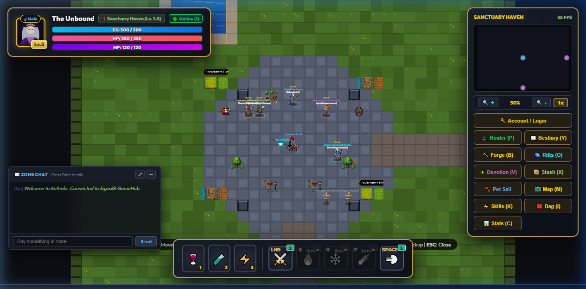

# ⚔️ MDG: Aethelis (My Dream Game) — 2D Pixel ARPG Engine

[](https://dotnet.microsoft.com/)
[](https://learn.microsoft.com/aspnet/core/signalr/introduction)
[](https://www.sqlite.org/)
[](https://developer.mozilla.org/en-US/docs/Web/API/Canvas_API)
[](tests/Mdg.Core.Tests/)
[](LICENSE)

> **Repository Description**:
> ⚔️ **MDG: Aethelis** — 2D Top-Down Pixel ARPG Engine featuring Server-Authoritative Architecture, Real-Time SignalR Multiplayer Co-op, 5-Act Continental Campaign, Genesis Crafting Forge & Alchemy Lab, Aethelis Compendium & Material Mastery, Monster Affixes Engine, 3-Phase Boss Fights, Dynamic Fog of War, and Endless Spire & Pinnacle Map Rifts.
>
> **Project Statement**:
> This is an **educational and learning game development project** built to explore and master modern ARPG systems, clean server-client architectures, and real-time networking. All visual and art assets were processed with **Banana** (Image AI / Asset processing pipeline) with the architectural and engineering pair-programming assistance of **Antigravity / Gemini** (Advanced AI Coding Assistant).

---

## 📸 Visual Showcase & Screenshots



---

## 🏷️ Suggested GitHub Topics
```
csharp, dotnet8, aspnetcore, signalr, game-development, arpg, pixel-art, vanilla-javascript, canvas2d, multiplayer, game-engine, sqlite, entity-framework-core, educational-project, gemini-ai, banana-ai
```

---

## 🌟 Key Features & Gameplay Systems

### 1. 🏛️ Streamlined 5-Hub Master Navigation
All 14+ game interfaces are unified into **5 Sleek Master Hubs** for maximum ergonomic clarity:

1. **⚔️ Hero & Progression Hub (`C` / `I` / `K` / `V` / `P`)**:
   - 🎒 *Inventory & Paperdoll Equipment (`I`)*
   - 📊 *Character Attributes, Resistances & Defenses (`C`)*
   - ⚡ *Branching Skill Tree & Socket Board (`K`)*
   - ✨ *Celestial Devotion Grid (`V`)*
   - 👥 *Multi-Hero Roster Management (`P`)*
2. **🔨 Genesis Forge & Alchemy Hub (`B`)**:
   - 🏭 *Smelting Kiln*: Refine raw ores into Iron/Mithril ingots, and blow Silica Sand into Glass Vials.
   - ⚗️ *Alchemy Lab*: Brew Flasks & Elixirs requiring Glass Vials, Aether Spring Water, and wild Herbs.
   - 🗡️ *Base Forging Bench*: Craft weapons and armor from refined ingots and cured leather.
   - 🔨 *Affix Reforging & Upgrades*: Deterministic crafting using Genesis Catalysts.
   - ♻️ *Item Salvage*: Material-accurate deconstruction yielding raw ingots and gems.
   - 🎒 *Material Vault & Gathering Professions*: Mining, Herbalism, and Beast Skinning.
3. **📖 Aethelis Compendium Hub (`Y` / `L`)**:
   - 📖 *Bestiary & Monster Lore*: Slain counter, species weaknesses, and permanent passive combat perks.
   - 💎 *Material Lore & Insight Mastery*: Catalog of 25+ crafting materials across 6 categories with 5-tier insight progression (*Novice $\to$ Adept $\to$ Expert $\to$ Master $\to$ Grandmaster*) unlocking bonus yields and high-tier affix rolls.
   - 🌳 *Monster Family Mastery*: 3-branch talent specialization trees (*Beast, Undead, Fiend, Elemental, Construct*).
   - 📜 *World Mythos & 9 Acts Chronicles*: 5 ancient lore chapters detailing the Primordial Era, Great Sundering, 9 Acts Campaign, Great Factions, and Void Rifts.
4. **🌌 Adventure & Endgame Hub (`M` / `O` / `U`)**:
   - 🗺️ *Continental World Atlas (`M`)*: Waypoints, safe-havens, and travel routes.
   - 🌌 *Gate of Eternity Map Device (`O`)*: Endgame map tiers with random affixes.
   - 🗼 *Endless Spire 100 Floors (`U`)*: Infinite ascending arena challenges.
5. **⚙️ System, Settings & Stash Hub (`ESC` / `X`)**:
   - 🌐 *Bilingual Localization (Vi/En)*: Real-time dynamic switching between Vietnamese and English.
   - 📦 *Account Shared Stash (`X`)*: Shared vault across all heroes on account.
   - ⚙️ *Audio, Graphics & Gameplay Settings*: Synthesizer volume, particle density, screen shake, and damage floaters.
   - 🌐 *World Channels & Cloud Sync*: Multi-shard channel switcher and Google OAuth cloud saves.

---

### 2. ⚔️ Deep Combat Mechanics & Monster Affix Engine
- **3-Phase Boss Encounters**:
  - *Phase 1 (100% - 65% HP)*: Base attack pattern and elemental strikes.
  - *Phase 2 (< 65% HP)*: Invulnerability shield (2s) & Void Minion wave summon.
  - *Phase 3 (< 25% HP)*: **Enraged State** (+40% Movement Speed, double attack rate, and Spiral Cataclysm Bullet-Hell barrage).
- **Elite Monster Affix Modifiers**:
  - `Aether Ward`: Absorbs 75% damage until shattered (stunning the monster for 1.5s).
  - `Magma Conduit`: Emits fireball volleys upon taking damage.
  - `Static Discharge`: Counter-attacks with 3 lightning bolts.
  - `Frostpulse`: Periodic 200px freezing pulse applying 50% slow.
  - `Vampiric Leech`: Steals 5% max HP when striking the player.
  - `Temporal Snare`: Aura reducing player movement speed by -40%.
- **Status Ailment Dynamics**:
  - **Bleed Damage**: Deals **$3.0\times$ damage** while the afflicted target is moving.
  - **Shock Amplification**: Scales incoming damage taken from **$+10\%$ up to $+50\%$**.
- **Exploration & Fog of War**:
  - Ray-casted line-of-sight fog revealing field maps tile by tile.
  - **$\ge 85\%$ Zone Exploration Bounty**: Awards +300 EXP & 3 Aether Crystals upon charting wild lands.

---

### 3. 🏰 5-Act Continental Campaign & Safe-Havens
- **5 Thematic Acts with Procedural Dungeons & Waypoints**:
  - **Act I: Sylvan Frontier** *(Sanctuary Haven, Whispering Plains, Verdant Canopy, Forgotten Crypt — Boss: Malakor)*
  - **Act II: Frozen Spires** *(Glacial Outpost, Frostpeak Tundra, Howling Ice Caverns, Stormpeak Ridge — Boss: Cryomancer Vael)*
  - **Act III: Infernal Caldera** *(Ashen Redoubt, Obsidian Wastes, Molten Caldera, Infernal Heart — Boss: Ignis the Undying)*
  - **Act IV: Sunken Necropolis** *(Oasis Sanctum, Shifting Dunes, Dread Tombs, Necropolis of Souls — Boss: High Inquisitor Morvath)*
  - **Act V: Celestial Void & Pinnacle** *(Aethelis Citadel, Void Abyss, Citadel of the Void, Pinnacle Arenas — Boss: Void Sovereign)*

---

### 4. 🌐 Real-Time Multiplayer Co-op (SignalR GameHub)
- Spatial zone grouping on `/gamehub` (`JoinZone`, `ChangeZone`, `LeaveZone`).
- 20 TPS client position broadcast with entity interpolation on canvas.
- Real-time skill casting synchronization and in-game Zone Chat box (`Press Enter`).

---

## 🏗️ Architecture & Technology Stack

```mermaid
graph TD
    Client["Client (HTML5 Canvas + Vanilla JS ES Modules)"] <-->|REST API / HTTP| WebApi["ASP.NET Core Web API (Controllers)"]
    Client <-->|WebSockets (SignalR)| GameHub["SignalR GameHub (/gamehub)"]
    WebApi --> Core["Mdg.Core (Game Logic, Loot, Stats, Forge)"]
    WebApi --> EFCore["Entity Framework Core"]
    EFCore --> DB[("SQLite Database (mdg_world.db)")]
```

| Layer | Technologies & Design Patterns |
| :--- | :--- |
| **Backend Core** | C# 12 / .NET 8, Clean Architecture, Server-Authoritative Logic Services (`ForgeCraftingService`, `LootGenerationService`, `CharacterStatsService`, `DamageCalculator`, `ZoneMapGenerator`) |
| **Database** | SQLite + Entity Framework Core (Code-First with automated DB Seeder for master items, monster lore, recipes, and campaign acts) |
| **Real-time Networking** | ASP.NET Core SignalR WebSocket Hub with spatial zone rooms and entity broadcast |
| **Frontend Client** | Vanilla JavaScript (ES Modules, zero heavy framework overhead), HTML5 Canvas 2D Render Pipeline with Y-sorting, Web Audio API synth engine |
| **Asset Pipeline** | 2D pixel art spritesheets and Act background artworks processed via **Banana** AI generation & Gemini |

---

## 🚀 Getting Started & How to Run

### Prerequisites
- [.NET 8.0 SDK](https://dotnet.microsoft.com/download/dotnet/8.0) or higher.
- Any modern web browser (Chrome, Edge, Firefox, Safari).

### 1. Clone & Run the Server
```bash
# Clone the repository
git clone https://github.com/your-username/my-dream-game.git
cd my-dream-game

# Run the backend server and client host
dotnet run --project src/Mdg.Server/Mdg.Server.csproj --urls http://localhost:5123
```

### 2. Launch the Game
Open your web browser and navigate to:
```
http://localhost:5123/
```

### 3. Run Unit Tests
```bash
dotnet test tests/Mdg.Core.Tests/Mdg.Core.Tests.csproj
```
*(129/129 automated unit tests covering itemization, forge crafting, damage calculations, monster affixes, boss state machines, and character roster persistence).*

---

## 🎮 Controls & Keybindings

| Key / Action | Function | Master Hub |
| :--- | :--- | :--- |
| **W, A, S, D** | Move Character (8-directional) | Core Combat |
| **LMB / 1** | Primary Slash / Cleave | Hotbar |
| **Q / 2** | Pyro Fireball | Hotbar |
| **W / 3** | Frost Nova | Hotbar |
| **E / 4** | Meteor Strike | Hotbar |
| **SPACE / 5** | Phase Dash | Hotbar |
| **1, 2, 3, 4** | Flask Slots (Charge-based Potions) | Flask Tray |
| **C** / **I** | Character Stats & Inventory Paperdoll | ⚔️ **Hero Hub** |
| **K** | Skill Tree & Socket Board | ⚔️ **Hero Hub** |
| **V** | Celestial Devotion Grid | ⚔️ **Hero Hub** |
| **P** | Hero Roster & Character Switcher | ⚔️ **Hero Hub** |
| **B** | Genesis Crafting Forge & Alchemy Lab | 🔨 **Forge Hub** |
| **Y** / **L** | Bestiary, Material Mastery & Lore Codex | 📖 **Compendium Hub** |
| **M** | Continental World Map Atlas | 🌌 **Adventure Hub** |
| **O** | Gate of Eternity Map Device | 🌌 **Adventure Hub** |
| **U** | Endless Spire 100 Floors | 🌌 **Adventure Hub** |
| **ESC** | Game Settings & Close Active Modal | ⚙️ **System Hub** |
| **X** | Account Shared Stash | ⚙️ **System Hub** |
| **F** | Quick Loot Pickup / Harvest Node / Interact | World Action |
| **ENTER** | Focus Zone Chat Input | Chat System |

---

## 📜 Acknowledgements & Credits
- **Core Game Engineering**: Conceived and designed as an open-source educational game development project.
- **AI Co-Development**: Architecture, server-authoritative service refactoring, procedural generation, and feature integrations engineered with **Antigravity / Gemini**.
- **Asset Processing**: Visual artwork, background covers, and pixel spritesheets processed and curated using **Banana**.
