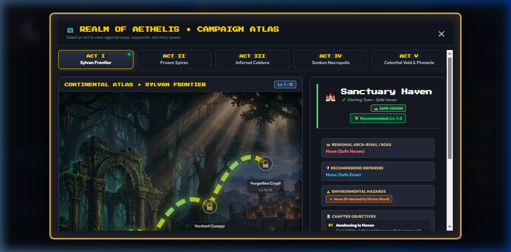
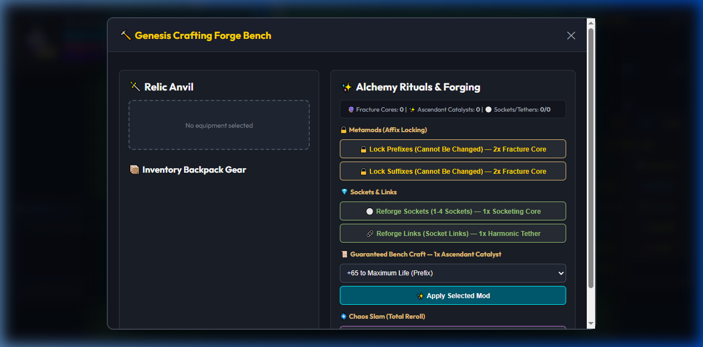
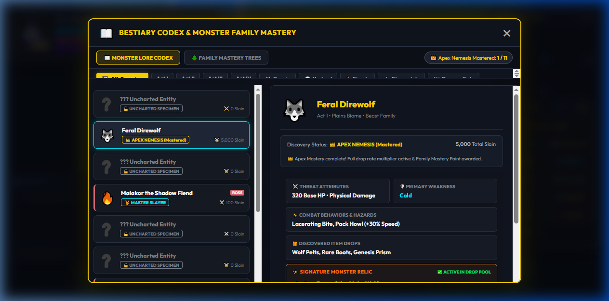
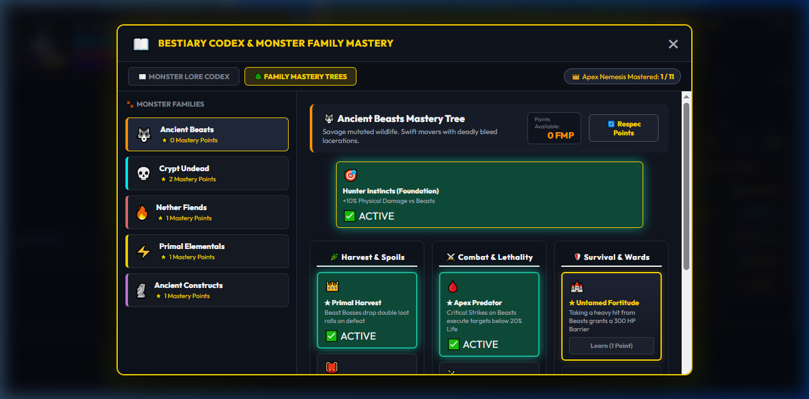
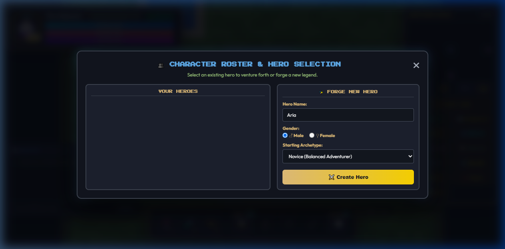

# ⚔️ MDG: Aethelis (My Dream Game) — 2D Pixel ARPG Engine

[](https://dotnet.microsoft.com/)
[](https://learn.microsoft.com/aspnet/core/signalr/introduction)
[](https://www.sqlite.org/)
[](https://developer.mozilla.org/en-US/docs/Web/API/Canvas_API)
[](LICENSE)

> **Repository Description**:
> ⚔️ **MDG: Aethelis** — 2D Top-Down Pixel ARPG Engine featuring a Server-Authoritative Architecture, Real-Time SignalR Multiplayer Co-op, 5-Act Continental Campaign, Genesis Crafting Forge, Bestiary Lore Mastery, and Endgame Pinnacle Map Rifts.
>
> **Project Statement**:
> This is an **educational and learning game development project** built to explore and master modern ARPG systems, clean server-client architectures, and real-time networking. All visual and art assets were processed with **Banana** (Image AI / Asset processing pipeline) with the architectural and engineering pair-programming assistance of **Gemini Flash 3.7** (Advanced AI Coding Assistant).

---

## 📸 Visual Showcase & Screenshots


---

## 🏷️ Suggested GitHub Topics
```
csharp, dotnet8, aspnetcore, signalr, game-development, arpg, pixel-art, vanilla-javascript, canvas2d, multiplayer, game-engine, sqlite, entity-framework-core, educational-project, gemini-ai, banana-ai
```

---

## 🌟 Key Features & Gameplay Systems

### 1. 🏰 5-Act Continental Campaign & Safe-Havens
- **5 Thematic Acts with Procedural Dungeons & Waypoints**:
  - **Act I: Sylvan Frontier** *(Sanctuary Haven, Whispering Plains, Verdant Canopy, Forgotten Crypt — Boss: Malakor)*
  - **Act II: Frozen Spires** *(Glacial Outpost, Frostpeak Tundra, Howling Ice Caverns, Stormpeak Ridge — Boss: Cryomancer Vael)*
  - **Act III: Infernal Caldera** *(Ashen Redoubt, Obsidian Wastes, Molten Caldera, Infernal Heart — Boss: Ignis the Undying)*
  - **Act IV: Sunken Necropolis** *(Oasis Sanctum, Shifting Dunes, Dread Tombs, Necropolis of Souls — Boss: High Inquisitor Morvath)*
  - **Act V: Celestial Void & Pinnacle** *(Aethelis Citadel, Void Abyss, Citadel of the Void, Pinnacle Arenas — Boss: Void Sovereign)*
- **Interactive Continental World Map Atlas (`M`)**: High-resolution act artwork, glowing SVG leylines, waypoint nodes, regional intel dossiers, and fast-travel.
- **Dynamic Biome Hazards**: Lava burns, toxic miasma bogs, deep frost, and static electric ground with elemental resistance mitigating mechanics.



### 2. 🔨 Deep Itemization & Genesis Forge Crafting
- **6-Tier Rarity System**: Common, Magic, Rare, Epic, Legendary, and Divine / Set Items with rolled affix pools.
- **Deterministic Crafting Bench (`B`) & Genesis Catalysts**:
  - *Aether Spark* 🔵: Awaken Normal base item $\to$ Magic item (1-2 random modifiers).
  - *Flux Catalyst* 🔄: Reforge all modifiers on a Magic item.
  - *Genesis Prism* 💎: Awaken Normal base $\to$ Rare item with 4-6 powerful modifiers.
  - *Fracture Core* 🔮: Reforge a Rare item with completely new random modifiers.
  - *Ascendant Catalyst* ✨: Augment a high-tier modifier onto a Rare item (Exalt Slam).
  - *Null Void Core* ❌: Strip/purify a random modifier to reclaim an open affix slot.
  - *Origin Matrix* 👑: Reroll explicit modifier numeric values to their maximum tier ranges.
  - *Socketing Core* ⚪: Reforge equipment sockets (1 to 4 sockets).
  - *Harmonic Tether* 🔗: Reforge socket links for support gem chaining.



### 3. ⚡ Skill Tree, Socket Board & Support Gems
- **5 Core Archetype Skills**: *Slash Cleave, Pyro Fireball, Frost Nova, Meteor Strike, Phase Dash*.
- **Skill Gem Sockets & Links**: Socket skills with support gems like *Greater Multiple Projectiles (GMP)*, *Spell Echo*, *Ignite Proliferation*, *Chain*, and *Concentrated Effect*.
- **Branching Morph Trees (`K`)**: Specialize skills into distinct variants (e.g. *Hellfire Chaos Fireball*, *Frost Shield Nova*, *Triple Wave Holy Slash*).

### 4. ✨ Celestial Devotion Grid (`V`)
- Passive constellation node allocations granting maximum Life, Energy Shield, Elemental Resistances (Fire, Cold, Lightning, Chaos), Attack/Cast Speed, Critical Strike Multiplier, and Life Leech.

### 5. 📖 Bestiary Codex & 3-Branch Family Mastery (`Y`)
- **Absolute Fog of Discovery**: Monster intel, weaknesses, and signature relics are concealed without numerical milestone spoilers, deciphering organically as players hunt.
- **3-Branch Non-Linear Family Talent Trees**: Specialize across 5 Great Families (*Beast, Undead, Fiend, Elemental, Construct*) with 3 distinct paths:
  - 🌿 *Harvest & Spoils*: Extra crafting catalysts, rare sockets, and double boss loot.
  - ⚔️ *Combat & Lethality*: Critical multiplier surges, execution strikes below 20% Life, and frenzy speed.
  - 🛡️ *Survival & Wards*: Family-specific damage mitigation, ailment immunities (*Bleed/Poison/Ignite/Freeze/Shock*), and emergency barriers.
- **🔄 Respec Points**: Full flexibility to refund allocated Family Mastery Points and experiment with alternative builds.
- **Server-Authoritative Drop Tables**: All signature unique artifacts and catalyst rolls are authoritatively computed on the backend server.

| Bestiary Lore Codex | 3-Branch Family Mastery Tree |
| :---: | :---: |
|  |  |

### 6. 👥 Multi-Character Roster & Independent Progression (`P`)
- Manage multiple heroes per account with independent progression, inventory, skills, and stash.
- Character creation form supporting **Vanguard 🛡️**, **Arcanist 🔮**, and **ShadowRogue 🗡️** classes with gender selection.



### 7. 🌐 Real-Time Multiplayer Co-op (SignalR GameHub)
- Spatial zone grouping on `/gamehub` (`JoinZone`, `ChangeZone`, `LeaveZone`).
- 20 TPS client position broadcast with entity interpolation on canvas.
- Real-time skill casting synchronization and in-game Zone Chat box (`Press Enter`).

### 8. 🌌 Gate of Eternity Map Device & Endgame Pinnacle Rifts (`O`)
- Open portal rifts into endgame map arenas with randomized difficulty tiers, monster pack density, and elite modifiers.

---

## 🏗️ Architecture & Technology Stack

```mermaid
graph TD
    Client["Client (HTML5 Canvas + Vanilla JS ES Modules)"] <-->|REST API / HTTP| WebApi["ASP.NET Core Web API (Controllers)"]
    Client <-->|WebSockets (SignalR)| GameHub["SignalR GameHub (/gamehub)"]
    WebApi --> Core["Mdg.Core (Game Logic, Loot, Stats, Forge)"]
    WebApi --> EFCore["Entity Framework Core"]
    EFCore --> DB[("SQLite Database (mdg_world.db)")]
```

| Layer | Technologies & Design Patterns |
| :--- | :--- |
| **Backend Core** | C# 12 / .NET 8, Clean Architecture, Server-Authoritative Logic Services (`ForgeCraftingService`, `LootGenerationService`, `CharacterStatsService`, `ZoneMapGenerator`) |
| **Database** | SQLite + Entity Framework Core (Code-First with automated DB Seeder for master items, monster lore, and campaign acts) |
| **Real-time Networking** | ASP.NET Core SignalR WebSocket Hub with spatial zone rooms and entity broadcast |
| **Frontend Client** | Vanilla JavaScript (ES Modules, zero heavy framework overhead), HTML5 Canvas 2D Render Pipeline with Y-sorting, Web Audio API synth engine |
| **Asset Pipeline** | 2D pixel art spritesheets and Act background artworks processed via **Banana** AI generation & Gemini Flash 3.7 |

---

## 🚀 Getting Started & How to Run

### Prerequisites
- [.NET 8.0 SDK](https://dotnet.microsoft.com/download/dotnet/8.0) or higher.
- Any modern web browser (Chrome, Edge, Firefox, Safari).

### 1. Clone & Run the Server
```bash
# Clone the repository
git clone https://github.com/your-username/my-dream-game.git
cd my-dream-game

# Run the backend server and client host
dotnet run --project src/Mdg.Server/Mdg.Server.csproj --urls http://localhost:5123
```

### 2. Launch the Game
Open your web browser and navigate to:
```
http://localhost:5123/
```

### 3. Run Unit Tests
```bash
dotnet test tests/Mdg.Core.Tests/Mdg.Core.Tests.csproj
```
*(80/80 automated unit tests covering itemization, forge crafting, resurrection mechanics, and character roster persistence).*

---

## 🎮 Controls & Keybindings

| Key / Action | Function |
| :--- | :--- |
| **W, A, S, D** | Move Character (8-directional) |
| **LMB / 1** | Primary Slash / Cleave |
| **Q / 2** | Pyro Fireball |
| **W / 3** | Frost Nova |
| **E / 4** | Meteor Strike |
| **SPACE / 5** | Phase Dash |
| **1, 2, 3** | Quaff Potions (Life, Mana, Quicksilver) |
| **I** | Inventory & Paperdoll Equipment |
| **K** | Skill Tree & Socket Board |
| **C** | Character Attributes & Defenses |
| **B** | Genesis Crafting Forge Bench |
| **Y** | Bestiary Codex & Monster Lore |
| **P** | Hero Roster & Character Switcher |
| **M** | Continental World Map Atlas |
| **O** | Gate of Eternity Map Device |
| **V** | Celestial Devotion Grid |
| **X** | Account Shared Stash |
| **F** | Quick Loot Pickup / Interact |
| **ENTER** | Focus Zone Chat Input |
| **ESC** | Close Active Modal |

---

## 📜 Acknowledgements & Credits
- **Core Game Engineering**: Conceived and designed as an open-source educational game development project.
- **AI Co-Development**: Architecture, server-authoritative service refactoring, procedural generation, and feature integrations engineered with **Gemini Flash 3.7**.
- **Asset Processing**: Visual artwork, background covers, and pixel spritesheets processed and curated using **Banana**.
