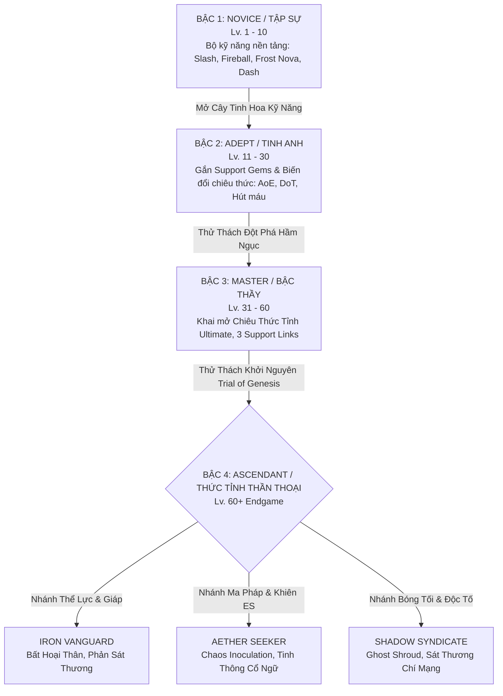

# MDG (Aethelis) - Hệ Thống Tiến Trình The Unbound & Thức Tỉnh Thăng Hoa (Single Deep Progression)

Định hướng thiết kế tinh gọn, tập trung: Người chơi khởi đầu là **The Unbound** tự do trang bị mọi loại Skill Gems và vũ khí, sau đó **phát triển chuyên sâu theo 4 Bậc Tiến Trình** và chọn 1 trong 3 Nhánh Thức Tỉnh Thăng Hoa (*Ascendance Archetypes*) ở Bậc 4.

---

## 1. Cấu Trúc Tiến Trình 4 Bậc (The Unbound 4-Tier Progression) `[ĐÃ HOÀN THÀNH - ACTIVE]`

### 1.1. Chi tiết từng bậc tiến trình `[ĐÃ HOÀN THÀNH - ACTIVE]`:
1. **Bậc 1: Tập Sự (Novice - Lv. 1 đến 10):** `[ĐÃ HOÀN THÀNH]`
   * Người chơi sử dụng bộ kỹ năng nền tảng: Chém kiếm thường (`LMB`), Cầu lửa cơ bản (`Q`), Sóng băng (`W`), Lướt né đòn (`Space`).
   * Làm quen với cơ chế né đòn, nhặt đồ và quản lý Thanh Năng Lượng (Mana) / Lá Chắn (ES).
2. **Bậc 2: Tinh Anh (Adept - Lv. 11 đến 30):** `[ĐÃ HOÀN THÀNH]`
   * Mở khóa các rãnh kết nối **Support Gems** trên trang bị và điểm **Skill Mastery Points**:
     * *Nhánh Hỏa Nộ:* Tăng phạm vi nổ của Fireball + thiêu đốt DoT (Damage over Time).
     * *Nhánh Băng Phong:* Đóng băng kẻ địch + tăng 50% sát thương chí mạng lên mục tiêu bị đông cứng.
     * *Nhánh Thiết Giáp:* Đòn chém chuyển 30% sát thương thành lớp giáp ảo bảo vệ.
3. **Bậc 3: Bậc Thầy (Master - Lv. 31 đến 60):** `[ĐÃ HOÀN THÀNH]`
   * Mở khóa kỹ năng Thức Tỉnh (Ultimate Awakening Skill - Phím `R`): Gọi Bão Thiên Thạch toàn màn hình hoặc Hóa Thần Khổng Lồ.
   * Cho phép kết nối tối đa **3 Support Gems** cho mỗi Active Skill Gem chính.
4. **Bậc 4: Thần Thoại (Ascendant - Lv. 60+ Endgame):** `[ĐÃ HOÀN THÀNH]`
   * Vượt qua *Trial of Genesis* để mở khóa 1 trong 3 nhánh Thức Tỉnh với các Keystones đột phá luật chơi:
     * *The Iron Vanguard (Bất Hoại Thân):* Kháng 85% mọi sát thương nhưng giảm 10% tốc độ chạy.
     * *Aether Seekers (Ma Pháp Khởi Nguyên):* Khiên Energy Shield x3, Máu cố định = 1, miễn nhiễm hoàn toàn sát thương Chaos.
     * *The Shadow Syndicate (Bóng Ma Độc Đoán):* Né đòn hồi 20% ES, đòn đánh dồn stack độc tố vô hạn.

---

## 2. Hệ Thống Khảm Ngọc Kỹ Năng & Liên Kết (Gem Sockets & Support Links) `[ĐÃ HOÀN THÀNH - ACTIVE]`

Trang bị có các rãnh khảm (Sockets) được đục bằng *Socketing Core* và kết nối bằng *Harmonic Tether*:

| Loại Ngọc Khảm | Vai Trò & Tác Dụng | Ví Dụ Ứng Dụng | Trạng Thái |
| :--- | :--- | :--- | :---: |
| **Active Skill Gem** | Đặt vào rãnh chính để mở khóa chiêu trên Hotbar | `Pyro Fireball`, `Heavy Slash`, `Frost Nova` | `[ĐÃ HOÀN THÀNH]` |
| **Support: Multiple Projectiles** | Tăng thêm số lượng tia đạn | Bắn 3-5 quả cầu lửa hình nón | `[ĐÃ HOÀN THÀNH]` |
| **Support: Echo Resonance** | Kích hoạt lại đòn đánh phụ sau 0.4s | Vết chém tự động chém thêm 1 nhát dư chấn | `[ĐÃ HOÀN THÀNH]` |
| **Support: Life Leech** | Hồi phục máu khi đánh trúng mục tiêu | Chuyển 4% lượng sát thương gây ra thành HP | `[ĐÃ HOÀN THÀNH]` |
| **Support: Nova Dispersion** | Biến kỹ năng đơn hướng thành vòng nổ tròn 360° | Cầu lửa nổ bung ra 8 hướng quanh thân | `[ĐÃ HOÀN THÀNH]` |

---

## 3. Tổng Hợp Bộ Tính Năng Cốt Lõi MDG Đã Thống Nhất

* ✅ **Tiến trình:** The Unbound phát triển 4 Bậc (Novice $\rightarrow$ Adept $\rightarrow$ Master $\rightarrow$ 3 Nhánh Ascendant) `[ĐÃ HOÀN THÀNH]`.
* ✅ **Kỹ năng:** Hệ thống Active/Support Gems kết hợp Cây Tinh Hoa Kỹ Năng (Per-Skill Mastery Tree) `[ĐÃ HOÀN THÀNH]`.
* ✅ **Loot & Kinh tế:** Rơi đồ theo bậc màu (Normal, Magic, Rare, Unique) + **Genesis Catalysts & Cores** (`Fracture Core`, `Genesis Prism`, `Ascendant Catalyst`...) `[ĐÃ HOÀN THÀNH]`.
* ✅ **Bản đồ & Thế giới:** Mạng lưới Waystones, Bản đồ Thế giới (World Map `M`) và Vực Thẳm Endgame (*Genesis Rift System `O`*) `[ĐÃ HOÀN THÀNH]`.
* ✅ **Bạn đồng hành:** Linh thú (Pet) tự động nhặt Tinh Thể Khởi Nguyên và hỗ trợ gửi bán đồ về thị trấn `[ĐÃ HOÀN THÀNH]`.
* ⏳ **Hệ thống Endless Spire & Co-op Switch (Cảm hứng SAO):** Leo tháp 100 tầng và cửa sổ tấn công phối hợp `[CẦN MỞ RỘNG - PLANNED]`.
