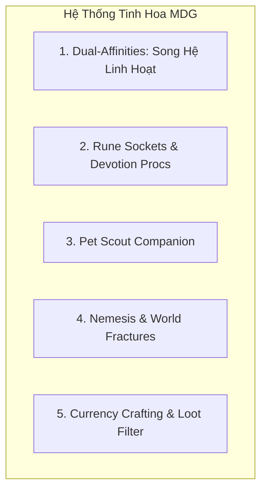

# Phân Tích & Tổng Hợp Tinh Hoa: Grim Dawn × Path of Exile × Torchlight cho MDG

Tài liệu so sánh, chắt lọc các cơ chế xuất sắc nhất từ 3 tượng đài ARPG và đề xuất giải pháp kiến trúc dung hợp độc bản (Unique Hybrid) cho **MDG: Aethelis**.

---

## 1. Bảng So Sánh & Chắt Lọc Tinh Hoa Cơ Chế

| Trục Tính Năng | Grim Dawn | Path of Exile (PoE) | Torchlight (I/II/Infinite) | Ý Tưởng Chắt Lọc Cho MDG |
| :--- | :--- | :--- | :--- | :--- |
| **Xây dựng Nhân vật (Class & Build)** | **Dual-Mastery**: Ghép 2 bảng kỹ năng (VD: Soldier + Occultist = Witchblade) | **Passive Skill Tree** khổng lồ & **Skill Gems + Support Links** | **Class cố định** + Cột kỹ năng 3 nhánh + Thanh **Charge/Frenzy Bar** | **Dual-Affinities (Song Hệ)** kết hợp **Keystones**: Chọn 1 Hệ Chính (Lv.1) + 1 Hệ Phụ (Lv.10) không gò bó class. |
| **Hệ thống Kỹ năng & Procs** | **Devotion System**: Chòm sao mở khóa kỹ năng phụ gắn trực tiếp vào skill (Proc on Hit) | **Gem Links**: Ngọc bổ trợ thay đổi hành vi chiêu (Multiple Projectiles, Cast on Crit) | Kỹ năng mở khóa theo cấp độ, tăng cấp bằng điểm Skill Points | **Rune Inscription (Khắc Ấn Ngọc)**: Gắn 1-2 Ấn phụ trợ vào Skill để kích hoạt hiệu ứng kép (Proc) khi đánh/crit. |
| **Hệ thống Đồ & Kinh tế** | Rơi đồ phong phú + **Components/Augments** ép trực tiếp vào slot | **Currency Orbs** (Không có vàng; Orb vừa là tiền vừa là phôi ép đồ) | Vàng (Gold) + Đồ huyền thoại + Ép ngọc (Gem Socketing) | **Essence & Currency Orbs**: Tiền tệ là các viên đá rèn đúc (Chaos/Alch), kết hợp mảnh ghép trang bị (Fragments). |
| **Bạn đồng hành (Companion)** | Không có Pet phụ trợ (chỉ có Summon quái đệ chiến đấu) | Golem / Minion thuần kỹ năng chiến đấu | **Pet Companion**: Đánh phụ, mang đồ phụ, tự chạy về làng bán rác/mua bình máu | **Aethelis Spirit/Golem Pet**: Bạn đồng hành tự hút tiền/nguyên liệu, giữ 6 ô túi phụ, bật Aura hỗ trợ. |
| **Cơ chế Khám phá Thế giới** | **Faction & Nemesis**: Diệt nhiều quái cùng tộc sẽ triệu hồi Nemesis Boss siêu khó | **Atlas of Worlds & Maps**: Ép dòng tăng độ khó cho hầm ngục endgame | **Phase Beast Portals**: Cổng ma thuật ngẫu nhiên mở ra thử thách mini-game | **Fracture Rifts & Nemesis**: Giết đủ quái dã ngoại sẽ nứt không gian gọi **Nemesis Boss** kèm rương báu. |

---

## 2. Chi Tiết Các Cơ Chế Đề Xuất Phát Triển Cho MDG

### 2.1. Dual-Affinities (Hệ Thống Song Hệ - Kế thừa Grim Dawn)
* **Khởi đầu (Lv. 1):** Chọn 1 Phân Hệ Cơ Bản (VD: *Vanguard - Đấu Sĩ*, *Arcanist - Pháp Sư*, *Shadowstalker - Sát Thủ*).
* **Tiến hóa (Lv. 10):** Mở khóa Phân Hệ Phụ (VD: *Vanguard* + *Pyromancy* = **Hỏa Hiệp Sĩ (Sun Paladin)**; *Shadowstalker* + *Necromancy* = **Kẻ Đoạt Hồn (Soul Reaper)**).
* **Lợi ích:** Tạo ra hàng chục phong cách build độc đáo từ lượng code tối giản, người chơi tự do sáng tạo.

### 2.2. Khắc Ấn Kỹ Năng & Devotion Procs (Dung hợp PoE + Grim Dawn)
* Mỗi Kỹ năng chính (VD: *Fireball*, *Slash*) có **2 Lỗ Khảm Ấn (Rune Sockets)**:
  * **Ấn Tách Nhánh (Split Rune):** Bắn ra 3 quả thay vì 1.
  * **Ấn Bão Lửa (Firestorm Proc - Grim Dawn style):** 20% cơ hội khi đòn đánh trúng đích sẽ tự động gọi thêm 1 đợt mưa sao băng con.
  * **Ấn Hút Huyết (Life Leech Proc):** Hồi 3% HP trên đòn chí mạng.

### 2.3. Bạn Đồng Hành Aethelis (Pet Companion - Kế thừa Torchlight)
* Người chơi được chọn 1 Linh Thú / Golem Cổ Đại đi cùng:
  * **Tính năng QoL (Tiện ích):** Tự động nhặt tiền và ngọc rèn đúc rơi trên mặt đất trong phạm vi 150px.
  * **Túi phụ:** Chứa thêm 6 ô đồ.
  * **Hỗ trợ chiến đấu:** Cung cấp 1 hào quang nhỏ (VD: +10% Tốc độ chạy hoặc +15 Giáp).

### 2.4. Vết Nứt Thế Giới & Thợ Săn Nemesis (Dung hợp Torchlight + Grim Dawn)
* **Nemesis Encounter:** Khi người chơi tiêu diệt đủ 40 Goblin trong Whispering Plains, biểu tượng cảnh báo xuất hiện và **Goblin Nemesis Warlord** sẽ dịch chuyển đến săn lùng người chơi.
* **World Fractures (Vết nứt không gian):** Xuất hiện ngẫu nhiên trên bản đồ dã ngoại. Bước vào sẽ mở ra đấu trường thử thách 45 giây sống sót nhận bão quà rơi (Loot Explosion).

---

## 3. Kiến Trúc Core C# Sẵn Sàng Mở Rộng (Universe Architecture)

Hệ thống được thiết kế theo các Module độc lập trong `src/Mdg.Core/`:
1. `Mdg.Core.Features.Affinity` $\rightarrow$ Quản lý cây Song Hệ (Mastery Tree).
2. `Mdg.Core.Features.Runes` $\rightarrow$ Quản lý hiệu ứng khảm ngọc bổ trợ chiêu thức.
3. `Mdg.Core.Features.Companions` $\rightarrow$ Quản lý hành vi và túi đồ của Pet.
4. `Mdg.Core.Features.Nemesis` $\rightarrow$ Quản lý tiến trình kích nổ Boss Nemesis theo từng vùng.
