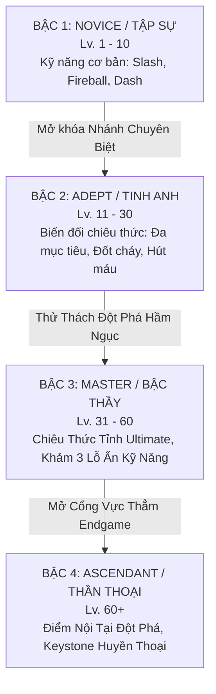

# MDG (Aethelis) - Hệ Thống Tiến Trình 1 Hệ Chuyên Sâu (Single Mastery Deep Progression)

Định hướng thiết kế tinh gọn, tập trung: **Không dùng Song hệ (Dual-Class)** mà sử dụng **1 Hệ Duy Nhất phát triển chuyên sâu dần lên theo từng bậc tiến hóa (Evolution Tiers)**.

---

## 1. Cấu Trúc Tiến Trình 4 Bậc (Single Class Tiered Progression)

### 1.1. Chi tiết từng bậc tiến trình:
1. **Bậc 1: Tập Sự (Novice - Lv. 1 đến 10):**
   * Người chơi sử dụng bộ kỹ năng nền tảng: Chém kiếm thường (`LMB`), Cầu lửa cơ bản (`Q`), Sóng băng (`W`), Lướt né đòn (`Space`).
   * Làm quen với cơ chế né đòn và quản lý Thanh Năng Lượng (Mana) / Lá Chắn (ES).
2. **Bậc 2: Tinh Anh (Adept - Lv. 11 đến 30):**
   * Mở khóa cây biến đổi kỹ năng (Skill Augments):
     * *Nhánh Hỏa Nộ:* Tăng phạm vi nổ của Fireball + thiêu đốt DoT (Damage over Time).
     * *Nhánh Băng Phong:* Đóng băng kẻ địch + tăng 50% sát thương chí mạng lên mục tiêu bị đông cứng.
     * *Nhánh Thiết Giáp:* Đòn chém chuyển 30% sát thương thành lớp giáp ảo bảo vệ.
3. **Bậc 3: Bậc Thầy (Master - Lv. 31 đến 60):**
   * Mở khóa kỹ năng Thức Tỉnh (Ultimate Awakening Skill - Phím `R`): Gọi Bão Thiên Thạch toàn màn hình hoặc Hóa Thần Khổng Lồ.
   * Mỗi kỹ năng mở thêm các **Lỗ Khảm Ấn (Rune Sockets)** để tự động kích nổ các hiệu ứng phụ (Proc on Hit).
4. **Bậc 4: Thần Thoại (Ascendant - Lv. 60+ Endgame):**
   * Mở khóa các điểm then chốt (Keystones) thay đổi toàn bộ luật chơi:
     * *Bất Hoại Thân (Iron Fortress):* Kháng 85% mọi sát thương nhưng tốc độ di chuyển giảm 15%.
     * *Hỗn Mang Bất Diệt (Chaos Weaver):* Mọi đòn đánh đều gây sát thương Chaos xuyên giáp.

---

## 2. Hệ Thống Khảm Ấn Kỹ Năng (Rune Sockets)

Mỗi kỹ năng được gắn thêm các viên Ấn Ngọc (Runes) để cường hóa phong cách chơi:

| Loại Ấn | Tác Dụng Cường Hóa | Ví Dụ Ứng Dụng |
| :--- | :--- | :--- |
| **Split Rune (Ấn Phân Nhánh)** | Tăng thêm số lượng tia đạn | Bắn 3 quả cầu lửa hình nón |
| **Echo Rune (Ấn Dư Chấn)** | Tự động kích nổ đòn phụ sau 0.5s | Vết chém chém thêm 1 nhát dư chấn |
| **Leech Rune (Ấn Hút Sinh Lực)** | Hồi máu/mana khi đánh trúng | Hút 4% lượng sát thương gây ra thành HP |
| **Nova Rune (Ấn Vòng Xoáy)** | Biến kỹ năng đường thẳng thành vòng tròn xung quanh thân | Cầu lửa nổ tỏa ra 8 hướng |

---

## 3. Tổng Hợp Bộ Tính Năng Cốt Lõi MDG Đã Thống Nhất

* ✅ **Tiến trình:** 1 Hệ duy nhất phát triển chuyên sâu 4 Bậc (Novice $\rightarrow$ Adept $\rightarrow$ Master $\rightarrow$ Ascendant).
* ✅ **Kỹ năng:** Nâng cấp kỹ năng + Khảm Ấn biến đổi chiêu thức (Rune Sockets).
* ✅ **Loot & Kinh tế:** Rơi đồ theo bậc màu (Normal, Magic, Rare, Unique) + Currency Orbs rèn đúc (Chaos, Alchemy, Exalted).
* ✅ **Bản đồ & Thế giới:** Mạng lưới Waystones, Bản đồ Thế giới (World Map `M`) và các Hầm ngục độ khó tăng dần.
* ✅ **Bạn đồng hành:** Linh thú (Pet) tự động nhặt Currency và hỗ trợ túi đồ phụ.
