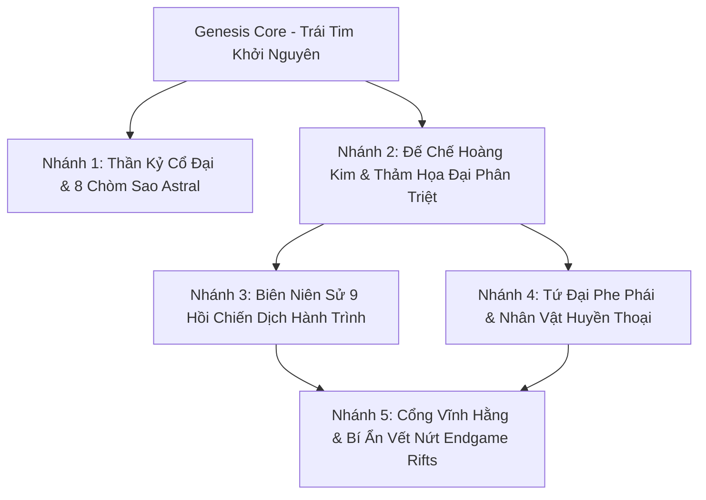

# MDG: Aethelis - Hệ Thống Lore & Biên Niên Sử Cốt Truyện Phân Nhánh (Branching Lore & Narrative Mythos Design)

---

## 1. Tổng Quan Kiến Trúc Cốt Truyện

Thế giới **Aethelis** được xây dựng theo phong cách **High-Fantasy Grim-Dark** với chiều sâu thế giới quan đa tầng, kết nối chặt chẽ giữa lối chơi ARPG hành động, hệ thống cây kỹ năng/Devotion, đền thần cổ đại và các hầm ngục Endgame Rifts.

Cốt truyện được phân thành **5 Đại Nhánh Tự Sự Độc Lập & Bổ Trợ Lẫn Nhau**:

---

## 2. Chi Tiết 5 Nhánh Lore Cốt Truyện

### 🌌 Nhánh I: Khởi Nguyên & Thần Kỷ Cổ Đại (*The Genesis & Primordial Mythos*)
* **Khởi Nguyên (Epoch 0):** Vũ trụ hình thành từ *Genesis Core*, sản sinh 4 Dòng Chảy Nguyên Tố thuần khiết:
  * 🔥 **Solar Ignis (Lửa Thiêng):** Đại diện cho sức sống, sự tái sinh và nhiệt năng cuồng nộ.
  * ❄️ **Abyssal Glacies (Băng Cực):** Đại diện cho sự trường tồn, phòng hộ băng giá và làm chậm thời gian.
  * ⚡ **Tempest Fulmen (Lôi Đình):** Tượng trưng cho tốc độ ánh sáng, sấm sét hủy diệt và bạo kích.
  * 🔮 **Astral Umbra (Hư Không & Ma Lực):** Cội nguồn của trí tuệ Arcane, khiên ma pháp (Energy Shield) và chiều không gian vô tận.
* **8 Đại Chòm Sao Thần Kỷ (Astral Devotion Constellations):**
  1. 🛡️ *The Silver Aegis* (+Armor, Giảm sát thương)
  2. 🔥 *The Solar Phoenix* (+Hồi HP, Sát thương Lửa)
  3. ⚡ *The Tempest Caller* (+Tốc độ đánh, Sát thương Sấm Sét)
  4. ❄️ *The Frost Warden* (+Kháng Băng, Đóng băng mục tiêu)
  5. 🗡️ *The Shadow Viper* (+Crit Multi, Độc dược, Né tránh)
  6. 🔮 *The Aether Weaver* (+Mana, Energy Shield, Spell Power)
  7. 👑 *The Celestial Fortune* (+Độ hiếm đồ rơi IIR, Nhân đôi Vàng/EXP)
  8. ⚔️ *The Cataclysmic Titan* (+Sát thương Vật lý, Diện tích quét kiếm)
* **Nguồn Gốc Các Đền Thần (Celestial Shrines):** Các bệ đá cổ xây dựng trên các điểm giao thoa của dòng chảy ley lines, ban tặng chúc phúc thần thánh $90\text{s}$ cho người khai mở.

---

### 🏛️ Nhánh II: Đế Chế Hoàng Kim & Thảm Họa Đại Phân Triệt (*The High Empire & The Great Sundering*)
* **Thời Kỳ Hoàng Kim (The Magiteck Era):** Nền văn minh con người làm chủ ngôn ngữ Cổ Ngữ (Runes), sáng tạo nên **Genesis Forge** (Bàn Rèn Khởi Nguyên) có khả năng đục lỗ, liên kết mạch ngọc (Socket Links) và điều chỉnh affixes của vũ khí.
* **Bi Kịch Tham Vọng:** Hội đồng Đại Pháp Sư (*High Synod of Magisters*) vì khao khát bất tử đã khoan thủng Lớp Màng Hư Không (*Void Well*). Dòng chảy tha hóa tràn ra, biến dã thú thành quái vật biến dị, kích hoạt các cỗ máy cổ đại nổi giận và xóa sổ các đô thành tráng lệ trong một đêm (*The Great Sundering*).
* **Sự Hình Thành Haven Sanctuary:** Những người sống sót tụ họp dưới tán Cổ Thụ Sylvan, lập nên thành trì **Sanctuary Haven** – pháo đài an toàn duy nhất của nhân loại.

---

### 🗺️ Nhánh III: Biên Niên Sử 9 Hồi Chiến Dịch (*The 9 Acts Campaign Chronicles*)

| Hồi (Act) | Tên Phân Vùng | Cấp Độ Khuyến Nghị | Boss Cuối Hồi & Bối Cảnh Cốt Truyện |
| :---: | :--- | :---: | :--- |
| **Act I** | **Sylvan Frontier** *(Biên Giới Rừng Thiêng)* | Lv. 1 - 15 | **🔥 Malakor the Shadow Fiend:** Thức tỉnh tại Haven Sanctuary, dọn dẹp hầm mộ Forgotten Crypt và giải cứu vùng đồng bằng Whispering Plains. |
| **Act II** | **Frozen Spires** *(Đỉnh Băng Vĩnh Cửu)* | Lv. 15 - 30 | **❄️ Cryomancer Vael:** Thiết lập Glacial Outpost, vượt qua bão tuyết Frostpeak Tundra và tiêu diệt Lãnh Chúa Băng Giá Vael. |
| **Act III** | **Molten Caldera** *(Hỏa Ngục Núi Lửa)* | Lv. 30 - 45 | **🌋 Lord Ignis the Ash Titan:** Thâm nhập Ashfall Citadel, né tránh dòng dung nham và dập tắt Hỏa Thần Ignis. |
| **Act IV** | **Sunken Catacombs** *(Lăng Mộ Ngập Nước)* | Lv. 45 - 55 | **🌊 Leviathan Broodlord:** Giải mã nền văn minh thủy cung cổ xưa dưới lòng đất. |
| **Act V** | **Sunken Fens** *(Đầm Lầy Độc Xà)* | Lv. 55 - 65 | **🐍 Queen Venomfang:** Tiêu diệt tổ rắn độc biến dị và tìm lại Mảnh Lõi Năng Lượng. |
| **Act VI** | **Stormpeak Citadel** *(Pháo Đài Bão Tố)* | Lv. 65 - 75 | **⚡ Tempest Overlord:** Chinh phục tháp lôi đình giữa tầng mây bão. |
| **Act VII** | **Void Abyss** *(Vực Thẳm Vô Tận)* | Lv. 75 - 85 | **🌌 Archon of the Void:** Đối đầu với quái vật bóng tối trong chiều không gian vặn xoắn. |
| **Act VIII** | **Scorched Wastelands** *(Sa Mạc Dung Nham)* | Lv. 85 - 90 | **🐉 Magma Wyrm King:** Quyết chiến với Rồng Lửa Viễn Cổ. |
| **Act IX** | **Genesis Core** *(Trái Tim Khởi Nguyên)* | Lv. 90 - 100 | **👑 The Corrupted Genesis Sovereign:** Trận chiến định đoạt sinh mệnh của toàn bộ thế giới Aethelis. |

---

### 👥 Nhánh IV: Tứ Đại Phe Phái & Nhân Vật Huyền Thoại (*The Four Great Factions*)

1. **🛡️ Hội Thánh Thể (Order of the Silver Aegis):**
   * *Đại diện hệ phái:* **Iron Vanguard** (Hiệp sĩ thiết giáp, khiên hộ thể, sát thương vật lý).
   * *Nhân vật cốt lõi:* **Elder Aethel** (Trưởng lão Haven), **Master Doran** (Thợ rèn đúc vũ khí).
   * *Tôn chỉ:* Bảo vệ người tị nạn, kiên cường phòng thủ, thanh trừng tà ác.
2. **🔮 Hội Pháp Sư Aetherium (The Arcane Synod):**
   * *Đại diện hệ phái:* **Aether Arcanist** (Pháp sư nguyên tố Lửa/Băng/Sét, Energy Shield).
   * *Nhân vật cốt lõi:* **High Scholar Morwen** (Nhà nghiên cứu Cổng Không Gian), **Archmage Cynthia**.
   * *Tôn chỉ:* Nghiên cứu cổ ngữ, ổn định vết nứt thời không và khai phá sức mạnh cội nguồn.
3. **🗡️ Bóng Tối Du Mục (The Shadow Weavers & Nightshades):**
   * *Đại diện hệ phái:* **Shadow Rogue** (Sát thủ tốc độ, đoạt mạng bằng chí mạng, độc dược và né tránh).
   * *Nhân vật cốt lõi:* **Kaelen the Vault Keeper** (Người giữ rương cổ), **Zephyr**.
   * *Tôn chỉ:* Tự do du mục, thám hiểm di tích nguy hiểm, thu hồi bảo vật thất lạc.
4. **⚙️ Dị Tộc & Người Kiến Tạo Cổ Đại (Ancient Constructs & Primal Clans):**
   * Người đá Golem bảo tồn ký ức, Bộ tộc Thổ dân Người Tuyết Frostpeak gìn giữ bí thuật nguyên thủy.

---

### 🌌 Nhánh V: Vết Nứt Thời Không & Cổng Vĩnh Hằng (*The Astral Gate & Endgame Rifts*)

* **Cơ Chế Bản Đồ Endgame (Map Device - Phím O):** Thiết bị đặt tại trung tâm Haven, sử dụng Mảnh Ký Ức (Map Tablets) để mở cổng bước vào các dòng thời gian song song bị phân rã.
* **Các Vết Nứt Nguy Hiểm:** Rifts sở hữu các dòng chỉ số biến dị (Mods): *Monster Turbo*, *Reflect Damage*, *Bloodlines*, *Nemesis Affixes* với tỷ lệ rơi trang bị Unique và Catalyst nguyên chất cao gấp bội.
* **Apex Void Sovereigns:** Những thực thể tối cao ngoài vũ trụ ngự trị ở đỉnh cao Tháp Vô Tận (Endless Spire) và Rift Tier 16+, thử thách bản lĩnh của những người chơi kiệt xuất nhất.
