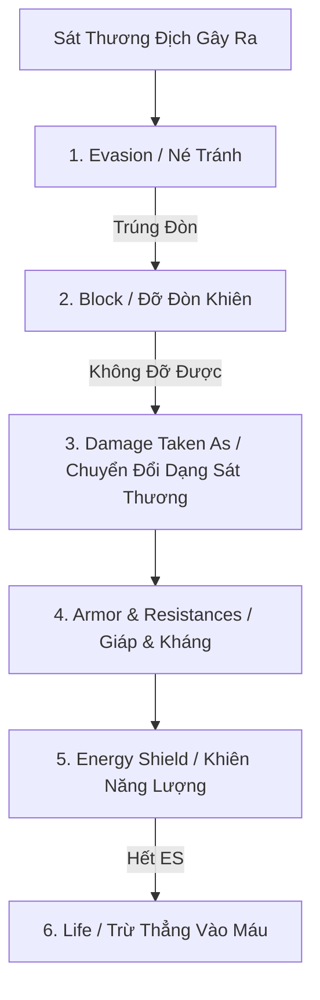

# ĐẶC TẢ THIẾT KẾ: CÔNG THỨC SÁT THƯƠNG, GIẢM THƯƠNG & ĐỀ XUẤT HỆ THỐNG MỞ RỘNG
*Tài liệu toán học cân bằng & định hướng phát triển dài hạn cho MDG (My Dream Game)*

---

## 1. Hệ Thống Tính Sát Thương Đầu Ra (Outgoing Damage Formula)

Để đảm bảo tính cân bằng và tạo cảm giác tăng tiến sức mạnh rõ rệt (Power Progression) như **Path of Exile** và **Grim Dawn**, sát thương được tính qua **5 bậc toán học phân tầng**:

```text
               ┌────────────────────────────────────────────────────────┐
               │              OUTGOING DAMAGE PIPELINE                  │
               └────────────────────────────────────────────────────────┘
                                           │
  1. BASE & FLAT          (Base Weapon/Skill Dmg + Flat Added from Gear)
                                           │
                                           ▼
  2. INCREASED / REDUCED  × (1 + Total % Increased - Total % Reduced) [Cộng dồn]
                                           │
                                           ▼
  3. MORE / LESS          × (1 + More_1) × (1 + More_2) × (1 - Less_1) [Nhân rời rạc]
                                           │
                                           ▼
  4. CRITICAL STRIKE      × (IsCrit ? CritMultiplier : 1.0)
                                           │
                                           ▼
  5. CONVERSION & EXTRA   Convert % Type_A -> Type_B + Gain % Extra Dmg
```

### 1.1. Công Thức Chi Tiết

$$\text{Final Damage} = \Big[ \sum (\text{Base} + \text{Flat}) \Big] \times \Big( 1 + \sum \text{Inc} - \sum \text{Red} \Big) \times \prod (1 + \text{More}_i) \times \prod (1 - \text{Less}_j) \times \text{CritMulti}$$

| Thuật Ngữ | Ý Nghĩa Kỹ Thuật | Ví Dụ Trong Game |
| :--- | :--- | :--- |
| **Flat Damage** | Sát thương cộng thẳng trực tiếp vào gốc. | `+45 Physical Damage`, `+50 Fire Damage`. |
| **Increased (%)** | Cộng dồn tuyến tính từ tất cả trang bị, cây kỹ năng (Additive). | Mặc 3 món đồ mỗi món `+20% Inc` $\rightarrow$ Tổng `+60% Inc` ($1.6\times$). |
| **More (%)** | Nhân riêng rẽ độc lập từng nguồn (Multiplicative). Cực kỳ giá trị! | Support Gem tăng `40% More Damage` $\rightarrow$ Nhân thẳng $\times 1.4$. |
| **Critical Strike** | Tỷ lệ bạo kích ($\text{Cap } 100\%$) và Sát thương bạo kích cơ bản $150\% - 350\%$. | Đòn đánh vàng rực, kích hoạt hiệu ứng vỡ nát âm thanh. |

---

## 2. Hệ Thống Giảm Thương Đầu Vào (Incoming Damage Mitigation Pipeline)

Toàn bộ sát thương nhận vào phải đi qua **6 lớp phòng thủ tuần tự**:



---

### 2.1. Giảm Sát Thương Vật Lý Qua Giáp (Armor Formula)

MDG áp dụng **Đường Cong Hyperbolic Chuẩn PoE** để ngăn chặn tình trạng bất tử và tạo giá trị cho các đòn đánh nặng (Heavy Hits):

$$\text{Physical Damage Reduction (PDR)} = \frac{\text{Armor}}{\text{Armor} + 5 \times \text{Incoming Physical Damage}}$$

$$\text{Damage Taken} = \text{Incoming Physical Damage} \times (1 - \text{PDR})$$

* **Đặc tính cốt lõi:**
  * Giáp **rất hiệu quả** trước bầy quái đánh đòn nhỏ (giảm tới $80\% - 90\%$).
  * Khi gặp **Cú đập cực mạnh của Boss**, tỷ lệ giảm phần trăm sẽ giảm xuống, buộc người chơi phải có thêm máu (Life Pool) và né chiêu.
  * Tỷ lệ giảm tối đa từ Giáp: $\text{Cap } 90\%$.

---

### 2.2. Kháng Nguyên Tố & Hỗn Loạn (Elemental & Chaos Resistances)

MDG phân loại 4 hệ kháng cơ bản:

$$\text{Elemental Damage Taken} = \text{Raw Elemental Damage} \times \big[ 1 - (\text{Resistance} - \text{Penetration}) \big]$$

| Hệ Kháng | Mốc Chuẩn (Cap) | Cơ Chế Hoạt Động Đặc Thù |
| :--- | :---: | :--- |
| **Fire Resistance** | $75\%$ (Max $90\%$) | Chống các đòn nổ lửa và giảm sát thương cháy thiêu đốt (Ignite DoT). |
| **Cold Resistance** | $75\%$ (Max $90\%$) | Chống sát thương băng và giảm thời gian bị Đóng băng (Freeze) / Làm chậm (Chill). |
| **Lightning Resistance**| $75\%$ (Max $90\%$) | Chống sốc điện, giảm nguy cơ bị khuếch đại sát thương từ hiệu ứng Shock. |
| **Chaos Resistance** | $75\%$ (Max $85\%$) | **Bỏ qua Energy Shield** (trừ thẳng vào Máu), trừ khi có trang bị đặc biệt hoặc ngọc *Chaos Bypass Shield*. |

---

### 2.3. Cơ Chế Khiên Năng Lượng (Energy Shield - ES)

* **Lớp máu thứ hai (Buffer Pool):** Hấp thụ $100\%$ sát thương Vật lý và Nguyên tố trước khi chạm vào Máu.
* **Tự động hồi phục (ES Recharge):** Sau **$2.0$ giây** không nhận sát thương, ES sẽ tự động hồi lại với tốc độ **$20\%$ Max ES / giây**.
* **Chống choáng (Stun Resistance):** Khi còn ít nhất $1$ điểm Energy Shield, người chơi nhận sẵn **$50\%$ cơ hội miễn nhiễm Choáng (Stun Avoidance)**.

---

### 2.4. Cơ Chế Né Tránh (Entropy-Based Evasion)

* Tránh may rủi liên tục (Streak of bad luck), game sử dụng **Bộ đếm Entropy ngầm** từ $0$ đến $99$:
  $$\text{Hit Chance} = 1 - \frac{\text{Target Evasion}}{\text{Target Evasion} + 4 \times \text{Attacker Accuracy}}$$
* Mỗi đòn đánh sẽ cộng dồn điểm Entropy; khi vượt quá 100 mới tính là trúng đòn và reset về 0. Người chơi có né cao đảm bảo né đều đặn, không bị quái đánh chết bất thình lình 3 phát liên tiếp.

---

## 3. Đề Xuất 5 Hệ Thống Thiết Kế Mở Rộng Đột Phá (Future Roadmaps)

Để đưa **MDG** trở thành một tựa game ARPG hoàn chỉnh, có chiều sâu hàng trăm giờ chơi, đề xuất 5 hệ thống mở rộng sau:

---

### 🌟 ĐỀ XUẤT 1: Hệ Thống Trạng Thái Dị Tật & Sát Thương Theo Thời Gian (Ailments & DoT)

```text
┌─────────────────┬──────────────────┬─────────────────────────────────────────────────┐
│ DỊ TẬT (AILMENT)│ THUỘC TÍNH GỐC   │ HIỆU ỨNG CHIẾN ĐẤU ĐẶC TRƯNG                    │
├─────────────────┼──────────────────┼─────────────────────────────────────────────────┤
│ 🔥 IGNITE       │ Fire Damage      │ Gây 50% sát thương đòn đánh thành DoT trong 4s. │
│ ❄️ FREEZE/CHILL │ Cold Damage      │ Đóng băng bất động 1.5s hoặc làm chậm 30% tốc độ│
│ ⚡ SHOCK        │ Lightning Damage │ Khuếch đại mọi sát thương nhận vào thêm +15-50% │
│ 🩸 BLEED        │ Physical Attack  │ Gây DoT vật lý, sát thương x3 KHI MỤC TIÊU DI CHUYỂN│
│ ☠️ POISON       │ Chaos / Physical │ Sát thương độc dồn stack vô hạn (Infinite Stack)│
└─────────────────┴──────────────────┴─────────────────────────────────────────────────┘
```

---

### 🌟 ĐỀ XUẤT 2: Hệ Thống Thú Cưng Đồng Hành (Companion & Pet System - Torchlight Style)

* **Tự Động Nhặt Đồ (Loot Filter Pet):** Thú cưng tự chạy nhặt ngọc Currency, nguyên liệu và trang bị theo bộ lọc đã cài đặt.
* **Gửi Đồ Về Thành Bán (Sell Junk to Town):** Người chơi có thể nhấn nút cho Pet ôm đồ rác về thành bán, nhận tiền vàng và quay trở lại sau 30 giây.
* **Kỹ Năng Trợ Chiến (Pet Aura):** Thú cưng sở hữu 1 hào quang buff (tăng $15\%$ Tốc độ di chuyển hoặc $+20\%$ Giáp).

---

### 🌟 ĐỀ XUẤT 3: Hệ Thống Rèn Đúc & Tiền Tố - Hậu Tố (Affix Crafting Engine)

* Mọi trang bị Rare/Unique được cấu thành từ **Tối đa 6 Dòng Chỉ Số (3 Tiền Tố - Prefixes + 3 Hậu Tố - Suffixes)**:
  * **Prefixes (Chỉ số công & phòng chính):** Flat Damage, % Phys Dmg, Max Life, Flat Armor, Energy Shield.
  * **Suffixes (Chỉ số phụ trợ):** Resistances (% Kháng), Critical Strike Chance/Multiplier, Attack/Cast Speed, Attribute Stats (Str/Dex/Int).
* **Bàn Rèn Ma Thuật (Crafting Bench):** Dùng các ngọc *Chaos Orb*, *Exalted Orb*, *Orb of Alchemy* để xóa, đập lại dòng hoặc khóa tiền tố.

---

### 🌟 ĐỀ XUẤT 4: Bản Đồ Endgame Vực Sâu (Atlas / Rift Mapping System)

* **Bản Đồ Mảnh Vỡ (Map Tiers 1 - 16):** Người chơi nhặt được các tấm bản đồ cổ (Waystones/Maps).
* **Roll Thuộc Tính Map:** Dùng ngọc để đập các dòng độ khó (Quái tăng $40\%$ Máu, Phản sát thương, Quái thêm 2 đạn) $\rightarrow$ Đổi lại tỷ lệ rơi đồ (Item Quantity & Rarity) tăng $150\% - 250\%$.
* **Đấu Trường Boss Tối Thượng (Pinnacle Boss Arenas):** Mở cửa đền thờ đối đầu với các Á Thần (Arch-Fiend of Aethelis) rơi ra trang bị Unique độc bản.

---

### 🌟 ĐỀ XUẤT 5: Bảng Cung Hoàng Đạo Thần Thánh (Constellation Devotion Grid - Grim Dawn Style)

* Khám phá các bia đá thần linh (Shrines) ẩn trong map để nhận **Devotion Points**.
* Mở bảng chòm sao thiên văn liên kết hàng trăm vì sao:
  * Mở khóa các kỹ năng nội tại phụ tự động kích hoạt khi đánh chí mạng (ví dụ: *Khi chém bạo kích $\rightarrow$ Tự động triệu hồi Bão Sấm Sét giáng xuống*).

---

## 4. Tóm Tắt Kế Hoạch Triển Khai Tiếp Theo

```text
[ GIAI ĐOẠN 1: ĐÃ XONG ] ──► [ GIAI ĐOẠN 2: TIẾP THEO ] ──► [ GIAI ĐOẠN 3: ENDGAME ]
 • Hệ thống Socket Gems       • Hệ thống DoT & Dị Tật      • Atlas / Rift Maps
 • Skill Mastery Tree        (Ignite, Freeze, Bleed)       • Pinnacle Bosses
 • Database SQLite            • Thú Cưng Auto-Loot Pet     • Constellation Devotion
 • Giáp & Kháng cơ bản        • Hệ Thống Crafting 6 Affix  • Giao Dịch Chợ Đen
```
