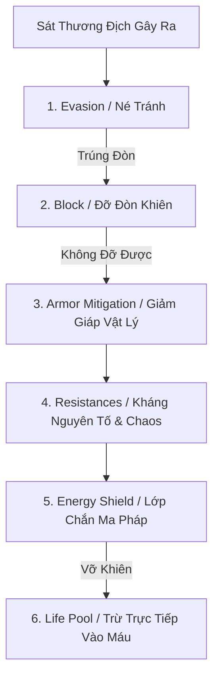

# ĐẶC TẢ THIẾT KẾ: CÔNG THỨC SÁT THƯƠNG, GIẢM THƯƠNG & HỆ THỐNG MỞ RỘNG
*Tài liệu toán học cân bằng & định hướng phát triển cho MDG (Aethelis)*

---

## 1. Hệ Thống Tính Sát Thương Đầu Ra (Outgoing Damage Formula) `[ĐÃ HOÀN THÀNH - ACTIVE]`

Để đảm bảo tính cân bằng và tạo cảm giác tăng tiến sức mạnh rõ rệt (Power Progression) như **Path of Exile** và **Grim Dawn**, sát thương được tính qua **5 bậc toán học phân tầng**:

```text
               ┌────────────────────────────────────────────────────────┐
               │              OUTGOING DAMAGE PIPELINE                  │
               └────────────────────────────────────────────────────────┘
                                            │
  1. BASE & FLAT          (Base Weapon/Skill Dmg + Flat Added from Gear)
                                            │
                                            ▼
  2. INCREASED / REDUCED  × (1 + Total % Increased - Total % Reduced) [Cộng dồn]
                                            │
                                            ▼
  3. MORE / LESS          × (1 + More_1) × (1 + More_2) × (1 - Less_1) [Nhân rời rạc]
                                            │
                                            ▼
  4. CRITICAL STRIKE      × (IsCrit ? CritMultiplier : 1.0)
                                            │
                                            ▼
  5. CONVERSION & EXTRA   Convert % Type_A -> Type_B + Gain % Extra Dmg
```

### 1.1. Công Thức Chi Tiết `[ĐÃ HOÀN THÀNH]`

$$\text{Final Damage} = \Big[ \sum (\text{Base} + \text{Flat}) \Big] \times \Big( 1 + \sum \text{Inc} - \sum \text{Red} \Big) \times \prod (1 + \text{More}_i) \times \prod (1 - \text{Less}_j) \times \text{CritMulti}$$

| Thuật Ngữ | Ý Nghĩa Kỹ Thuật | Ví Dụ Trong Game | Trạng Thái |
| :--- | :--- | :--- | :---: |
| **Flat Damage** | Sát thương cộng thẳng trực tiếp vào gốc. | `+45 Physical Damage`, `+50 Fire Damage`. | `[ĐÃ HOÀN THÀNH]` |
| **Increased (%)** | Cộng dồn tuyến tính từ tất cả trang bị, cây kỹ năng (Additive). | Mặc 3 món đồ mỗi món `+20% Inc` $\rightarrow$ Tổng `+60% Inc` ($1.6\times$). | `[ĐÃ HOÀN THÀNH]` |
| **More (%)** | Nhân riêng rẽ độc lập từng nguồn (Multiplicative). Cực kỳ giá trị! | Support Gem tăng `40% More Damage` $\rightarrow$ Nhân thẳng $\times 1.4$. | `[ĐÃ HOÀN THÀNH]` |
| **Critical Strike** | Tỷ lệ bạo kích ($\text{Cap } 100\%$) và Sát thương bạo kích cơ bản $150\% - 350\%$. | Đòn đánh vàng rực, kích hoạt hiệu ứng vỡ nát âm thanh. | `[ĐÃ HOÀN THÀNH]` |

---

## 2. Hệ Thống Giảm Thương Đầu Vào (Incoming Damage Mitigation Pipeline) `[ĐÃ HOÀN THÀNH - ACTIVE]`

Toàn bộ sát thương nhận vào phải đi qua **6 lớp phòng thủ tuần tự**:



### 2.1. Công Thức Giảm Trừ Theo Giáp (Armor vs Damage Scaling) `[ĐÃ HOÀN THÀNH]`

$$\text{Armor Reduction (\%)} = \frac{\text{Armor}}{\text{Armor} + 5 \times \text{Raw Damage}} \quad (\text{Cap tối đa } 90\%)$$

* **Ý nghĩa thực chiến:** Giáp cực kỳ hiệu quả trước bầy quái đánh đòn nhỏ (trash mobs), nhưng giảm dần tác dụng trước đòn dộng búa của Boss khủng $\rightarrow$ Khuyến khích người chơi nâng máu và né chiêu lớn.

### 2.2. Hệ Thống Kháng Nguyên Tố & Băng Hoại (Resistances & Penalties) `[ĐÃ HOÀN THÀNH]`

$$\text{Damage Taken} = \text{Damage} \times \big( 1 - \min(\text{CurrentResist}, \text{ResistCap}) \big)$$

* **Resist Cap chuẩn:** $75\%$ (Có thể nâng lên tối đa $90\%$ thông qua trang bị thần thoại).
* **Phạt Kháng theo Tiến trình (Act Resistance Penalties):**
  * *Act 1 - 3:* Kháng cơ bản $0\%$.
  * *Act 4 - 6:* Phạt $-25\%$ toàn bộ kháng.
  * *Act 7 - 9 & Endgame Rifts:* Phạt $-50\%$ toàn bộ kháng $\rightarrow$ Bắt buộc rèn đồ kháng Rare trên trang bị.

---

## 3. Hệ Thống Dị Tật & Trạng Thái Chiến Đấu (Combat Ailments & Procs) `[ĐÃ HOÀN THÀNH - ACTIVE]`

```text
┌─────────────────┬──────────────────┬─────────────────────────────────────────────────┐
│ DỊ TẬT (AILMENT)│ NGUYÊN TỐ GÂY RA │ HIỆU ỨNG TÁC ĐỘNG TRONG COMBAT                   │
├─────────────────┼──────────────────┼─────────────────────────────────────────────────┤
│ 🔥 IGNITE       │ Fire Damage      │ Thiêu đốt gây sát thương Hỏa liên tục (DoT 4s)  │
│ ❄️ FREEZE/CHILL │ Cold Damage      │ Làm chậm tốc độ 30% -> Đóng băng cứng mục tiêu   │
│ ⚡ SHOCK        │ Lightning Damage │ Tăng từ +10% đến +50% mọi sát thương nhận vào   │
│ 🩸 BLEED        │ Physical Attack  │ Gây DoT vật lý, sát thương x3 KHI MỤC TIÊU DI CHUYỂN│
│ ☠️ POISON       │ Chaos / Physical │ Sát thương độc dồn stack vô hạn (Infinite Stack)│
└─────────────────┴──────────────────┴─────────────────────────────────────────────────┘
```

---

## 4. Các Phân Hệ Mở Rộng Tiếp Theo

### 🌟 Hệ Thống Thú Cưng Đồng Hành (Companion & Pet System) `[ĐÃ HOÀN THÀNH - ACTIVE]`
* **Tự Động Nhặt Đồ:** Thú cưng tự chạy nhặt ngọc Currency, nguyên liệu và trang bị theo bộ lọc.
* **Gửi Đồ Về Thành Bán:** Nhấn nút cho Pet ôm đồ rác về thành bán, nhận tiền vàng và quay trở lại sau 30 giây.

### 🌟 Bàn Rèn Genesis Forge (Affix Crafting Engine) `[ĐÃ HOÀN THÀNH - ACTIVE]`
* Rèn 6 dòng chỉ số (3 Prefixes + 3 Suffixes) bằng các Genesis Catalysts & Cores.

### 🌟 Cây Chòm Sao Thiên Ân (Celestial Devotion Star Tree - Phím V) `[ĐÃ HOÀN THÀNH - ACTIVE]`
* Cây thiên văn 4 nhánh (Phoenix, Frost Warden, Thunder Lord, Void Reaper) với 4 combat procs.

### 🌟 Cổng Vô Cực & Bản Đồ Vực Sâu (Map Device & Void Rifts - Phím O) `[ĐÃ HOÀN THÀNH - ACTIVE]`
* Bản đồ Tier 1-16, ghép mảnh cổ ngữ và roll độ khó.

### 🌟 Tháp Vô Tận & Co-op Switch (Cảm hứng SAO) `[CẦN MỞ RỘNG - PLANNED]`
* **Aethel Spire (100 Tầng):** Chế độ leo tháp vô tận, đánh Boss tầng canh cổng mở khóa Waypoint và Leaderboard.
* **Co-op Stagger Switch:** Cửa sổ 3 giây bạo kích x2 khi đồng đội tạo choáng.
