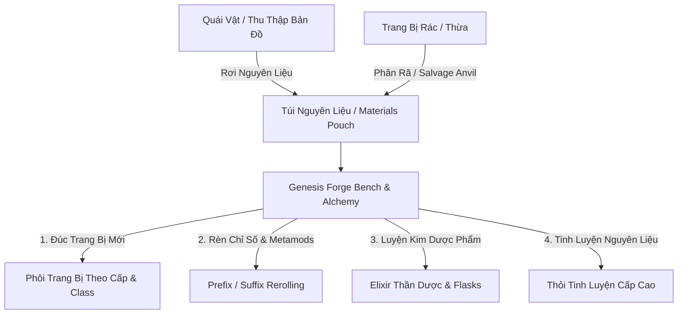

# MDG: Aethelis - Crafting Materials, Reagents & Salvage System Design

## 1. Executive Summary & Problem Statement
Hệ thống **Nguyên Liệu Chế Tác & Tái Chế Trang Bị (Crafting Materials & Salvage Engine)** mở rộng chiều sâu cho nền kinh tế ARPG, giải quyết vấn đề "trang bị rác rơi vãi không ai nhặt" và hoàn thiện vòng lặp chơi: **Săn quái / Thu thập $\to$ Thu thập Nguyên liệu & Phân rã $\to$ Rèn đúc trang bị & Pha chế Dược phẩm tại Genesis Forge**.

---

## 2. Đánh Giá Tác Động Toàn Diện (Impact Analysis)

| Phân Hệ Game | Mức Độ Tác Động | Phân Tích Chi Tiết & Rủi Ro | Giải Pháp Kiến Trúc Đảm Bảo An Toàn |
| :--- | :---: | :--- | :--- |
| **🎒 Túi Đồ & Quản Lý Ô Chứa** | **Vừa** | Nếu nguyên liệu chiếm từng ô riêng như Gear sẽ gây tràn túi đồ ($16 - 24$ ô) rất nhanh. | Bổ sung **Ngăn Túi Nguyên Liệu Riêng (Materials Pouch)** với cơ chế Auto-Stack vô hạn số lượng ($9999$). |
| **⚔️ Hệ Thống Rơi Đồ (Loot Tables)** | **Thấp** | Thêm các dòng nguyên liệu mới vào bảng Drop Table của quái vật. | Mở rộng enum `ItemCategory.Material`, hoàn toàn độc lập và **không ghi đè/ảnh hưởng** đến tỷ lệ rơi đồ Rare/Unique hiện có. |
| **🔨 Genesis Forge Bench** | **Trung Bình** | Mở rộng giao diện và bổ sung thêm Tab Đúc Phôi, Tab Phân Rã (Salvage) và Luyện Kim. | Tái sử dụng Modal Forge hiện có, mở rộng thêm các tab phụ không phá vỡ tính năng ép Socket/Affix cũ. |
| **💾 Cơ Sở Dữ Liệu & Savegame** | **Không Tác Động** | Cần lưu trữ số lượng từng loại nguyên liệu của nhân vật hoặc tài khoản. | Lưu dưới dạng JSON Key-Value `{ [materialId]: quantity }` vào trường `MaterialsJson` trong bảng `Characters` hoặc `BackpackJson`. Hoàn toàn tương thích ngược ($100\%$ backward-compatible). |
| **🌐 Multiplayer & Shared Stash** | **Thấp** | Đồng bộ số lượng nguyên liệu giữa các phiên chơi và chia sẻ chung tài khoản. | Nguyên liệu có thể gửi vào `SharedStash` để nhân vật phụ (alt heroes) cùng sử dụng. |

---

## 3. Hệ Thống 4 Nhóm Nguyên Liệu Chế Tác

### A. ⛏️ Khoáng Thạch & Kim Loại Cổ (Ores & Metals)
* **`mat_iron_ore` (Iron Ore / Quặng Sắt):** Dùng đúc phôi giáp sắt và vũ khí cận chiến cơ bản.
* **`mat_mithril_chunk` (Mithril Chunk / Mảnh Mithril):** Kim loại ma pháp bền nhẹ, dùng cho trang bị Cấp $20 - 45$.
* **`mat_adamantite_ingot` (Adamantite Ingot / Thỏi Kim Cương):** Kim loại Endgame siêu cứng, tăng giáp và chỉ số vật lý tối đa.
* **`mat_aether_crystal` (Aetherium Crystal / Tinh Thể Ma Lực):** Tinh thể phát quang dùng đúc gậy phép và vòng hộ thân.

### B. 🌿 Thảo Dược & Dịch Chiết Tự Nhiên (Herbs & Botanical Extracts)
* **`mat_blood_herb` (Bloodroot Herb / Rễ Huyết Thảo):** Nguyên liệu pha chế Bình Máu Lớn và Dược phẩm Tăng HP tối đa.
* **`mat_mana_bloom` (Mana Bloom / Hoa Ma Lực):** Nấu bình Mana và thuốc hồi phục Energy Shield.
* **`mat_wind_leaf` (Windstrider Leaf / Lá Gió Thần):** Dùng chế tạo Dược Phẩm Tăng Tốc Độ Di Chuyển ($+25\%$ Move Speed $30\text{ phút}$).

### C. 🐺 Mảnh Quái Vật & Thú Liệu (Monster Parts & Beast Trophies)
* **`mat_beast_leather` (Beast Leather / Da Thú Dã Ngoại):** Đúc giáp da Evasion và giày tăng tốc.
* **`mat_fiend_horn` (Fiend Demon Horn / Sừng Ác Quỷ):** Rèn vũ khí tăng tỷ lệ chí mạng và sát thương Chaos.
* **`mat_dragon_scale` (Dragon Scale / Vảy Rồng Núi Lửa):** Rèn giáp kháng lửa và sát thương nổ lửa.

### D. 🔮 Lõi Tinh Thể & Tinh Hoa Ma Thuật (Elemental Cores & Catalyst Shards)
* **`mat_fire_core` / `mat_frost_core` / `mat_spark_core` / `mat_void_core`:** Thổi hồn nguyên tố tương ứng vào trang bị khi đúc.

---

## 4. Các Tính Năng Mới Tại Bàn Rèn (Genesis Forge 2.0)

1. **🔨 Tab 1: Đúc Trang Bị (Equipment Forging):**
   * Người chơi chọn loại trang bị muốn đúc (Vũ khí, Giáp, Nón, Giày, Nhẫn...).
   * Chọn cấp độ Base Item mong muốn $\to$ Tiêu hao Khoáng Thạch + Da Thú $\to$ Đúc ra trang bị với các dòng ngẫu nhiên.
2. **♻️ Tab 2: Phân Rã Trang Bị (Salvage Anvil):**
   * Đặt trang bị rác/không dùng vào bàn rã:
     * Đồ Trắng (Normal): Thu được $3\times$ Quặng thô / Da thường.
     * Đồ Xanh (Magic): Thu được $5\times$ Quặng + $1\times$ Bột Ma Thuật.
     * Đồ Vàng (Rare): Thu được $8\times$ Quặng Tinh Luyện + $1\times$ Mảnh Catalyst.
     * Đồ Unique: Thu được $1\times$ Fracture Core / Socket Core.
3. **🧪 Tab 3: Giả Kim & Dược Phẩm (Alchemy Workshop):**
   * Nấu thảo dược thành các bình Elixir tăng cường chỉ số duy trì trong $15 - 30\text{ phút}$ (vd: *Elixir of Iron Skin*, *Elixir of Arcane Surge*).
4. **✨ Tab 4: Cường Hóa & Ép Khảm (Existing Sockets / Affixes):**
   * Kế thừa trọn vẹn hệ thống reroll Socket, Link và khóa Affix hiện có.
