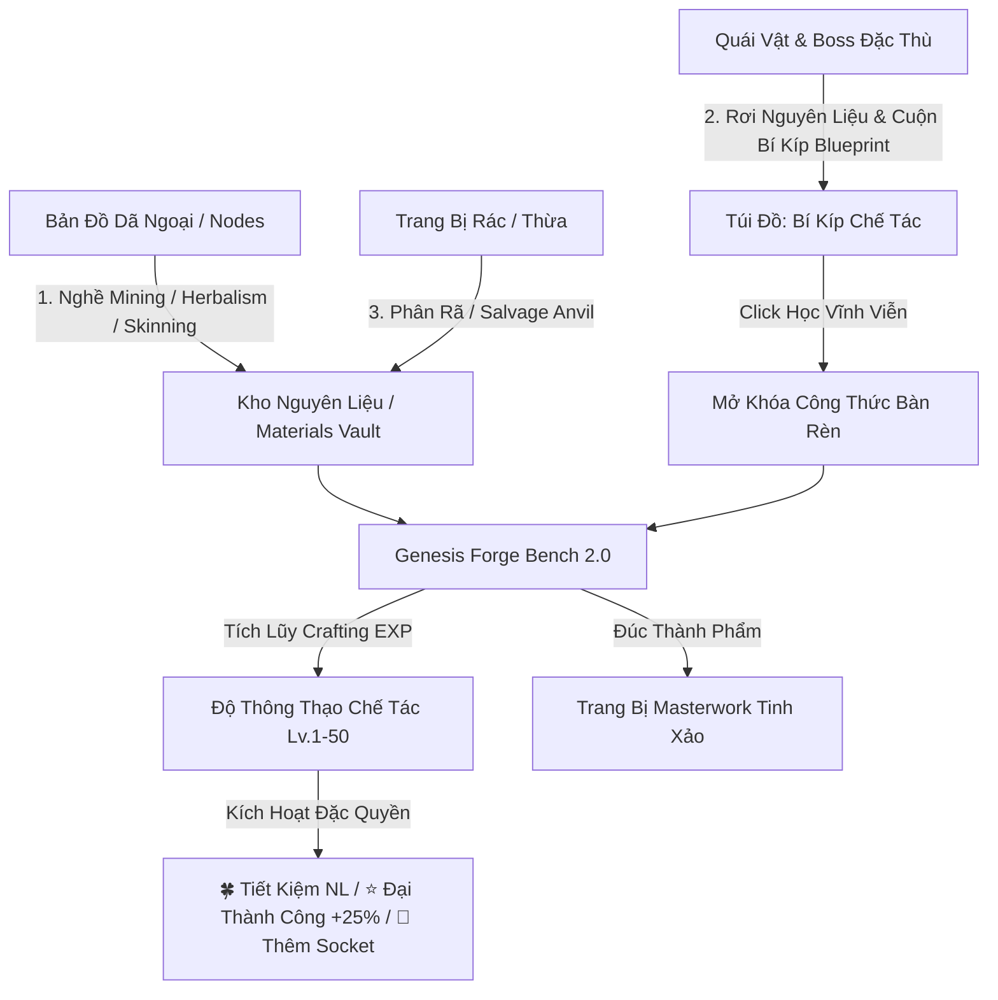

# MDG: Aethelis - Crafting Materials, Reagents, Gathering & Genesis Forge Design

## 1. Executive Summary & Vòng Lặp Chế Tác Hoàn Chỉnh
Hệ thống **Nguyên Liệu Chế Tác, Nghề Nghiệp Khai Thác & Bàn Rèn Genesis Forge** mở rộng chiều sâu cho nền kinh tế ARPG Aethelis, hoàn thiện vòng lặp chơi:
**Khám phá Bản Đồ & Săn Quái $\to$ Khai thác Nốt Tài Nguyên / Thu Thập Bí Kíp Blueprint $\to$ Tích lũy Nguyên Liệu & Phân Rã Trang Bị $\to$ Nâng Cấp Nghề Nghiệp & Độ Thông Thạo Bàn Rèn $\to$ Đúc Trang Bị Masterwork & Khảm Nạp Metamods**.



---

## 2. Bàn Rèn Genesis Forge 2.0 (ARPG Grid & Visual Experience)

### 2.1. Triết lý Giao Diện & Trải Nghiệm Người Dùng
* **Ô Lưới ARPG Chuẩn ($56\times 56\text{px}$):** Thiết kế đồng bộ phong cách hòm đồ ARPG cao cấp với viền màu phẩm chất phát quang (Rarity Glow) và huy hiệu số lượng (Stack Badges).
* **Tự Động Ẩn Nguyên Liệu Bằng 0 (Auto-Hide Zero Quantity):** Kho nguyên liệu (Materials Vault) và bảng chi phí chế tác tự động ẩn các loại tài nguyên chưa sở hữu ($count \le 0$), loại bỏ cảm giác rối mắt.
* **Rich Floating Tooltips:** Rê chuột lên bất kỳ ô nguyên liệu/trang bị nào đều mở bảng thông tin động với độ hiếm, xuất xứ và công dụng chi tiết.
* **7 Phân Hệ Tabs Chức Năng:**
  1. 🏭 **Lò Luyện (Smelting Kiln):** Nung Cát Thạch Anh thành Vỏ Bình Thủy Tinh Rỗng, Bình Thạch Anh Cường Hóa, Thỏi Sắt, Thỏi Mithril và Da Thuộc.
  2. ⚗️ **Giả Kim (Alchemy Lab):** Pha chế các loại Flask hồi phục sinh lực, năng lượng và thần dược tăng tốc/hộ thể từ Dược liệu + Vỏ Bình + Nước Suối Aether.
  3. 🗡️ **Rèn Phôi (Base Forging):** Lò rèn đúc phôi vũ khí & giáp trụ từ Thỏi Kim Loại Tinh Luyện, Da Thuộc và Gỗ Lõi Cổ Thụ.
  4. 🔨 **Cường Hóa (Relic Anvil):** Khóa Affix (Metamods Prefix/Suffix Lock), Reroll Socket/Links, Bench Affix và Chaos Slam.
  5. ♻️ **Phân Rã (Salvage Anvil):** Phân rã trang bị rác thành nguyên liệu thỏi tinh luyện và gỗ lõi theo cấu trúc linh kiện thực tế.
  6. 🎒 **Kho Vật Liệu (Materials Vault):** Kho lưu trữ 18+ loại tài nguyên và vỏ bình vô hạn stack.
  7. 🛠️ **Nghề Nghiệp (Professions):** Quản lý cấp độ và bậc mở khóa của 3 nghề thu thập.

---

## 3. Hệ Thống 3 Nghề Nghiệp Thu Thập (Gathering Professions System)

Để khai thác các nốt tài nguyên trên bản đồ thế giới, người chơi cần rèn luyện nghề nghiệp tương ứng (Cấp độ $1 \to 50$):

| Nghề Nghiệp (Profession) | Biểu Tượng | Đối Tượng Khai Thác | Nguồn Thu Thập | Bậc Phân Cấp Nguyên Liệu Mở Khóa |
| :--- | :---: | :--- | :--- | :--- |
| **Mining (Khai Khoáng)** | ⛏️ | Quặng sắt, Tinh thể ma pháp, Lõi kim cương | Nốt mỏ đá trên bản đồ & Quái hệ Golem/Construct | • Lv. 1: Iron Ore (Common)<br>• Lv. 10: Mithril Chunk (Uncommon)<br>• Lv. 25: Aether Crystal (Rare)<br>• Lv. 40: Adamantite Ingot (Mythic) |
| **Herbalism (Thảo Dược)** | 🌿 | Rễ huyết thảo, Hoa ma lực, Lá gió thần | Bụi hoa/cây thảo mộc bản đồ & Quái hệ Thực vật | • Lv. 1: Bloodroot Herb (Common)<br>• Lv. 10: Mana Bloom (Uncommon)<br>• Lv. 25: Windstrider Leaf (Rare) |
| **Skinning & Hunting (Lột Da / Săn Bắt)** | 🐺 | Da thú rừng, Sừng quỷ dị giới, Vảy rồng lửa | Thu hoạch sau khi hạ gục Quái Thú (Beasts / Dragons) | • Lv. 1: Beast Leather (Common)<br>• Lv. 15: Fiend Demon Horn (Rare)<br>• Lv. 35: Dragon Scale (Mythic) |

---

## 4. Cơ Chế Độ Thông Thạo Chế Tác (Crafting Mastery Engine)

Độ Thông Thạo Chế Tác phản ánh kinh nghiệm rèn đúc của thợ rèn ($1 \to 50$), mở khóa các đặc quyền bị động:

### 4.1. 6 Bậc Danh Hiệu (Mastery Ranks)
* **Apprentice (Lv. 1 - 9):** 🛠️ Novice Apprentice
* **Journeyman (Lv. 10 - 19):** ⚒️ Adept Journeyman
* **Artisan (Lv. 20 - 29):** 💎 Skilled Artisan
* **MasterSmith (Lv. 30 - 39):** 🔨 Master Forger
* **Grandmaster (Lv. 40 - 49):** 🌟 Grandmaster Artificer
* **PrimordialGodSmith (Lv. 50):** 👑 Primordial God-Smith (Tối Thượng)

### 4.2. Thuật Toán Tích Lũy Kinh Nghiệm (Crafting EXP Formula)
* $\text{EXP To Next Level} = 150 \times 1.12^{\text{Level} - 1}$
* **Nguồn tích lũy EXP:**
  * **Đúc phôi trang bị (`Base Forging`):** $+35\text{ EXP}$
  * **Đập bùa Anvil (`Chaos Slam` / `Metamods`):** $+20 \to +30\text{ EXP}$
  * **Bench Affix / Socket Reforge:** $+15 \to +25\text{ EXP}$
  * **Phân rã trang bị (`Salvage`):** $+15\text{ EXP}$

### 4.3. 3 Đặc Quyền Kích Hoạt Tự Động (Mastery Perks)
1. 🍀 **Tiết Kiệm Nguyên Liệu (Resource Conservation):** Tỷ lệ $5\% \to 30\%$ không tiêu hao bất kỳ nguyên liệu nào khi đúc.
2. ⭐ **Đại Thành Công (Masterwork Critical):** Tỷ lệ $5\% \to 25\%$ trang bị đúc ra nhận thêm $+25\%$ chỉ số cơ bản, phẩm chất `Rare`, tiền tố `⭐ Masterwork` và hiệu ứng hào quang vàng rực rỡ.
3. 💎 **Ban Phước Socket (Extra Socket Blessing):** Tỷ lệ $5\% \to 35\%$ trang bị tự động mở thêm $+1$ Socket (tối đa 6 sockets).

---

## 5. Hệ Thống Bản Vẽ Chế Tác Rơi Từ Quái Đặc Thù (Monster-Specific Blueprint Drop System)

Trang bị cao cấp không thể đúc tự do mà bắt buộc phải sở hữu **Cuộn Bí Kíp Bản Vẽ (Recipe Blueprint Scroll)** thu thập từ các Boss và Quái Tinh Anh đặc thù.

```mermaid
graph LR
    Boss[Boss / Quái Tinh Anh] -->|Hạ gục (Tỷ lệ drop)| Scroll[📜 Cuộn Bí Kíp Blueprint]
    Scroll -->|Click / Chuột Phải trong Túi| Learn[Học vĩnh viễn vào Bàn Rèn]
    Learn --> Unlock[Mở khóa công thức đúc tại Tab Base Forging]
```

### 5.1. Danh Mục Bản Vẽ & Nguồn Rơi Quái Vật

| Mã Công Thức | Tên Trang Bị | Cấp Độ | Vị Trí | Trạng Thái Ban Đầu | Quái Vật & Boss Rơi Bí Kíp | Khu Vực / Biome |
| :--- | :--- | :---: | :---: | :---: | :--- | :--- |
| `forge_iron_sword` | **Iron Longsword** | Lv. 1 | MainHand | 🔓 **Mặc định** | *Tân thủ có sẵn* | Sanctuary Haven |
| `forge_iron_armor` | **Reinforced Iron Cuirass** | Lv. 1 | BodyArmor | 🔓 **Mặc định** | *Tân thủ có sẵn* | Sanctuary Haven |
| `forge_aether_ring` | **Aetherium Band of Resilience** | Lv. 20 | Ring | 🔒 **Cần Bí Kíp** | • **Malakor the Shadow Fiend** (Boss $85\%$)<br>• **Crypt Undead Warrior** ($12\%$) | Forgotten Crypts (Act 1) |
| `forge_mithril_blade` | **Mithril Arcane Blade** | Lv. 25 | MainHand | 🔒 **Cần Bí Kíp** | • **Cryomancer Vael** (Boss $100\%$)<br>• **Frost Elemental** ($15\%$) | Frozen Spires (Act 2) |
| `forge_mithril_hauberk` | **Mithril Ward Hauberk** | Lv. 25 | BodyArmor | 🔒 **Cần Bí Kíp** | • **Yeti Frost Goliath** ($25\%$)<br>• **Cryomancer Vael** ($100\%$) | Frozen Spires (Act 2) |
| `forge_prismatic_amulet` | **Prismatic Star Amulet** | Lv. 40 | Amulet | 🔒 **Cần Bí Kíp** | • **Ignis the Scourge Wyrm** (Boss $85\%$)<br>• **Magma Colossus Golem** ($18\%$) | Volcanic Core (Act 3) |
| `forge_adamantite_greatsword` | **Adamantite Colossus Greatsword** | Lv. 50 | MainHand | 🔒 **Cần Bí Kíp** | • **Ignis the Scourge Wyrm** (Boss $100\%$) | Volcanic Core (Act 3) |
| `forge_adamantite_plate` | **Adamantite Titan Warplate** | Lv. 50 | BodyArmor | 🔒 **Cần Bí Kíp** | • **Ignis the Scourge Wyrm** (Boss $100\%$) | Volcanic Core (Act 3) |

### 5.2. Giao Diện & Bộ Lọc Base Forging
* **4 Chế Độ Lọc:** `Tất Cả` | `🔓 Đã Học` | `🔒 Chưa Học` | `✨ Đủ NL`.
* **Công thức bị khóa:** Hiển thị mờ (`recipe-locked`), icon `🔒`, dòng chữ nguồn rơi `🔒 Rơi từ: [Tên Quái/Boss]`.
* **Khung Xem Trước (Preview):** Banner đỏ cảnh báo **BẢN VẼ BÍ TRUYỀN CHƯA MỞ KHÓA** kèm gợi ý vị trí địa lý săn quái, nút Đúc bị vô hiệu hóa `🔒 Yêu Cầu Học Bản Vẽ Từ Quái Vật`.

---

## 6. Lò Nung Thủy Tinh (Smelting Kiln) & Bàn Giả Kim (Alchemy Lab)

### 6.1. Quy Trình Nung Thủy Tinh & Luyện Kim (Smelting Kiln)
| Công Thức | Nguyên Liệu Nạp | Thành Phẩm | Cấp Độ | Ứng Dụng |
| :--- | :--- | :--- | :---: | :--- |
| **Bình Thủy Tinh Rỗng** | $3\times$ Cát Thạch Anh (`mat_silica_sand`) | $1\times$ `item_empty_vial` | Lv. 1 | Vỏ bình chứa cho thuốc hồi máu, mana, tốc độ |
| **Bình Thạch Anh Cường Hóa** | $1\times$ `item_empty_vial` + $2\times$ Tinh Thể Aether (`mat_aether_crystal`) | $1\times$ `item_crystal_flask` | Lv. 25 | Vỏ bình chịu áp suất cao cho thần dược T3 |
| **Thỏi Sắt Tinh Luyện** | $2\times$ Quặng Sắt Thô (`mat_iron_ore`) | $1\times$ `mat_iron_ingot` | Lv. 1 | Rèn kiếm sắt, giáp sắt và dược dịch Granite |
| **Thỏi Mithril Băng Ngân** | $2\times$ Quặng Mithril (`mat_mithril_chunk`) | $1\times$ `mat_mithril_ingot` | Lv. 15 | Rèn ma kiếm, giáp xích và nhẫn ma pháp |
| **Da Thuộc Bền Bỉ** | $2\times$ Da Thú Tươi (`mat_beast_leather`) | $1\times$ `mat_tanned_leather` | Lv. 1 | Gia cố giáp da, quấn chuôi kiếm và dược dịch Granite |

### 6.2. Danh Mục Pha Chế Bàn Giả Kim (Alchemy Lab)
| Bình Dược Phẩm | Vỏ Bình Yêu Cầu | Dung Môi & Dược Liệu | Hiệu Năng & Chỉ Số |
| :--- | :--- | :--- | :--- |
| **Lesser Life Flask (T1)** | $1\times$ `item_empty_vial` | $1\times$ Nước Suối Aether + $3\times$ Huyết Thảo | Hồi 500 Máu trong 4.0s (60 Max Charges, 20/lần) |
| **Lesser Mana Flask (T1)** | $1\times$ `item_empty_vial` | $1\times$ Nước Suối Aether + $3\times$ Hoa Ma Lực | Hồi 300 Mana & 180 ES trong 4.0s (60 Max Charges, 20/lần) |
| **Quicksilver Speed Flask (T2)** | $1\times$ `item_empty_vial` | $2\times$ Nước Suối Aether + $5\times$ Lá Phong Lôi | $+45\%$ Tốc độ chạy & $+25\%$ Tốc độ đánh trong 5.0s |
| **Granite Fortitude Flask (T2)** | $1\times$ `item_empty_vial` | $2\times$ Thỏi Sắt + $2\times$ Da Thuộc | $+1200$ Giáp & $+25\%$ Kháng Toàn Phần trong 5.0s |
| **Divine Life Flask of Staunching (T3)** | $1\times$ `item_crystal_flask` | $3\times$ Nước Suối Aether + $8\times$ Huyết Thảo + $1\times$ Lõi Băng | Hồi 1200 Máu + Miễn Nhiễm & Xóa Chảy Máu |
| **Arcane Mana Flask of Warding (T3)** | $1\times$ `item_crystal_flask` | $3\times$ Nước Suối Aether + $8\times$ Hoa Ma Lực + $1\times$ Tinh Thể Aether | Hồi 800 Mana & 450 ES + Miễn Nhiễm Nguyền Rủa |

---

## 7. Hệ Thống Độ Thấu Suốt Nguyên Liệu (Material Insight Mastery)

Khi thu thập hoặc tinh luyện nguyên liệu, người chơi tích lũy điểm **Thấu Suốt (Material Insight EXP)** cho từng loại vật liệu:
* **Tier 1: Tập Sự (Novice - 0 EXP):** Mở khóa thông tin nguồn gốc và danh mục công thức.
* **Tier 2: Tinh Thông (Adept - 15 EXP):** $+10\%$ cơ hội nhận thêm sản phẩm phụ khi thu thập.
* **Tier 3: Chuyên Gia (Expert - 50 EXP):** $+15\%$ sản lượng khai thác từ các nốt tài nguyên tự nhiên.
* **Tier 4: Bậc Thầy (Master - 120 EXP):** Giảm $-10\%$ hao phí nguyên liệu khi rèn đúc tại Genesis Forge.
* **Tier 5: Thánh Truyền (Grandmaster - 300 EXP):** $+5\%$ tỷ lệ kích hoạt dòng thuộc tính cao cấp (High-Tier Affix) khi sử dụng nguyên liệu này.


