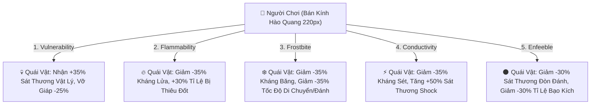

# 💀 Aethelis Curse Auras (Blasphemy) & Keystone Passives Design

---

## 1. Triết Lý Thiết Kế: Biến Đổi Nguyền Rủa Thành Vòng Hào Quang Tỏa Xung Quanh

Trong thế giới ARPG chuyên sâu, thay vì phải liên tục bấm phím để niệm bùa nguyền rủa (Curses/Hexes) lên từng đàn quái vật, game cung cấp cơ chế **Ngọc Bổ Trợ Chuyển Hóa Hào Quang (`Support Gem: Blasphemy Aura`)**:
- Khi gắn ngọc `Support: Blasphemy Aura` cùng rãnh liên kết với bất kỳ viên `Curse Gem` nào:
  * Kỹ năng nguyền rủa tự động chuyển hóa thành **Vòng Hào Quang Hắc Ám (Curse Aura bán kính $220$px)** liên tục phát sáng dưới chân người chơi.
  * Mọi quái vật lọt vào bán kính hào quang đều bị áp đặt $100\%$ hiệu ứng nguyền rủa ngay tức khắc.
  * **Cơ chế cân bằng:** Mỗi hào quang nguyền rủa khóa **$25\%$ Mana Tối Đa (Mana Reservation)**.

---

## 2. Danh Mục 5 Kỹ Năng Nguyền Rủa (Curse & Hex Skill Gems)

| Tên Ngọc Nguyền Rủa | Loại Phép | Màu Hào Quang | Hiệu Ứng Suy Yếu Lên Quái Vật Lân Cận |
| :--- | :---: | :---: | :--- |
| 💀 **Vulnerability** | Vật Lý / Chảy Máu | Đỏ Thẫm `#e11d48` | Quái nhận thêm **$+35\%$ Sát thương Vật lý & Bleed**, giảm $-25\%$ Giáp phòng thủ. |
| 🔥 **Flammability** | Hỏa Diễm / Thiêu Đốt | Đỏ Cam `#ff5500` | Giảm **$-35\%$ Kháng Lửa**, tăng $+30\%$ Cơ hội bị Thiêu Đốt (Ignite). |
| ❄️ **Frostbite** | Băng Giá / Làm Chậm | Xanh Lam `#00f2fe` | Giảm **$-35\%$ Kháng Băng**, **làm chậm $-35\%$ Tốc độ di chuyển & tốc đánh** của quái. |
| ⚡ **Conductivity** | Lôi Điện / Shock | Vàng Kim `#ffd700` | Giảm **$-35\%$ Kháng Sét**, **khuếch đại $+50\%$ Sát thương Shock** nhận vào. |
| 🌑 **Enfeeble** | Hắc Ám / Suy Tàn | Tím Hư Không `#c678dd` | Làm giảm **$-30\%$ Sát thương gây ra** của quái, giảm $-30\%$ Tỷ lệ Bạo kích của quái. |

---

## 3. Danh Mục 4 Kỹ Năng Thụ Động Đột Phá (Keystone Passives)

1. 🛡️ **Iron Fortress (Pháo Đài Bất Hoại):**
   - Mọi chỉ số Kháng Nguyên Tố vượt mốc tối đa ($>75\%$) được chuyển hóa thành **$+300$ Giáp Vật Lý**.
   - Miễn nhiễm hoàn toàn hiệu ứng Đẩy lùi (Knockback) và Choáng (Stun).
2. 🔮 **Chaos Inoculation (Bất Tử Khởi Nguyên):**
   - Máu tối đa bị khóa cố định $= 1$ HP.
   - **Lá Chắn Năng Lượng (Energy Shield) tăng $+100\%$**.
   - Miễn nhiễm hoàn toàn $100\%$ Sát thương Chaos và Độc Tố.
3. 🩸 **Crimson Zealot (Huyết Ma Thuật - Blood Magic):**
   - Mọi kỹ năng tiêu hao **Máu thay vì Mana**.
   - Khi ở trạng thái Máu Thấp ($<50\%$ HP): Nhận thêm **$+35\%$ Sát thương Tổng Thể** và $+15\%$ Tốc độ chạy.
4. ⚡ **Elemental Overload (Bùng Nổ Nguyên Tố):**
   - Đòn đánh chí mạng không nhân đôi sát thương, nhưng kích hoạt trạng thái **Tăng $+40\%$ Sát Thương Nguyên Tố Toàn Diện** kéo dài $8$ giây.
