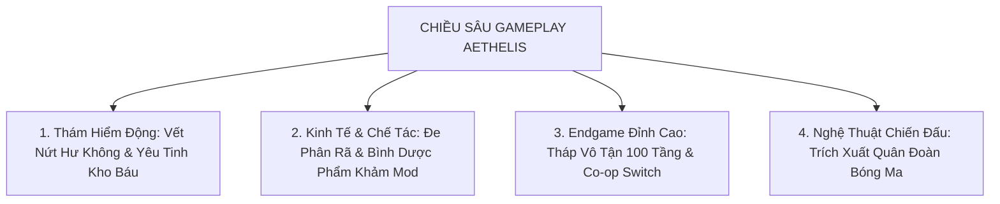

# MDG: Aethelis - Đề Xuất Nâng Tầm Chiều Sâu Gameplay & Hệ Thống Đột Phá (Gameplay Depth Expansion Proposal)

---

## 1. Tóm Tắt Định Hướng Phát Triển (Executive Summary)

Sau khi hoàn thiện nền móng ARPG vững chắc (Hệ thống Combat 6 lớp phòng ngự, Cây Kỹ năng & Devotion, 9 Act Chiến dịch, Bestiary Sương Mù Khám Phá, Multiplayer 4 Kênh và Đền Thần Shrines), việc bổ sung **chiều sâu trải nghiệm (Gameplay Depth)** sẽ tập trung vào 4 mục tiêu cốt lõi:
1. **Gia tăng tính ngẫu nhiên & bất ngờ trong thám hiểm bản đồ (Dynamic Encounters).**
2. **Hoàn thiện vòng lặp kinh tế rèn đúc & quản lý trang bị rác (Salvage & Flask Alchemy).**
3. **Mở rộng thử thách kỹ năng Endgame đỉnh cao (Endless Spire 100 Tầng & Pinnacle Boss Mechanics).**
4. **Đột phá cơ chế tương tác chiến đấu co-op & triệu hồi bóng ma (Co-op Switch & Shadow Extraction).**

---

## 2. Chi Tiết 4 Trục Đề Xuất Chiều Sâu

### 🌌 Trục 1: Sự Kiện Bản Đồ Ngẫu Nhiên (Dynamic Map Incursions & Encounters)

| Sự Kiện / Thực Thể | Cơ Chế Hoạt Động | Phần Thưởng & Giá Trị Gameplay | Độ Phức Tạp Kỹ Thuật |
| :--- | :--- | :--- | :---: |
| **🌀 Void Breach (Vết Nứt Hư Không)** | Chạm vào vết nứt màu tím $\to$ Vòng năng lượng mở rộng trong $25\text{s}$, quái Void tràn ra liên tục. Càng hạ gục nhanh, vòng càng nở rộng. | Khi kết thúc đợt sóng sẽ nổ **Rương Báu Hư Không (Void Cache)** rơi nhiều mảnh ngọc Genesis Catalysts. | **Thấp - Trung bình** (Tái sử dụng spawner & particle) |
| **👺 Aethel Goblin (Yêu Tinh Kho Báu)** | Quái vật mang bao vàng chạy trốn khi thấy người chơi, không tấn công nhưng chạy cực nhanh và né đòn. | Nếu hạ gục trước khi nó mở cổng tẩu thoát ($15\text{s}$), nổ tung ra $5 - 10$ trang bị Rare/Unique và tiền vàng. | **Thấp** (Thêm trạng thái AI Flee) |
| **⛩️ Corrupted Shrine (Đền Bị Phong Ấn)** | Đền thần bị phủ hắc ám $\to$ Kích hoạt sẽ triệu hồi 3 đợt quái tinh anh hộ vệ. Tiêu diệt hết để thanh tẩy đền. | Nhận **Siêu Chúc Phúc Thần Khí x2 Thời Lượng ($180\text{s}$)** và $+50\%$ Rơi Đồ trong suốt thời gian hiệu lực. | **Thấp** (Mở rộng từ hệ thống Shrines hiện có) |

---

### 🧪 Trục 2: Bình Dược Phẩm Khảm Thuộc Tính & Đe Phân Rã (Flasks & Salvage Engine)

1. **♻️ Đe Phân Rã (Salvage Anvil tại Bàn Rèn):**
   * Người chơi không còn phải vứt bỏ trang bị thừa xuống đất. Đưa trang bị vào bàn phân rã:
     * *Normal (Trắng):* Thu về Quặng Sắt / Da Thú thô.
     * *Magic (Xanh):* Thu về Mảnh Mithril + Bột Ma Pháp.
     * *Rare (Vàng):* Thu về Quặng Tinh Luyện + Mảnh Catalyst (`Genesis Shards`).
     * *Unique (Cam):* Thu về $1\times$ `Fracture Core` hoặc `Socketing Core`.
2. **🧪 Hệ Thống Bình Dược Phẩm Có Thuộc Tính (Affixed Flasks):**
   * Bình thuốc sử dụng cơ chế tích điểm sạc (Flask Charges) khi tiêu diệt quái vật.
   * Có thể dùng `Aether Spark` và `Flux Catalyst` để rèn dòng lên Bình Thuốc:
     * *Quicksilver Flask of the Cheetah:* $+40\%$ Tốc độ di chuyển, $+20\%$ Tốc độ đánh khi uống.
     * *Granite Flask of Iron Skin:* $+1500$ Giáp, Miễn nhiễm Chảy Máu (Bleed).
     * *Diamond Flask of Incision:* $+100\%$ Tỷ lệ Chí Mạng (Lucky Crit) trong $5\text{s}$.

---

### 🏰 Trục 3: Tháp Vô Tận 100 Tầng & Cơ Chế Co-op Switch (Endless Spire & SAO Switch)

1. **🗼 Endless Spire of Aethelis (Tháp Vô Tận 100 Tầng):**
   * Chế độ phụ bản leo tầng độc lập với 9 Act Chiến dịch.
   * Mỗi tầng sở hữu địa hình ngẫu nhiên, mật độ quái dày đặc và các dòng điều chỉnh độ khó (Floor Modifiers: *Minus Max Resist*, *Turbo Monsters*, *Volatile Explosions*).
   * Cứ mỗi 10 tầng là một **Tầng Trùm Canh Cổng (Floor Sovereign)** với đấu trường riêng biệt. Vượt qua sẽ lưu vĩnh viễn mốc Waypoint và ghi danh vào Bảng Xếp Hạng Tài Khoản (`Spire Leaderboard`).
2. **⚔️ Cơ Chế Phối Hợp Co-op Stagger & Switch Window:**
   * Khi đánh trúng Boss liên tục, thanh **Stagger Bar** dưới thanh máu Boss sẽ đầy dần.
   * Khi thanh đầy, Boss bị choáng $3\text{s}$ và hiện vòng hào quang vàng **"SWITCH OPPORTUNITY"**.
   * Đồng đội lao vào tung kỹ năng trong cửa sổ 3s này sẽ kích hoạt **Bạo Kích $\times 2.0$ sát thương** và hiệu ứng âm thanh vang dội.

---

### 👤 Trục 4: Trích Xuất Linh Hồn Quân Đoàn Bóng Ma (Shadow Extraction)

* **Cảm hứng:** *Solo Leveling / Hệ Thống Triệu Hồi Linh Hồn Manhua*.
* **Cơ chế:** Khi người chơi thuộc hệ phái `ShadowRogue` hoặc mở khóa Keystone `Shadow Sovereign` trên cây Devotion:
  * Khi tiêu diệt quái vật Tinh anh hoặc Boss, xuất hiện làn khói tím bóng tối (`Arise Trigger`).
  * Nhấn phím `F` (Extract) để trích xuất linh hồn của quái vật đó thành **Chiến Binh Bóng Ma (Shadow Soldier)** với sprite đen khói phát sáng xanh tím.
  * Tối đa duy trì **3 Chiến Binh Bóng Ma** đi theo bảo vệ và tự động tấn công kẻ địch trong $60\text{s}$.

---

## 3. Bảng Phân Tích Đánh Giá Trade-Off & Mức Độ Ưu Tiên Triển Khai

| Phân Hệ Đề Xuất | Tác Động Trải Nghiệm (Fun Factor) | Chi Phí Kỹ Thuật (Effort) | Rủi Ro Hệ Thống | Mức Độ Ưu Tiên Khuyến Nghị |
| :--- | :---: | :---: | :---: | :---: |
| **1. Đe Phân Rã (Salvage Anvil) & Tab Rèn Đúc 2.0** | ⭐⭐⭐⭐⭐ (Rất cao) | Thấp (1-2 ngày) | Thấp (Tương thích $100\%$ DB) | 🥇 **Ưu tiên số 1** (Giải quyết ngay trang bị rác) |
| **2. Sự Kiện Bản Đồ (Void Breach & Treasure Goblin)** | ⭐⭐⭐⭐⭐ (Rất cao) | Vừa (2-3 ngày) | Rất thấp (Event engine độc lập) | 🥈 **Ưu tiên số 2** (Tạo bất ngờ khi đi map) |
| **3. Bình Dược Phẩm Khảm Affixes (Flask System)** | ⭐⭐⭐⭐ (Cao) | Vừa (2 ngày) | Thấp (Mở rộng từ Item Engine) | 🥉 **Ưu tiên số 3** (Tăng chiều sâu build) |
| **4. Tháp Vô Tận 100 Tầng (Endless Spire)** | ⭐⭐⭐⭐⭐ (Rất cao) | Vừa (2-3 ngày) | Thấp (Tận dụng Map Generator) | 🎖️ **Ưu tiên số 4** (Nội dung cày cuốc Endgame) |
| **5. Trích Xuất Quân Đoàn Bóng Ma (Shadow Extraction)** | ⭐⭐⭐⭐ (Cao) | Cao (3-4 ngày) | Vừa (Đồng bộ pet AI & Multiplayer) | 🎖️ **Ưu tiên số 5** (Đặc sắc class Shadow) |
| **6. Cơ Chế Co-op Switch Window** | ⭐⭐⭐⭐ (Cao) | Vừa (2 ngày) | Thấp (Sử dụng SignalR Hub) | 🎖️ **Ưu tiên số 6** (Cộng đồng co-op) |
