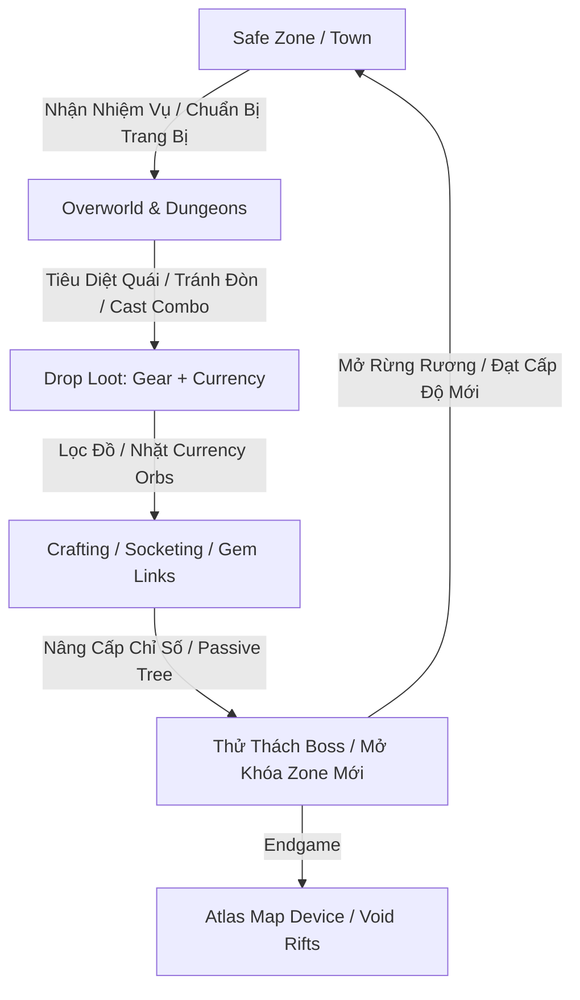

# MDG (Aethelis) - Thiết Kế & Lộ Trình Cải Thiện Gameplay & Hệ Thống

Tài liệu thiết kế chi tiết vòng lặp gameplay, hệ thống rơi đồ (Itemization & Loot), kiến trúc bản đồ (Map & Atlas System), cây nội tại (Passive Tree) và lộ trình phát triển theo từng giai đoạn chuẩn **PoE / Diablo + Universe Architecture v4.0**.

---

## 1. Vòng Lặp Gameplay Cốt Lõi (Core Gameplay Loop)



### 1.1. Chu kỳ cảm xúc của người chơi (Player Engagement Cycle)
1. **Kill Fast (Cảm giác hành động đã tay):** Đòn đánh dứt khoát, sát thương nổ số màu sắc theo loại nguyên tố (Physical, Fire, Cold, Lightning, Chaos), hiệu ứng âm thanh va chạm (Hit Impact) và rung màn hình nhẹ (Screen Shake khi Crit).
2. **Loot Excitement (Cảm giác rơi đồ kích thích):** Cột sáng (Loot Beam), âm thanh rơi đồ kim loại/ngọc quý ("Clink!"), phân loại màu sắc rõ ràng (Normal, Magic, Rare, Unique, Currency).
3. **Deep Customization (Độ sâu build đồ):** Không cố định class, sức mạnh đến từ việc phối hợp: **Chỉ số cơ bản + Cây Passive Tree + Ngọc kỹ năng (Gems & Links) + Trang bị rèn (Affixes)**.

---

## 2. Hệ Thống Vật Phẩm & Rơi Đồ (Itemization & Loot Drops)

Áp dụng trọn vẹn triết lý Itemization của *Path of Exile*: **Không dùng tiền vàng vô nghĩa, toàn bộ nền kinh tế vận hành bằng Currency Orbs dùng để chế tác**.

### 2.1. Phân cấp độ hiếm (Item Rarity)

| Cấp Độ Hiếm | Màu Sắc | Số Lượng Thuộc Tính (Affixes) | Ý Nghĩa / Mục Đích Sử Dụng |
| :--- | :---: | :---: | :--- |
| **Normal (Trắng)** | `#C8C8C8` | 0 Mod | Vật phẩm phôi (Base Item), dùng để đục lỗ hoặc nâng cấp bằng Tinh Thể Khởi Nguyên. |
| **Magic (Xanh dương)** | `#8888FF` | 1-2 Mods (1 Prefix, 1 Suffix) | Giai đoạn đầu game, dễ rèn lại thuộc tính. |
| **Rare (Vàng)** | `#FFFF77` | 3-6 Mods (Tối đa 3 Prefixes + 3 Suffixes) | Xương sống của trang bị mid/endgame. |
| **Unique (Cam nâu)** | `#AF6025` | Thuộc tính cố định đặc dị | Không thể đổi mod, thay đổi cơ chế gameplay (Keystone Changer). |
| **Genesis Currency (Vàng kim)** | `#AA9E82` | Tinh thể rèn đúc & xúc tác | Vừa là tiền tệ giao dịch, vừa là nguyên liệu ép đồ trực tiếp. |

### 2.2. Hệ Thống Tiền Tệ & Tinh Thể Rèn Đúc (Genesis Crafting Catalysts & Resonators)

| Tinh Thể Khởi Nguyên | Độ Hiếm (Drop Weight) | Tác Dụng Rèn Đúc | Vai Trò Kinh Tế (Sink / Faucet) |
| :--- | :---: | :--- | :--- |
| **Aether Spark** | $100$ (Common) | Đánh thức ma lực: Đồ Trắng $\rightarrow$ Đồ Xanh (Magic 1-2 mods). | Dễ nhặt ở đầu game, dùng chế đồ chuyển tiếp. |
| **Flux Catalyst** | $80$ (Common) | Reroll lại toàn bộ dòng của đồ Xanh (Magic). | Tiêu hao khi roll đồ phôi đầu game hoặc bình máu (Flasks). |
| **Genesis Prism** | $20$ (Uncommon) | Nâng cấp đồ Trắng $\rightarrow$ Đồ Vàng (Rare) với 4-6 dòng ngẫu nhiên. | Rèn trang bị Rare và ép tăng độ khó Map Endgame. |
| **Fracture Core** | $10$ (Rare) | Reroll lại toàn bộ dòng của đồ Vàng (Rare). | **Đơn vị tiền tệ chuẩn trong giao dịch server** và phí bàn rèn. |
| **Ascendant Catalyst** | $1.5$ (Very Rare) | Thêm 1 dòng ngẫu nhiên cực phẩm vào đồ Vàng chưa đủ 6 dòng. | Tiền tệ cao cấp cho việc hoàn thiện đồ End-game (Exalt Slam). |
| **Origin Matrix** | $0.3$ (Ultra Rare) | Tái cân chỉnh giá trị số (Roll min-max) của các dòng hiện có. | Đỉnh cao hoàn thiện trang bị God-tier. |
| **Socketing Core** | $30$ (Uncommon) | Thay đổi ngẫu nhiên số lượng rãnh khảm (Sockets 1-4). | Đục lỗ trang bị phục vụ gắn Skill Gems. |
| **Harmonic Tether** | $15$ (Uncommon) | Tái thiết lập các liên kết chuỗi (Socket Links) giữa các rãnh khảm. | Kết nối Active Gem với nhiều Support Gems. |

#### Cơ chế Tiêu Thụ Tiền Tệ Tránh Lạm Phát (Economy Sinks):
1. **Genesis Forge (Bàn Rèn Cổ Đại):** Khóa Tiền tố (Prefix Lock) tốn $2\times$ *Fracture Core*, Chế tạo dòng cố định tốn $1\times$ *Ascendant Catalyst*.
2. **Rift Infusion (Khuếch đại Bản Đồ):** Ép *Genesis Prism* / *Fracture Core* lên Rift Maps để tăng $+80\%$ Quantity đồ rơi.
3. **Mastery Respec:** Dùng *Flux Catalyst* để tẩy và phân bổ lại điểm trên Cây Tinh Hoa Kỹ Năng.

### 2.3. Cấu trúc Thuộc tính (Affix Pool: Prefixes & Suffixes)
Mỗi trang bị Rare có tối đa 3 Tiền tố (Prefix) và 3 Hậu tố (Suffix):
* **Prefixes (Chỉ số nền & Sát thương):** Flat Physical Damage, % Increased Physical Damage, Flat Max Life, Flat Energy Shield, +1 All Skill Gems.
* **Suffixes (Tiện ích & Phòng thủ):** % Resistances (Fire/Cold/Lightning/Chaos), % Attack/Cast Speed, % Critical Strike Chance, Attributes (Strength/Dexterity/Intelligence).

---

## 3. Hệ Thống Bản Đồ & Tiến Trình Thế Giới (Map & World Progression)

### 3.1. Phân cấp 3 Tầng Thế Giới (Three-Tier World Model)

```text
┌────────────────────────────────────────────────────────────────────────┐
│ TẦNG 1: CAMPAIGN OVERWORLD (Cốt truyện & Khám phá tuyến tính)           │
│  Act 1: Sanctuary Haven -> Whispering Plains -> Forgotten Crypt        │
│  Act 2: Sunken Marshlands -> Sunken Ruins -> Abyssal Depths            │
│  Act 3: Molten Caldera -> Dragonspine Peak -> The Core Rift            │
└──────────────────────────────────┬─────────────────────────────────────┘
                                   ▼
┌────────────────────────────────────────────────────────────────────────┐
│ TẦNG 2: WAYPOINT & FAST TRAVEL NETWORK (Hệ thống cổng dịch chuyển)      │
│  - Mở khóa mạng lưới bia đá (Waystones) khi bước qua.                  │
│  - Phím M mở World Map để dịch chuyển tức thời giữa các vùng an toàn.  │
└──────────────────────────────────┬─────────────────────────────────────┘
                                   ▼
┌────────────────────────────────────────────────────────────────────────┐
│ TẦNG 3: ENDGAME GENESIS RIFT SYSTEM (Hệ thống Rifts & Map Modifiers)   │
│  - Đặt "Rift Map Item" (Tier 1 -> 16) vào Cổng Vực Thẳm (Map Device).  │
│  - Ép Genesis Prism / Fracture Core lên Map để tăng độ khó và % Drop:  │
│    + "Monsters reflect 15% Elemental Damage" (+20% Quantity)           │
│    + "Monsters gain 100% Extra Physical as Fire" (+25% Rarity)         │
│    + "Players have -20% to all Maximum Resistances" (+35% Pack Size)   │
└────────────────────────────────────────────────────────────────────────┘
```

### 3.2. Thuật toán sinh Map ngẫu nhiên (Procedural Map Generation)
* **Overworld:** Sinh địa hình dạng Cellular Automata / Perlin Noise kết hợp Spline Road (Đường mòn nối giữa 2 cổng Portal).
* **Dungeon/Crypt:** Sinh theo thuật toán **BSP (Binary Space Partitioning)** hoặc **Room & Corridor Graph** tạo các căn phòng vuông vức kết nối bởi hành lang đá, có phòng Boss ở góc xa nhất.

---

## 4. Cây Kỹ Năng & Nội Tại (Skill Gems & Passive Tree)

### 4.1. Hệ thống Kỹ Năng dạng Ngọc (Socket & Link System)
1. **Active Skill Gem (Ngọc chủ động):** Gắn vào lỗ trên áo/vũ khí để có skill (ví dụ: *Fireball, Cyclone, Frost Nova*).
2. **Support Gem (Ngọc bổ trợ):** Gắn vào lỗ **được liên kết (Linked)** với ngọc chủ động để thay đổi bản chất skill:
   * *Fireball* + *Multiple Projectiles Support* $\rightarrow$ Bắn ra 5 quả cầu lửa hình quạt.
   * *Fireball* + *Cast On Critical Strike Support* $\rightarrow$ Tự động phóng hỏa khi đánh thường trúng chí mạng.
   * *Cyclone* + *Cast While Channelling* + *Meteor* $\rightarrow$ Vừa xoay kiếm vừa gọi thiên thạch dội xuống.

### 4.2. Cây Nội Tại Bát Ngát (Passive Skill Tree)
* Tất cả nhân vật xuất phát từ các điểm khác nhau trên 1 cây nội tại khổng lồ chung (Strength/Armor bên trái, Dexterity/Evasion bên phải, Intelligence/ES ở trên).
* **Keystones (Điểm then chốt thay đổi luật chơi):**
  * *Chaos Inoculation:* Máu tối đa trở thành 1, nhưng Miễn nhiễm 100% sát thương Chaos (Dồn toàn lực vào Energy Shield).
  * *Iron Reflexes:* Toàn bộ điểm Né tránh (Evasion) chuyển đổi thành Giáp (Armor).
  * *Avatar of Fire:* 50% sát thương vật lý/băng/sét chuyển thành Hỏa, không thể gây sát thương ngoài Hỏa.

---

## 5. Lộ Trình Triển Khai Kỹ Thuật Theo Từng Giai Đoạn (Phased Roadmap)

### Giai đoạn 1: Hoàn thiện Combat Feel & Loot Drop Cơ Bản (Sprint 1)
- [x] Tạo chuyển động mượt mà, khử sạch viền lưới và zoom camera in/out.
- [ ] Thêm hiệu ứng rơi đồ (Loot Drop Animation) khi quái chết:
  - Vật phẩm rơi dạng thẻ chữ màu bay lên rồi rơi xuống đất kèm tia sáng (Loot Beam).
  - Bấm chuột/phím `Space` hoặc `F` để nhặt đồ vào túi (Inventory).
- [ ] Thêm thanh máu Boss to phía trên đỉnh màn hình (Boss Health Bar).

### Giai đoạn 2: Hệ thống Trang bị & Currency Crafting trong Core C# (Sprint 2)
- [ ] Xây dựng `ItemEntity`, `ItemAffix`, `RarityEnum` trong `Mdg.Core.Features.Items`.
- [ ] Xây dựng bộ tính toán rơi đồ `LootTableCalculator` theo cấp độ quái (`MonsterLevel`) và chỉ số `ItemQuantity / ItemRarity` của người chơi.
- [ ] Hiện thực các Currency Orbs cơ bản (`Transmute`, `Augment`, `Alchemy`, `Chaos`).

### Giai đoạn 3: Hệ thống Gem Sockets & Support Links (Sprint 3)
- [ ] Cấu trúc dữ liệu `SocketLinkGroup` trên từng trang bị (1-6 lỗ, màu Red/Green/Blue).
- [ ] Kết nối logic Support Gem vào `SkillManager` của Core để tự động nhân multiplier (More/Less damage, Area of Effect, Extra Projectiles).

### Giai đoạn 4: Thuật toán Sinh Map Ngẫu Nhiên & Fog of War (Sprint 4)
- [ ] Viết bộ sinh Dungeon ngẫu nhiên bằng C# thuần (`ProceduralDungeonGenerator`).
- [ ] Tích hợp sương mù che khuất tầm nhìn (Fog of War / Darkness Exploration) trên Canvas và Minimap.

### Giai đoạn 5: Endgame Atlas & Server Multiplayer Synchronization (Sprint 5)
- [ ] Hệ thống Map Device và Affixes biến đổi quái vật trong hầm ngục.
- [ ] Đồng bộ hóa trạng thái qua WebSockets / WebRTC trên `Mdg.Server` với fixed tick 30 Hz.
