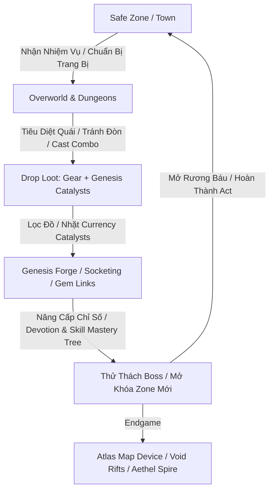

# MDG (Aethelis) - Thiết Kế & Lộ Trình Gameplay & Hệ Thống Đa Vũ Trụ

Tài liệu thiết kế chi tiết vòng lặp gameplay, hệ thống vật phẩm (Itemization & Loot), kiến trúc bản đồ (Map & Atlas System), cây nội tại (Passive / Devotion Tree), tích hợp cảm hứng từ **Sword Art Online (SAO)** và lộ trình phát triển theo chuẩn **ARPG Universe Architecture v4.0**.

---

## 1. Vòng Lặp Gameplay Cốt Lõi (Core Gameplay Loop) `[ĐÃ HOÀN THÀNH - ACTIVE]`

### 1.1. Chu kỳ cảm xúc của người chơi (Player Engagement Cycle) `[ĐÃ HOÀN THÀNH - ACTIVE]`
1. **Kill Fast (Cảm giác hành động đã tay):** Đòn đánh dứt khoát, sát thương nổ số theo loại nguyên tố (Physical, Fire, Cold, Lightning, Chaos), hiệu ứng va chạm (Hit Impact) và rung màn hình nhẹ (Screen Shake khi Crit).
2. **Loot Excitement (Cảm giác rơi đồ kích thích):** Cột sáng (Loot Beam), âm thanh rơi đồ kim loại/ngọc quý ("Clink!"), phân loại màu sắc rõ ràng (Normal, Magic, Rare, Unique, Genesis Currency).
3. **Deep Customization (Độ sâu build đồ):** Không cố định class, sức mạnh đến từ việc phối hợp: **Chỉ số cơ bản + Cây Celestial Devotion Tree + Cây Tinh Hoa Kỹ Năng (Skill Mastery) + Trang bị rèn (Affixes)**.

---

## 2. Hệ Thống Vật Phẩm & Rơi Đồ (Itemization & Loot Drops) `[ĐÃ HOÀN THÀNH - ACTIVE]`

Áp dụng trọn vẹn triết lý Itemization nguyên bản: **Toàn bộ nền kinh tế vận hành bằng Genesis Catalysts & Cores dùng để chế tác**.

### 2.1. Phân cấp độ hiếm (Item Rarity) `[ĐÃ HOÀN THÀNH - ACTIVE]`

| Cấp Độ Hiếm | Màu Sắc | Số Lượng Thuộc Tính (Affixes) | Ý Nghĩa / Mục Đích Sử Dụng |
| :--- | :---: | :---: | :--- |
| **Normal (Trắng)** | `#C8C8C8` | 0 Mod | Vật phẩm phôi (Base Item), dùng để đục lỗ hoặc nâng cấp bằng Tinh Thể Khởi Nguyên. |
| **Magic (Xanh dương)** | `#8888FF` | 1-2 Mods (1 Prefix, 1 Suffix) | Giai đoạn đầu game, dễ rèn lại thuộc tính. |
| **Rare (Vàng)** | `#FFFF77` | 3-6 Mods (Tối đa 3 Prefixes + 3 Suffixes) | Xương sống của trang bị mid/endgame. |
| **Unique (Cam nâu)** | `#AF6025` | Thuộc tính cố định đặc dị | Không thể đổi mod, thay đổi cơ chế gameplay (Keystone Changer). |
| **Genesis Currency (Vàng kim)** | `#AA9E82` | Tinh thể rèn đúc & xúc tác | Vừa là tiền tệ giao dịch, vừa là nguyên liệu ép đồ trực tiếp. |

### 2.2. Hệ Thống Tinh Thể Rèn Đúc (Genesis Crafting Catalysts & Cores) `[ĐÃ HOÀN THÀNH - ACTIVE]`

| Tinh Thể Khởi Nguyên | Độ Hiếm (Weight) | Tác Dụng Rèn Đúc | Vai Trò Kinh Tế (Sink / Faucet) |
| :--- | :---: | :--- | :--- |
| **Aether Spark** | $100$ (Common) | Đánh thức ma lực: Đồ Trắng $\rightarrow$ Đồ Xanh (Magic 1-2 mods). | Dễ nhặt ở đầu game, dùng chế đồ chuyển tiếp. |
| **Flux Catalyst** | $80$ (Common) | Reroll lại toàn bộ dòng của đồ Xanh (Magic). | Tiêu hao khi roll đồ phôi đầu game hoặc bình máu (Flasks). |
| **Genesis Prism** | $20$ (Uncommon) | Nâng cấp đồ Trắng $\rightarrow$ Đồ Vàng (Rare) với 4-6 dòng ngẫu nhiên. | Rèn trang bị Rare và ép tăng độ khó Map Endgame. |
| **Fracture Core** | $10$ (Rare) | Reroll lại toàn bộ dòng của đồ Vàng (Rare). | **Đơn vị tiền tệ chuẩn trong giao dịch server** và phí bàn rèn. |
| **Ascendant Catalyst** | $1.5$ (Very Rare) | Thêm 1 dòng ngẫu nhiên cực phẩm vào đồ Vàng chưa đủ 6 dòng. | Tiền tệ cao cấp cho việc hoàn thiện đồ End-game. |
| **Origin Matrix** | $0.3$ (Ultra Rare) | Tái cân chỉnh giá trị số (Roll min-max) của các dòng hiện có. | Đỉnh cao hoàn thiện trang bị God-tier. |
| **Socketing Core** | $30$ (Uncommon) | Thay đổi ngẫu nhiên số lượng rãnh khảm (Sockets 1-4). | Đục lỗ trang bị phục vụ gắn Skill Gems. |
| **Harmonic Tether** | $15$ (Uncommon) | Tái thiết lập các liên kết chuỗi (Socket Links) giữa các rãnh khảm. | Kết nối Active Gem với nhiều Support Gems. |

---

## 3. Hệ Thống Bản Đồ & Tiến Trình Thế Giới (Map & World Atlas) `[ĐÃ HOÀN THÀNH - ACTIVE]`

### 3.1. Phân cấp 3 Tầng Thế Giới `[ĐÃ HOÀN THÀNH - ACTIVE]`
* **Tầng 1: 9 Acts Campaign Overworld:** Trải dài từ Act 1 (`Sanctuary Haven`) đến Act 9 (`Genesis Core`), có đồ họa background đặc trưng, địa hình sinh tự động, quái tinh anh và Boss theo từng Act.
* **Tầng 2: Continental Atlas & Waypoint Network (Phím M):** Mở giao diện bản đồ đại lục toàn màn hình, hiển thị mạng lưới Leylines nối các điểm dịch chuyển, cho phép Teleport tức thời giữa các vùng đã khám phá.
* **Tầng 3: Endgame Map Device & Void Rifts (Phím O):** Đặt bản đồ Khe Nứt Vực Thẳm (Tier 1-16) kết hợp 3 mảnh đá cổ ngữ (Fragments) để tăng tỉ lệ rơi đồ và độ khó.

---

## 4. Cây Kỹ Năng & Thiên Cung Thần Lực (Devotion & Skill Mastery) `[ĐÃ HOÀN THÀNH - ACTIVE]`

### 4.1. Cây Chòm Sao Thiên Ân (Celestial Devotion Star Tree - Phím V) `[ĐÃ HOÀN THÀNH - ACTIVE]`
* **Gốc khởi nguyên (Genesis Nexus):** Nút trung tâm kết nối với 4 nhánh chòm sao cổ đại:
  1. 🔥 **The Phoenix:** Tăng Sát thương Hỏa, Kháng Hỏa, Bạo kích, kích hoạt bão lửa *Phoenix Firestorm* khi Crit.
  2. ❄️ **The Frost Warden:** Tăng Khiên ES, Giáp, Kháng Băng, kích hoạt khiên hộ mệnh *Glacial Barrier* khi dưới 35% máu.
  3. ⚡ **The Thunder Lord:** Tăng Tốc độ đánh/phép, Sát thương Sét, Tỉ lệ Crit, kích hoạt phóng điện *Chain Lightning* 3 mục tiêu.
  4. ☠️ **The Void Reaper:** Tăng Kháng Chaos, Hút máu (Leech), Sát thương Chaos, kích hoạt hút 10% Máu & ES khi hạ gục quái (*Void Siphon*).

### 4.2. Cây Tinh Hoa Kỹ Năng Riêng Biệt (Per-Skill Mastery Tree - Phím K) `[ĐÃ HOÀN THÀNH - ACTIVE]`
* Mỗi kỹ năng (Slash, Fireball, Frost Nova, Meteor, Dash) sở hữu bảng Socket Board và nhánh nâng cấp bổ trợ độc lập.

---

## 5. Tích Hợp Đánh Giá & Cơ Chế Vũ Trụ Sword Art Online (SAO) `[KẾ HOẠCH MỞ RỘNG - PLANNED]`

| Cơ chế SAO | Tiềm năng trong MDG | Phân tích Thiết kế Đề xuất cho MDG: Aethelis | Trạng thái |
| :--- | :--- | :--- | :--- |
| **Tháp 100 Tầng (Aincrad Spire)** | ⭐⭐⭐⭐⭐ (Rất cao) | **Endless Spire of Aethelis (Tháp Vô Tận)**: - Chế độ leo tầng sau 9 Act chính tuyến. - Mỗi tầng có quái tinh anh + Boss tầng canh cổng. - Mở khóa Waypoint vĩnh viễn và bảng xếp hạng (Leaderboard) theo tài khoản. | `[CẦN MỞ RỘNG - PLANNED]` |
| **Cơ chế Switch (Co-op Burst)** | ⭐⭐⭐⭐⭐ (Rất cao) | **Co-op Stagger & Switch Window**: - Khi người chơi A dùng kỹ năng tạo trạng thái *Stagger* (Choáng váng), boss xuất hiện vòng sáng *Switch Target* trong 3s. - Người chơi B lao vào đánh skill sẽ kích hoạt x2.0 Sát thương bạo kích và hiệu ứng âm thanh đặc biệt. | `[CẦN MỞ RỘNG - PLANNED]` |
| **Kỹ năng Ẩn (Unique Mastery)** | ⭐⭐⭐⭐ (Cao) | **Ascendant Keystones (Nút Thiên Phú Ẩn)**: - Mở khóa trong Skill Tree khi hoàn thành thử thách bí mật (ví dụ: Diệt Boss Act 4 không mất máu mở nhánh *Song kiếm Phản xạ* hoặc *Thánh thuẫn Hộ mệnh*). | `[CẦN MỞ RỘNG - PLANNED]` |
| **Hệ thống Danh tiếng (Karma Cursor)** | ⭐⭐⭐⭐ (Cao) | **Aethel Alignment (Hệ thống Khí sắc)**: - Viền avatar/tên nhân vật đổi màu theo trạng thái: 🟢 *Guardian* (hỗ trợ đồng đội), 🟡 *Wanderer* (trung lập), 🔴 *Shadow Outlaw* (khu vực PvP Contested Zone). | `[CẦN MỞ RỘNG - PLANNED]` |
| **Rèn Vũ khí Độc bản (Lisbeth Forge)** | ⭐⭐⭐⭐ (Cao) | **Genesis Boss Core Synthesizer**: - Ghép các lõi rớt từ Boss (`Dragon Core`, `Void Core`) với Catalyst để rèn vũ khí mang tên định danh riêng với chỉ số ngẫu nhiên cực đại. | `[CẦN MỞ RỘNG - PLANNED]` |

---

## 6. Tổng Hợp Bảng Trạng Thái Tiến Độ Toàn Dự Án (System Status Matrix)

| Hệ Thống / Module | Phân Hệ | Trạng Thái | Ghi Chú Kỹ Thuật |
| :--- | :--- | :---: | :--- |
| **Single Deep Progression (The Unbound)** | Core RPG | `[ĐÃ HOÀN THÀNH]` | 4 bậc tiến trình, 3 nhánh Ascendant class |
| **Hệ thống Combat & Mitigation** | Combat Engine | `[ĐÃ HOÀN THÀNH]` | Kháng nguyên tố, Giáp, ES, Evasion, Block Cap 75% |
| **Genesis Crafting & Currency** | Crafting / Forge | `[ĐÃ HOÀN THÀNH]` | Bàn rèn Genesis Forge Bench, 8 loại Catalysts & Cores |
| **Celestial Devotion Tree** | Passive System | `[ĐÃ HOÀN THÀNH]` | Cây chòm sao thiên văn, SVG leylines, 4 combat procs |
| **World Map Atlas & 9 Acts** | Map & Exploration | `[ĐÃ HOÀN THÀNH]` | Fullscreen Atlas (Phím M), 9 Acts, Fast Travel |
| **Multi-Character Roster & Google Auth** | Cloud & Account | `[ĐÃ HOÀN THÀNH]` | Google OAuth 2.0 Direct Auth, Roster nhiều nhân vật |
| **SignalR Multiplayer Co-op & Chat** | Multiplayer | `[ĐÃ HOÀN THÀNH]` | Thấy nhau trong cùng map, chat khu vực, sync combat |
| **Defeat & Resurrection Engine** | Death Penalty | `[ĐÃ HOÀN THÀNH]` | Scroll of Resurrection, Server-Authoritative Check |
| **Bestiary Lore & Codex** | Lore System | `[ĐÃ HOÀN THÀNH]` | Tra cứu quái vật, lore, chỉ số điểm yếu nguyên tố |
| **Endless Spire 100 Tầng (SAO)** | Endgame Mode | `[CẦN MỞ RỘNG]` | Tích hợp vào Map Device (Phím O) |
| **Co-op Stagger & Switch (SAO)** | Combat Sync | `[CẦN MỞ RỘNG]` | Tận dụng SignalR GameHub broadcast Stagger window |
| **Genesis Boss Core Synthesizer (SAO)** | Forge Expansion | `[CẦN MỞ RỘNG]` | Ghép Lõi Boss chế tạo vũ khí Unique |
