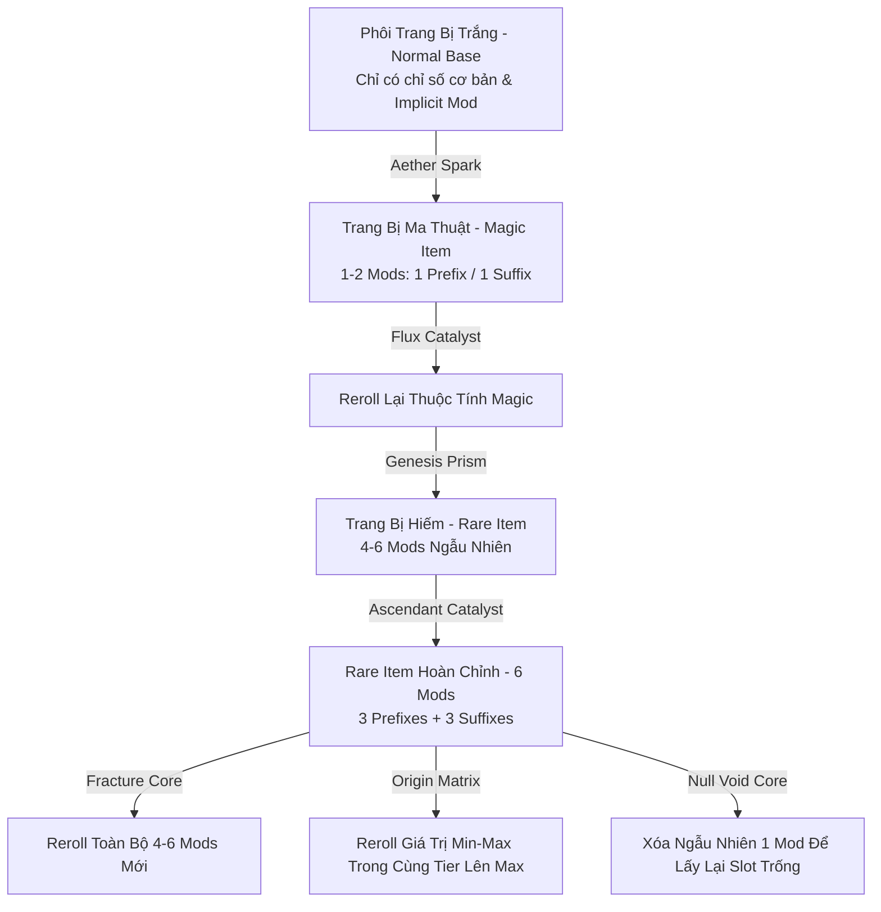

# ĐẶC TẢ THIẾT KẾ: HỆ THỐNG THUỘC TÍNH VẬT PHẨM & CƠ CHẾ CHẾ TÁC (ITEM AFFIXES & CRAFTING SYSTEM)
*Tài liệu kiến trúc hệ thống Thuộc Tính Tiền Tố / Hậu Tố (Prefixes & Suffixes), Phân Tầng Chỉ Số (Affix Tiers) & Cơ Chế Luyện Kim (Genesis Crafting Engine) cho MDG (Aethelis)*

---

## 1. Tổng Quan Triết Lý Thiết Kế Mod Vật Phẩm (Item Modifiers Philosophy) `[ĐÃ HOÀN THÀNH - ACTIVE]`

Hệ thống vật phẩm trong **MDG (Aethelis)** tuân theo chuẩn mực chiều sâu của thể loại ARPG kinh điển (Path of Exile / Diablo II):
1. **Phân Tách Rõ Ràng Tiền Tố (Prefix) & Hậu Tố (Suffix):** Mỗi nhóm mod đại diện cho các trường chỉ số chuyên biệt, ngăn ngừa việc trang bị bị mất cân bằng hoặc quá lệch một chiều.
2. **Quy Tắc Giới Hạn Theo Phẩm Cấp (Rarity Cap):**
   - **Magic (Xanh dương):** Tối đa 1 Prefix + 1 Suffix = **2 Mods**.
   - **Rare (Vàng kim):** Tối đa 3 Prefixes + 3 Suffixes = **6 Mods**.
   - **Unique (Cam nâu):** Sở hữu bộ Mod độc bản cố định, không thể can thiệp bằng chế tác thông thường.
3. **Phân Tầng Theo Cấp Độ Vật Phẩm (Item Level - iLvl & Tier Scaling):** Cấp độ phôi trang bị (iLvl) quyết định trần Tier của Affix (Tier 1 là mạnh nhất - God Roll, Tier 5 là cơ bản).
4. **Luyện Kim Ngẫu Nhiên & Có Điều Hướng (Deterministic & RNG Crafting):** Người chơi có thể dùng các loại Tinh Thể Khởi Nguyên (Genesis Catalysts) hoặc Bàn Luyện Kim (Forge Bench) để thêm, xóa, reroll hoặc khóa thuộc tính.



---

## 2. Cấu Trúc Affix: Tiền Tố (Prefix) vs Hậu Tố (Suffix) `[ĐÃ HOÀN THÀNH - ACTIVE]`

```text
┌─────────────────────────────────────────────────────────────────────────────┐
│ 🪓 [RARE] Dragonbone Greataxe (Item Level 78)                               │
├─────────────────────────────────────────────────────────────────────────────┤
│ TIỀN TỐ (PREFIXES) [Tối đa 3]:                                              │
│  [P1 - T1] +45 to Physical Damage (FlatPhys: 35-50)                         │
│  [P2 - T1] +58% Increased Physical Damage (IncPhys: 50-65%)                 │
│  [P3 - T2] +75 to Maximum Life (FlatLife: 70-85)                            │
├─────────────────────────────────────────────────────────────────────────────┤
│ HẬU TỐ (SUFFIXES) [Tối đa 3]:                                               │
│  [S1 - T1] +24% Increased Attack Speed (AttackSpeed: 20-25%)                │
│  [S2 - T1] +42% to Global Critical Strike Multiplier (CritMulti: 35-45%)   │
│  [S3 - T2] +32% to Fire Resistance (FireRes: 30-35%)                        │
└─────────────────────────────────────────────────────────────────────────────┘
```

---

## 3. Phân Tầng Thuộc Tính (Affix Tiers Scaling) `[ĐÃ HOÀN THÀNH - ACTIVE]`

Mỗi Affix có **5 Tiers**, yêu cầu cấp độ vật phẩm (`iLvl`) tương ứng để có thể roll ra:

| Tier | Yêu Cầu iLvl | Hệ Số Sức Mạnh (Scale Multiplier) | Màu Hiển Thị (Alt Detail) | Tỷ Lệ Trọng Số (Weight) | Trạng Thái |
| :---: | :---: | :---: | :---: | :---: | :---: |
| **Tier 1 (God Roll)** | $\text{iLvl} \ge 75$ | $100\%$ Max Value | `#FFD700` (Vàng kim) | $5\%$ (Rất hiếm) | `[ĐÃ HOÀN THÀNH]` |
| **Tier 2 (Pinnacle)** | $\text{iLvl} \ge 60$ | $80\% - 90\%$ Max Value | `#00F2FE` (Xanh ngọc) | $15\%$ | `[ĐÃ HOÀN THÀNH]` |
| **Tier 3 (Adept)** | $\text{iLvl} \ge 45$ | $65\% - 79\%$ Max Value | `#C678DD` (Tím nhạt) | $25\%$ | `[ĐÃ HOÀN THÀNH]` |
| **Tier 4 (Seasoned)** | $\text{iLvl} \ge 25$ | $50\% - 64\%$ Max Value | `#98C379` (Xanh lá) | $30\%$ | `[ĐÃ HOÀN THÀNH]` |
| **Tier 5 (Novice)** | $\text{iLvl} \ge 1$ | $35\% - 49\%$ Max Value | `#ABB2BF` (Trắng xám) | $25\%$ | `[ĐÃ HOÀN THÀNH]` |

---

## 4. Cơ Chế Luyện Kim & Chế Tác Vật Phẩm (Genesis Crafting Pipeline) `[ĐÃ HOÀN THÀNH - ACTIVE]`

Hệ thống cung cấp **8 loại Tinh thể Khởi Nguyên (Genesis Catalysts & Cores)** để thao tác với Affix Slots:

| Tên Catalyst | Icon | Chức Năng Luyện Kim | Quy Tắc Nghiệp Vụ | Trạng Thái |
| :--- | :---: | :--- | :--- | :---: |
| **Aether Spark** | 🔵 | Nâng cấp trang bị Normal thành **Magic** | Sinh ngẫu nhiên 1 hoặc 2 Affixes (1P hoặc 1P+1S). | `[ĐÃ HOÀN THÀNH]` |
| **Flux Catalyst** | 🔄 | Reroll lại toàn bộ thuộc tính trang bị **Magic** | Xóa sạch mod cũ, roll lại 1-2 Affixes mới. | `[ĐÃ HOÀN THÀNH]` |
| **Genesis Prism** | 💎 | Nâng cấp trang bị Normal thành **Rare** | Sinh ngẫu nhiên từ $4$ đến $6$ Affixes mới. | `[ĐÃ HOÀN THÀNH]` |
| **Fracture Core** | 🔮 | Reroll ngẫu nhiên toàn bộ trang bị **Rare** | Xóa sạch mod cũ, roll lại ngẫu nhiên 4-6 Affixes mới. | `[ĐÃ HOÀN THÀNH]` |
| **Ascendant Catalyst** | ✨ | Thêm 1 Affix cao cấp vào trang bị **Rare** | Chỉ áp dụng khi Rare item có $< 6$ mods. | `[ĐÃ HOÀN THÀNH]` |
| **Null Void Core** | ❌ | Xóa ngẫu nhiên $1$ Affix trên trang bị | Giúp giải phóng 1 slot mod xấu để tiếp tục craft. | `[ĐÃ HOÀN THÀNH]` |
| **Origin Matrix** | 👑 | Reroll giá trị số bên trong cùng Tier lên max range | Roll lại điểm Min-Max tối ưu trong dải Tier đó. | `[ĐÃ HOÀN THÀNH]` |
| **Socketing Core** | ⚪ | Tái cấu trúc số lượng Socket (1 đến 4 lỗ) | Phân bố lại số lượng ngọc có thể khảm vào trang bị. | `[ĐÃ HOÀN THÀNH]` |
| **Harmonic Tether** | 🔗 | Liên kết chuỗi các Socket (Socket Links) | Kích hoạt hiệu ứng liên kết hỗ trợ kỹ năng. | `[ĐÃ HOÀN THÀNH]` |

---

## 5. Bàn Luyện Kim Khởi Nguyên (Genesis Forge Bench - Phím B) `[ĐÃ HOÀN THÀNH - ACTIVE]`

Cho phép người chơi chế tạo **chính xác 1 Mod mong muốn** vào slot còn trống trên trang bị.

---

## 6. Kế Hoạch Mở Rộng: Lò Rèn Lõi Boss (Cảm Hứng SAO Lisbeth Forge) `[CẦN MỞ RỘNG - PLANNED]`

* **Boss Core Synthesizer:** Ghép các Lõi Boss hiếm (`Dragon Core`, `Void Core`, `Obsidian Heart`) với Genesis Catalysts để rèn vũ khí mang tên định danh riêng (`Named Unique Weapons`) với chỉ số ngẫu nhiên cực đại.
