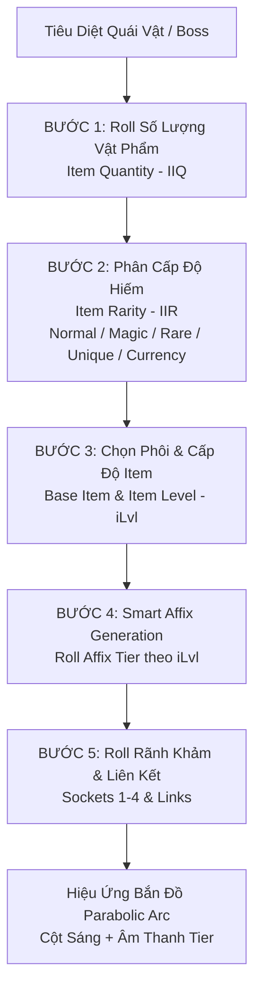

# ĐẶC TẢ THIẾT KẾ: HỆ THỐNG LOOT ĐỒ, TỶ LỆ RƠI & BỘ LỌC VẬT PHẨM (LOOT & DROP PIPELINE)
*Tài liệu kiến trúc hệ thống Rơi Đồ, Thuật toán Phân Bổ & Trải Nghiệm Nhặt Đồ (Loot Experience) cho MDG (Aethelis)*

---

## 1. Tổng Quan Triết Lý Rơi Đồ (Core Loot Philosophy)

Hệ thống Loot trong **MDG (Aethelis)** được xây dựng nhằm mang lại **cảm giác thỏa mãn cực độ (Dopamine Rush)** khi tiêu diệt quái vật, đồng thời loại bỏ tình trạng rác màn hình (Loot Clutter) thông qua 4 nguyên tắc cốt lõi:
1. **Ít Hơn Nhưng Chất Lượng Hơn (Quality over Quantity):** Giảm số lượng đồ rác vô giá trị, tăng trọng số thuộc tính có ích (Smart Loot Rolling).
2. **Server-Authoritative Drop Calculation:** Toàn bộ công thức tính toán số lượng, độ hiếm và thuộc tính vật phẩm được tính toán độc quyền trên Backend Server để chống gian lận.
3. **Cột Sáng & Âm Thanh Đặc Trưng (Visual Beams & Sound Tiering):** Mỗi phẩm cấp vật phẩm quý hiếm có hiệu ứng cột sáng và âm thanh rơi đồ riêng biệt.
4. **Hút Đồ Thông Minh & Linh Thú Thu Gom (Vacuum Loot & Pet Companion):** Nhặt 1 viên Tinh thể sẽ tự động gom toàn bộ Tinh thể cùng loại xung quanh.



---

## 2. Quy Trình 5 Bậc Tính Toán Rơi Đồ (The 5-Step Drop Pipeline)

### 2.1. Bước 1: Tính Số Lượng Vật Phẩm Rơi Ra (Increased Item Quantity - IIQ)
Số lượng vật phẩm rơi ra được quyết định bởi cấp bậc quái vật và chỉ số IIQ từ trang bị / bản đồ:

$$\text{Final Drop Count} = \text{Base Drops} \times \big( 1 + \sum \text{IIQ}_{\text{Player}} + \text{IIQ}_{\text{Map}} \big)$$

| Cấp Bậc Quái Vật | Số Lượng Rơi Cơ Bản (Base Drops) | Tỷ Lệ Rơi Tối Thiểu |
| :--- | :---: | :--- |
| **Normal Monster** | $0 - 1$ món | $35\%$ cơ hội rơi 1 món đồ hoặc Tinh thể |
| **Champion Pack** | $1 - 3$ món | $100\%$ chắc chắn rơi ít nhất 1 món |
| **Rare Elite** | $3 - 5$ món | Chắc chắn rơi $1$ món Rare + $1$ Tinh Thể Khởi Nguyên |
| **Pinnacle Boss** | $8 - 14$ món | Vụ nổ Loot (Loot Explosion) với bảo đảm đồ Unique & Tinh thể cao cấp |

---

### 2.2. Bước 2: Phân Định Phẩm Cấp Độ Hiếm (Increased Item Rarity - IIR)
Độ hiếm của từng món đồ được roll lần lượt từ cao xuống thấp (Unique $\rightarrow$ Rare $\rightarrow$ Magic $\rightarrow$ Normal):

$$\text{Rarity Threshold} = \frac{\text{Base Weight}}{\max\left(1.0, 1 + \text{IIR}_{\text{Player}} + \text{IIR}_{\text{Map}}\right)}$$

| Phẩm Cấp (Rarity) | Màu Nhận Diện | Cột Sáng (Beam) | Tỷ Lệ Cơ Bản (Base Weight) | Âm Thanh Rơi (Sound Tier) |
| :--- | :---: | :---: | :---: | :--- |
| **Unique (Độc Bản)** | `#AF6025` (Cam nâu) | Cột sáng Vàng Cam rực rỡ | $0.8\%$ | Tiếng chuông thánh ngân vang (Tier 1 Divine SFX) |
| **Genesis High Currency** | `#FFD700` (Vàng kim) | Cột sáng Trắng Kim | $1.2\%$ | Tiếng pha lê ngân dài vang vọng (Tier 1 Chime) |
| **Rare (Hiếm)** | `#FFFF77` (Vàng tươi)| Cột sáng Vàng nhạt | $15.0\%$ | Tiếng gõ kim loại sắc bén (Tier 2 SFX) |
| **Magic (Ma Thuật)** | `#8888FF` (Xanh dương)| Không | $35.0\%$ | Tiếng rơi nhẹ (Tier 3 SFX) |
| **Normal (Thường)** | `#C8C8C8` (Trắng xám) | Không | $48.0\%$ | Tiếng gạch đá va chạm cơ bản |

---

### 2.3. Bước 3: Cấp Độ Vật Phẩm (Item Level - iLvl) & Chọn Phôi (Base Item)
- **Công thức xác định iLvl:**
  - Quái Thường (Normal): $\text{iLvl} = \text{Zone Level}$
  - Quái Tinh Anh (Champion / Rare): $\text{iLvl} = \text{Zone Level} + 1$
  - Trùm (Pinnacle Boss): $\text{iLvl} = \text{Zone Level} + 2$
- **Ý nghĩa của iLvl:** Quyết định trần chỉ số tối đa (Affix Tiers) và số lượng lỗ tối đa có thể đục:
  - $\text{iLvl } 1 - 24$: Tối đa 2 Sockets, Affix Tier 4-5.
  - $\text{iLvl } 25 - 49$: Tối đa 3 Sockets, Affix Tier 2-3.
  - $\text{iLvl } 50+$: Tối đa 4 Sockets, Affix Tier 1 (God-tier Rolls).

---

### 2.4. Bước 4: Thuật Toán "Smart Loot" & Phân Tầng Thuộc Tính (Affix Tiers)
Để loại bỏ tình trạng nhặt được đồ Rare có thuộc tính vô dụng:
1. **Roll 2 lần lấy giá trị cao hơn (Advantage Roll):** Khi đồ Unique hoặc Rare cấp cao rơi ra, Server sẽ roll 2 lần cho mỗi giá trị số của Affix và chọn kết quả cao hơn.
2. **Quy tắc tương thích vũ khí:** Vũ khí cận chiến (Sword/Axe) có tỷ lệ roll ra *Physical Damage / Attack Speed* cao gấp 3 lần so với *Spell Damage / Cast Speed*.

---

### 2.5. Bước 5: Phân Bổ Rãnh Khảm & Liên Kết (Sockets & Socket Links)
- Khi vật phẩm rơi ra, hệ thống tự động roll số rãnh khảm và liên kết:
  - Tỷ lệ 1 Socket: $50\%$
  - Tỷ lệ 2 Sockets: $35\%$
  - Tỷ lệ 3 Sockets: $12\%$
  - Tỷ lệ 4 Sockets (Max): $3\%$
- Nếu roll được 4 Sockets và 4 Links kết nối hoàn chỉnh $\rightarrow$ Kích hoạt hiệu ứng đặc biệt **"4-Linked Drop Notification"**.

---

## 3. Trải Nghiệm Tương Tác Nhặt Đồ (Loot Interaction & UX)

```text
┌─────────────────────────────────────────────────────────────────────────────┐
│ 🌟 [UNIQUE] Crown of the Void (Hubris Circlet)   [Alt: Xem chi tiết Min-Max]│
├─────────────────────────────────────────────────────────────────────────────┤
│ 🔮 [CURRENCY] Fracture Core (x1)                 [Tự động hút trong 250px]  │
├─────────────────────────────────────────────────────────────────────────────┤
│ 💎 [CURRENCY] Genesis Prism (x1)                                            │
├─────────────────────────────────────────────────────────────────────────────┤
│ 🪓 [RARE] Dragonbone Greataxe (Item Level 65)                               │
└─────────────────────────────────────────────────────────────────────────────┘
```

### 3.1. Cơ Chế Hút Gom Đồ Tự Động (Vacuum Looting)
* Khi người chơi nhặt bất kỳ Tinh Thể Khởi Nguyên nào (ví dụ: *Aether Spark*, *Fracture Core*, *Genesis Shard*), toàn bộ Tinh Thể cùng loại nằm trong bán kính **250px (khoảng 8 ô lưới)** sẽ tự động bay vào túi đồ của người chơi cùng một lúc.

### 3.2. Linh Thú Đồng Hành Thu Gom (Loot Pet Companion)
* Linh thú có tầm di chuyển độc lập, tự động chạy đến nhặt các Tinh thể và Nguyên liệu rèn đúc rớt trên sàn đấu mà người chơi không cần nhấp chuột.
* Cung cấp tùy chọn bật/tắt: *Auto-Loot Currency*, *Auto-Loot Gems*, *Auto-Loot Rare Items*.

---

## 4. Hệ Thống Bộ Lọc Đồ Tích Hợp Sẵn (Built-in Dynamic Loot Filter)

Người chơi có thể chuyển đổi giữa **4 Chế Độ Lọc Đồ** ngay trong menu cài đặt mà không cần cài đặt file rời phức tạp:

| Cấp Bộ Lọc | Mục Đích Sử Dụng | Quy Tắc Lọc & Ẩn |
| :--- | :--- | :--- |
| **1. Normal (Tân Thủ)** | Giai đoạn Act 1 - Act 2 | Hiển thị tất cả mọi món đồ rơi trên sàn đấu. |
| **2. Semi-Strict (Chuyển Tiếp)**| Giai đoạn Act 3 - Cấp 50 | Ẩn toàn bộ đồ Trắng (Normal), chỉ hiện đồ Trắng có 3-4 Sockets. |
| **3. Strict (Endgame Tiêu Chuẩn)**| Vực Thẳm Rift Tiers 1-10 | Ẩn toàn bộ đồ Trắng và Xanh (Magic). Đồ Rare hiển thị font chữ vừa. Tinh thể cao cấp có viền sáng. |
| **4. Uber-Strict (Cực Phẩm)**| Vực Thẳm Rift Tiers 11-16 | Chỉ hiển thị: Đồ Unique, Đồ Rare iLvl 60+, Tinh thể từ *Genesis Prism / Fracture Core* trở lên. |

---

## 5. Cơ Chế Phân Bổ Loot Trong Tổ Đội (Party Loot Allocation)

Khi chơi chế độ Multiplayer Co-op, hệ thống cung cấp 3 cơ chế phân bổ rớt đồ:

1. **Instanced Loot (Loot Riêng Từng Người - Mặc Định):** Mỗi người chơi chỉ nhìn thấy và nhặt được phần đồ dành riêng cho mình. Không có xung đột nhặt đồ.
2. **Timed Priority Allocation (Ưu Tiên Có Thời Hạn):** Đồ rơi ra có tên người được ưu tiên trong **5 giây đầu tiên**. Sau 5 giây, vật phẩm chuyển sang trạng thái tự do (Free-For-All) cho bất kỳ ai nhặt.
3. **Free-For-All (Tự Do Hoàn Toàn):** Mọi thành viên trong Party nhìn thấy chung một bãi đồ và ai nhanh tay hơn sẽ nhặt được.

---

## 6. Lộ Trình Triển Khai Vào Mã Nguồn (Code Implementation Blueprint)

1. **C# Backend (`Mdg.Core/Features/Items/`):**
   - Mở rộng `LootTable.cs` để hỗ trợ công thức IIQ/IIR, iLvl base drop tables và roll Socket links.
   - Thêm class `LootFilterEngine.cs` để lọc danh sách drop trước khi gửi payload về Client.
2. **JavaScript Client (`wwwroot/js/`):**
   - Cập nhật `renderer.js`: Vẽ hiệu ứng Parabolic Arc khi vật phẩm rơi từ quái ra đất, vẽ cột sáng (Light Beams) cho đồ Unique/High Currency.
   - Cập nhật `combat.js` & `inventory.js`: Tích hợp cơ chế Vacuum Looting trong bán kính 250px và hỗ trợ phím `Alt` để ẩn/hiện nhãn tên đồ trên mặt đất.
