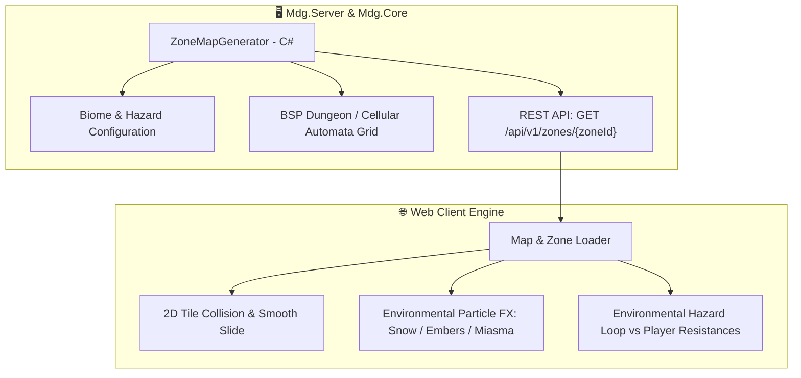

# Đặc Tả Thiết Kế Hệ Thống Map Biomes, Sinh Địa Hình Ngẫu Nhiên & Hiệu Ứng Môi Trường (Environmental Hazards)

## 1. Tổng Quan Kiến Trúc (Architecture Overview)

Hệ thống Bản đồ trong **My Dream Game (MDG)** được thiết kế theo tiêu chuẩn **Server-Authoritative Procedural Generation** kết hợp cơ chế **Environmental Hazards & Resistance Checks** (kiểm tra chỉ số kháng cự của nhân vật trước môi trường khắc nghiệt).



---

## 2. Phân Loại 6 Biome Môi Trường & Hiệu Ứng Đặc Trưng (Map Types & Biomes)

Mỗi Zone trong thế giới Aethelis thuộc về một **Biome Type** riêng biệt, mang các hiệu ứng môi trường tác động trực tiếp lên người chơi và quái vật:

| Biome Type | Icon | Tên Bản Đồ | Thuật Toán Sinh Map | Hiệu Ứng Môi Trường (Environmental Hazard) | Yêu Cầu Kháng Cự (Resistance Check) |
| :--- | :---: | :--- | :--- | :--- | :--- |
| **Sanctuary / Town** | 🌿 | **Sanctuary Haven** | Town Plaza & Perimeter Walls | `Breeze of Peace`: Tăng $+5\%$ HP/Mana Regen mỗi giây. Không có quái nguy hiểm. | Không yêu cầu |
| **Wild Plains** | 🌾 | **Whispering Plains** | Cellular Automata & Winding River | `Wild Winds`: Quái vật có tốc độ di chuyển tăng $+15\%$. Cỏ cây cản tầm nhìn nhẹ. | Kháng Cơ Bản |
| **Frostpeak Glacier** | ❄️ | **Frostpeak Tundra** | Glacial Crevasses & Ice Caves | `Permafrost Blizzard`: Bão tuyết lạnh giá làm chậm $-20\%$ Action Speed. Khi bị quái đánh, có **$35\%$ cơ hội bị Đóng Băng (Frozen)** $1.0\text{s}$. | **Cold Resistance $\ge 75\%$** (Triệt tiêu hoàn toàn tỷ lệ đóng băng môi trường). |
| **Molten Caldera** | 🔥 | **Molten Caldera** | Magma Rivers & Obsidian Islands | `Scorching Heatwave`: Đất nóng bốc hơi nung đỏ. Người chơi bị dính sát thương Hỏa DoT liên tục. | **Fire Resistance $\ge 75\%$** (Nếu dưới 75%, chịu $(75 - \text{FireRes}) \times 2.5$ Fire Dmg/s). |
| **Forgotten Crypt** | 🏰 | **Forgotten Crypt** | BSP Room-and-Corridor Dungeon | `Curse of Miasma`: Chướng khí độc và âm khí bóng tối. Giảm $-30\%$ khả năng hồi phục từ bình máu (Flask Recovery). | **Chaos Resistance $\ge 50\%$** (Giúp thanh lọc chướng khí, hồi phục bình thường). |
| **Stormpeak Crags** | ⚡ | **Stormpeak Ridge** | High Mountain Peaks & Thunder Paths | `Static Overload`: Sấm sét giáng ngẫu nhiên từ bầu trời. Nếu trúng đòn sét sẽ bị `Shock` nhận thêm $+35\%$ sát thương. | **Lightning Resistance $\ge 75\%$** (Giảm thời gian Shock và sát thương lôi giáng). |

---

## 3. Công Thức Tính Toán Sát Thương & Tỷ Lệ Hiệu Ứng Môi Trường

### 3.1. Cơ Chế Đóng Băng Bão Tuyết (Frostpeak Hazard)
$$\text{Freeze Chance on Hit} = \max\left(0\%, 40\% \times \left(1 - \frac{\text{Cold Resistance}}{75\%}\right)\right)$$
* *Ví dụ 1:* Người chơi có $\text{Cold Res} = 75\%$ $\implies$ Tỷ lệ đóng băng $= 0\%$ (Miễn nhiễm bão tuyết).
* *Ví dụ 2:* Người chơi có $\text{Cold Res} = 0\%$ $\implies$ Tỷ lệ đóng băng $= 40\%$ mỗi khi nhận đòn đánh từ quái vật.

### 3.2. Cơ Chế Thiêu Đốt Nham Thạch (Molten Hazard DoT)
$$\text{Lava Heat Damage Per Second} = \max\left(0, (75 - \text{Fire Resistance}) \times 2.5\right)$$
* *Ví dụ 1:* Người chơi có $\text{Fire Res} = 75\%$ $\implies \text{DoT} = 0$ HP/s.
* *Ví dụ 2:* Người chơi có $\text{Fire Res} = 25\%$ $\implies \text{DoT} = (75 - 25) \times 2.5 = 125$ Fire Dmg/s.

### 3.3. Cơ Chế Chướng Khí Hầm Ngục (Crypt Miasma Decay)
$$\text{Flask Recovery Multiplier} = \min\left(1.0, 0.7 + 0.3 \times \frac{\text{Chaos Resistance}}{50\%}\right)$$
* *Ví dụ:* Nếu $\text{Chaos Res} \le 0\%$, khả năng hồi phục máu của bình máu chỉ đạt $70\%$ so với thông thường.

---

## 4. Hệ Thống Bản Đồ Ngẫu Nhiên Đa Tầng (Endgame Map Affixes - Atlas Modifiers)

Sau khi hoàn thành cốt truyện cơ bản, người chơi có thể nhặt các bản đồ **Atlas Maps** (Map Tiers 1-16) và dùng Orb để đập dòng (Craft Map Affixes) tăng độ khó để nhận bội số đồ rơi cực khủng:

```text
┌─────────────────────────────────────────────────────────────────────────────┐
│ 🗺️ TIER 10 FROSTPEAK GLACIER (RARE MAP)                                    │
├─────────────────────────────────────────────────────────────────────────────┤
│ 📜 Map Affixes:                                                             │
│  • [Prefix] Monsters deal +45% Extra Damage as Cold                        │
│  • [Prefix] +35% Monster Pack Size & +20% Magic Monsters                   │
│  • [Suffix] Players have -25% to all Elemental Resistances                 │
│  • [Suffix] Area has patches of Burning & Chilling Ground                  │
├─────────────────────────────────────────────────────────────────────────────┤
│ 💎 Reward Multipliers:                                                      │
│  • Item Quantity: +78%                                                     │
│  • Item Rarity:   +112%                                                    │
│  • Monster Exp:   +40%                                                     │
└─────────────────────────────────────────────────────────────────────────────┘
```

---

## 5. Lộ Trình Triển Khai (Implementation Steps)

1. **Backend C# (`Mdg.Core/Features/Maps/`):**
   * Định nghĩa `ZoneBiomeType`, `EnvironmentalHazardConfig`, `ZoneMapDto`.
   * Cài đặt `ZoneMapGenerator` với các thuật toán sinh map theo Biome (Plains, Tundra, Caldera, BSP Crypt).
   * Đăng ký endpoint `GET /api/v1/zones/{zoneId}` và `GET /api/v1/zones/biomes` trong `Program.cs`.
2. **Frontend Client (`main.js`, `combat.js`, `renderer.js`):**
   * Fetch `ZoneMapDto` từ Server khi người chơi bước qua Cổng hoặc Fast Travel.
   * Render hạt hiệu ứng thời tiết theo Biome (Tuyết rơi ở Tundra, Tàn lửa bay ở Caldera, Hạt chướng khí xanh ở Crypt).
   * Kích hoạt vòng lặp `HazardTicker` kiểm tra Kháng Cự của nhân vật và hiển thị cảnh báo UI (`⚠️ Cold Res Low! Susceptible to Freeze`).
