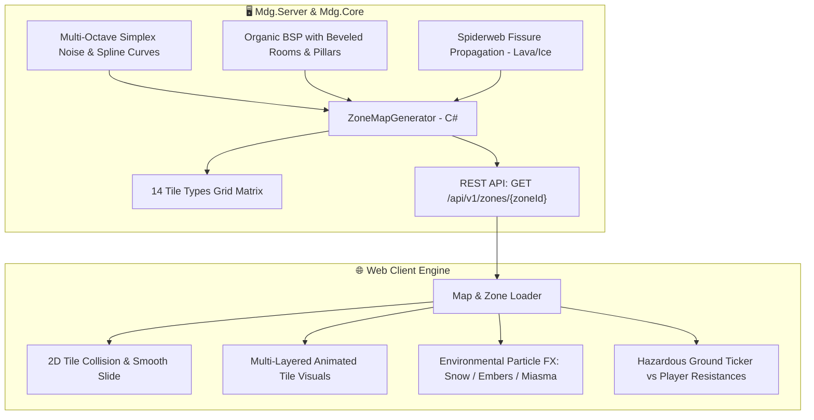

# ĐẶC TẢ THIẾT KẾ: ĐỊA HÌNH BIOMES & NGUY CƠ MÔI TRƯỜNG TỰ NHIÊN (MAP BIOMES & HAZARDS)

---

## 1. Kiến Trúc Sinh Địa Hình Server-Authoritative `[ĐÃ HOÀN THÀNH - ACTIVE]`

---

## 2. Hệ Thống 14 Phân Loại Ô Địa Hình (14 Tile Types Matrix) `[ĐÃ HOÀN THÀNH - ACTIVE]`

| Mã Tile | Tên Địa Hình | Đặc Tính Vật Lý | Tác Động Gameplay & Hiệu Ứng | Trạng Thái |
| :---: | :--- | :---: | :--- | :---: |
| `0` | **Natural Floor (Đất/Cỏ tự nhiên)** | Đi lại tự do | Nền tảng cơ bản theo Biome (Cỏ xanh, Tuyết trắng, Tro núi lửa). | `[ĐÃ HOÀN THÀNH]` |
| `1` | **Solid Wall (Vách đá / Tường thành)**| Cản hoàn toàn | Đổ bóng 3D, chặn tầm nhìn và đường bay của đạn thẳng. | `[ĐÃ HOÀN THÀNH]` |
| `2` | **Deep Water (Nước sâu)** | Không thể đi | Sông ngòi tự nhiên, phản chiếu ánh sáng và bọt sóng chuyển động. | `[ĐÃ HOÀN THÀNH]` |
| `3` | **Worn Cobblestone Path (Đường mòn)** | Tăng $+10\%$ Tốc chạy | Lối mòn đá cổ dẫn thẳng tới các cổng Portal dịch chuyển. | `[ĐÃ HOÀN THÀNH]` |
| `4` | **Ancient Plaza (Quảng trường)** | Khu vực an toàn | Gạch đá hoa cương lát tâm thị trấn Sanctuary Haven. | `[ĐÃ HOÀN THÀNH]` |
| `5` | **Molten Lava (Dung Nham Sôi Sục)** | Địa hình nguy hiểm | **Chịu 40 Fire Dmg/s** (giảm theo Fire Res) + Dính thiêu đốt Ignite. | `[ĐÃ HOÀN THÀNH]` |
| `6` | **Toxic Miasma Bog (Bãi Chướng Khí)** | Địa hình nguy hiểm | **Chịu 30 Chaos Dmg/s** + Giảm $40\%$ hiệu lực hồi máu bình Flask. | `[ĐÃ HOÀN THÀNH]` |
| `7` | **Glacial Slippery Ice (Băng Trơn)**| Địa hình nguy hiểm | **Chịu 20 Cold Dmg/s** + Làm chậm $-50\%$ tốc độ chạy (Chilled). | `[ĐÃ HOÀN THÀNH]` |
| `8` | **Static Electric Ground (Sét Điện)**| Địa hình nguy hiểm | **Chịu 25 Lightning Dmg/s** + Dính hiệu ứng Shock $+25\%$ sát thương. | `[ĐÃ HOÀN THÀNH]` |
| `9` | **Shallow Sand & Shoals (Bãi Cát Nông)**| Đi lại tự do | Bờ cát ven sông/bờ hồ, làm mềm ranh giới giữa đất liền và nước sâu. | `[ĐÃ HOÀN THÀNH]` |
| `10`| **Ancient Stone Pillar (Cột Đá Cổ)** | Cản đạn & di chuyển | Trụ đá phế tích cổ đại dùng làm điểm ẩn nấp (Cover) trước đòn bắn của quái. | `[ĐÃ HOÀN THÀNH]` |
| `11`| **Abyssal Chasm (Vực Thẳm Không Đáy)**| Không thể đi | Vực sâu hun hút trong Stormpeak Ridge và Hầm ngục Forgotten Crypt. | `[ĐÃ HOÀN THÀNH]` |
| `12`| **Deep Snow Drift (Tuyết Dày)** | Làm chậm $-15\%$ | Đụn tuyết dày tích tụ ở sườn núi Frostpeak Tundra. | `[ĐÃ HOÀN THÀNH]` |
| `13`| **Scorched Earth (Đất Cháy Xém)** | Đi lại tự do | Vết tàn tích cháy đen xung quanh các miệng núi lửa và bãi dung nham. | `[ĐÃ HOÀN THÀNH]` |

---

## 3. Thuật Toán Sinh Địa Hình Tự Nhiên & Hữu Cơ `[ĐÃ HOÀN THÀNH - ACTIVE]`

1. **Plains & Rivers (Sông Ngòi Uốn Khúc Hữu Cơ):** Sử dụng Cubic Spline Interpolation kết hợp Perlin Noise tạo dòng sông mềm mại, bãi cát bồi và các cây cầu tự nhiên.
2. **Volcanic Spiderweb Fissures (Vết Nứt Nham Thạch Núi Lửa):** Áp dụng Random Walk Branching để vết nứt dung nham lan tỏa từ tâm miệng núi lửa ra xung quanh.
3. **Organic Crypt Dungeon (Hầm Ngục Đẽo Góc & Cột Đá Cổ):** BSP kết hợp Cellular Corner Smoothing và bố trí cột đá cổ che chắn.
4. **Glacial Ridges & Crevasses (Sườn Băng & Đụn Tuyết):** Simplex Ridge Noise tạo các rãnh nứt băng tuyết và tuyết dày.

---

## 4. Kế Hoạch Mở Rộng Địa Hình Theo Cảm Hứng SAO `[CẦN MỞ RỘNG - PLANNED]`

* **Endless Labyrinth Spire Generator:** Thuật toán sinh mê cung tháp nhiều tầng với độ phức tạp tăng dần từ Tầng 1 đến Tầng 100.
* **Boss Room Chamber:** Phòng đấu trùm khép kín tự động phong tỏa khi người chơi bước vào cho đến khi Boss bị tiêu diệt.
