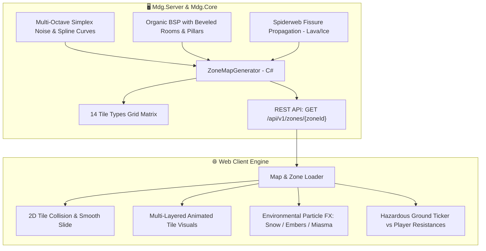

---

## 2. Hệ Thống 14 Phân Loại Ô Địa Hình Đa Dạng (Expanded 14 Tile Types Matrix)

Để loại bỏ cảm giác khối vuông cơ học đơn điệu, thế giới Aethelis sử dụng ma trận **14 loại Tile địa hình sinh động**:

| Mã Tile | Tên Địa Hình | Đặc Tính Vật Lý | Tác Động Gameplay & Hiệu Ứng |
| :---: | :--- | :---: | :--- |
| `0` | **Natural Floor (Đất/Cỏ tự nhiên)** | Đi lại tự do | Nền tảng cơ bản theo Biome (Cỏ xanh, Tuyết trắng, Tro núi lửa). |
| `1` | **Solid Wall (Vách đá / Tường thành)**| Cản hoàn toàn | Đổ bóng 3D, chặn tầm nhìn và đường bay của đạn thẳng. |
| `2` | **Deep Water (Nước sâu)** | Không thể đi | Sông ngòi tự nhiên, phản chiếu ánh sáng và bọt sóng chuyển động. |
| `3` | **Worn Cobblestone Path (Đường mòn)** | Tăng $+10\%$ Tốc chạy | Lối mòn đá cổ dẫn thẳng tới các cổng Portal dịch chuyển. |
| `4` | **Ancient Plaza (Quảng trường)** | Khu vực an toàn | Gạch đá hoa cương lát tâm thị trấn Sanctuary Haven. |
| `5` | **Molten Lava (Dung Nham Sôi Sục)** | Địa hình nguy hiểm | **Chịu 40 Fire Dmg/s** (giảm theo Fire Res) + Dính thiêu đốt Ignite. |
| `6` | **Toxic Miasma Bog (Bãi Chướng Khí)** | Địa hình nguy hiểm | **Chịu 30 Chaos Dmg/s** + Giảm $40\%$ hiệu lực hồi máu bình Flask. |
| `7` | **Glacial Slippery Ice (Băng Trơn)**| Địa hình nguy hiểm | **Chịu 20 Cold Dmg/s** + Làm chậm $-50\%$ tốc độ chạy (Chilled). |
| `8` | **Static Electric Ground (Sét Điện)**| Địa hình nguy hiểm | **Chịu 25 Lightning Dmg/s** + Dính hiệu ứng Shock $+25\%$ sát thương. |
| `9` | **Shallow Sand & Shoals (Bãi Cát Nông)**| Đi lại tự do | Bờ cát ven sông/bờ hồ, làm mềm ranh giới giữa đất liền và nước sâu. |
| `10`| **Ancient Stone Pillar (Cột Đá Cổ)** | Cản đạn & di chuyển | Trụ đá phế tích cổ đại dùng làm điểm ẩn nấp (Cover) trước đòn bắn của quái. |
| `11`| **Abyssal Chasm (Vực Thẳm Không Đáy)**| Không thể đi | Vực sâu hun hút trong Stormpeak Ridge và Hầm ngục Forgotten Crypt. |
| `12`| **Deep Snow Drift (Tuyết Dày)** | Làm chậm $-15\%$ | Đụn tuyết dày tích tụ ở sườn núi Frostpeak Tundra. |
| `13`| **Scorched Earth (Đất Cháy Xém)** | Đi lại tự do | Vết tàn tích cháy đen xung quanh các miệng núi lửa và bãi dung nham. |

---

## 3. Thuật Toán Sinh Địa Hình Tự Nhiên & Hữu Cơ (Organic Procedural Algorithms)

1. **Plains & Rivers (Sông Ngòi Uốn Khúc Hữu Cơ):**
   - Sử dụng **Cubic Spline Interpolation** kết hợp **Perlin Noise** tạo dòng sông uốn khúc mềm mại thay vì sóng sin cố định.
   - Tự động sinh bãi cát bồi (`TILE_SHALLOW_WATER_SAND`) và 2-3 cây cầu đá/gỗ tự nhiên bắc qua các điểm thắt cổ chai hẹp nhất của dòng sông.
2. **Volcanic Spiderweb Fissures (Vết Nứt Nham Thạch Núi Lửa):**
   - Áp dụng thuật toán **Random Walk Branching (Fissure Propagation)** để các dòng dung nham nứt nẻ lan tỏa từ trung tâm miệng núi lửa ra các nhánh phụ.
   - Bao quanh các dòng dung nham là dải đất cháy xém (`TILE_BURNT_GROUND`) tạo độ chân thật.
3. **Organic Crypt Dungeon (Hầm Ngục Đẽo Góc & Cột Đá Cổ):**
   - Thuật toán **BSP** kết hợp **Cellular Corner Smoothing**: Các phòng không còn là hình hộp vuông vức mà được vát góc, đục hốc tường và bố trí các cụm cột đá cổ (`TILE_ANCIENT_PILLAR`) để che chắn.
4. **Glacial Ridges & Crevasses (Sườn Băng & Đụn Tuyết):**
   - Sử dụng **Simplex Ridge Noise** sinh các rãnh nứt băng tuyết hiểm trở xen kẽ các dải tuyết dày (`TILE_DEEP_SNOW`).

---

## 4. Công Thức Tính Toán Sát Thương & Tỷ Lệ Hiệu Ứng Môi Trường

### 3.1. Cơ Chế Đóng Băng Bão Tuyết (Frostpeak Hazard)
$$\text{Freeze Chance on Hit} = \max\left(0\%, 40\% \times \left(1 - \frac{\text{Cold Resistance}}{75\%}\right)\right)$$
* *Ví dụ 1:* Người chơi có $\text{Cold Res} = 75\%$ $\implies$ Tỷ lệ đóng băng $= 0\%$ (Miễn nhiễm bão tuyết).
* *Ví dụ 2:* Người chơi có $\text{Cold Res} = 0\%$ $\implies$ Tỷ lệ đóng băng $= 40\%$ mỗi khi nhận đòn đánh từ quái vật.

### 3.2. Cơ Chế Thiêu Đốt Nham Thạch (Molten Hazard DoT)
$$\text{Lava Heat Damage Per Second} = \max\left(0, (75 - \text{Fire Resistance}) \times 2.5\right)$$
* *Ví dụ 1:* Người chơi có $\text{Fire Res} = 75\%$ $\implies \text{DoT} = 0$ HP/s.
* *Ví dụ 2:* Người chơi có $\text{Fire Res} = 25\%$ $\implies \text{DoT} = (75 - 25) \times 2.5 = 125$ Fire Dmg/s.

### 3.3. Cơ Chế Chướng Khí Hầm Ngục (Crypt Miasma Decay)
$$\text{Flask Recovery Multiplier} = \min\left(1.0, 0.7 + 0.3 \times \frac{\text{Chaos Resistance}}{50\%}\right)$$
* *Ví dụ:* Nếu $\text{Chaos Res} \le 0\%$, khả năng hồi phục máu của bình máu chỉ đạt $70\%$ so với thông thường.

---

### 3.4. Cơ Chế Trừ HP Khi Bước Vào Ô Địa Hình Nguy Hiểm (Tile-Based Hazardous Ground)

Bên cạnh hiệu ứng thời tiết chung của toàn Biome, người chơi và quái vật khi **bước chân trực tiếp vào các ô địa hình đặc thù (Hazard Tiles)** sẽ bị trừ máu và dính hiệu ứng theo thời gian thực:

```mermaid
graph TD
    Step[Người chơi di chuyển vào Tọa độ Tile (tx, ty)] --> Check{Loại Ô Địa Hình?}
    Check -->|TILE_LAVA = 5| L[🔥 Vũng Dung Nham Sôi Sục<br>Chịu 40 Fire Damage/s + Thiêu Đốt Ignite]
    Check -->|TILE_TOXIC_MIASMA = 6| P[☠️ Bãi Chướng Khí Độc Tố<br>Chịu 30 Chaos Damage/s + Giảm 40% Hồi Bình Máu]
    Check -->|TILE_GLACIAL_ICE = 7| I[❄️ Băng Trơn Vực Thẳm<br>Chịu 20 Cold Damage/s + Giảm 50% Tốc Độ Di Chuyển]
    Check -->|TILE_ELECTRIC_GROUND = 8| E[⚡ Vết Nứt Sét Tĩnh Điện<br>Chịu 25 Lightning Damage/s + Dính Hiệu Ứng Shock +25%]
```

| Loại Ô Địa Hình | Mã Tile | Sát Thương Cơ Bản / Giây | Công Thức Giảm Trừ Kháng Cự | Hiệu Ứng Trạng Thái Đi Kèm (Status Ailment) |
| :--- | :---: | :---: | :--- | :--- |
| **Lava Ground (Dung Nham)** | `5` | $40\text{ Fire Dmg/s}$ | $\text{Dmg} = 40 \times \left(1 - \frac{\text{FireRes}}{100}\right)$ | Bị **Ignite** (cháy liên tục trong $2.0\text{s}$ sau khi rời khỏi ô). |
| **Toxic Miasma (Bãi Độc)** | `6` | $30\text{ Chaos Dmg/s}$ | $\text{Dmg} = 30 \times \left(1 - \frac{\text{ChaosRes}}{100}\right)$ | Bỏ qua Khiên Năng Lượng (trừ thẳng vào Máu), giảm $-40\%$ hồi phục bình máu. |
| **Glacial Ice (Băng Giá)** | `7` | $20\text{ Cold Dmg/s}$ | $\text{Dmg} = 20 \times \left(1 - \frac{\text{ColdRes}}{100}\right)$ | Làm chậm tốc độ chạy $-50\%$ (Chilled). Nếu $\text{ColdRes} < 50\%$, có $25\%$ cơ hội Đóng băng $1\text{s}$. |
| **Static Ground (Sét Điện)** | `8` | $25\text{ Lightning Dmg/s}$ | $\text{Dmg} = 25 \times \left(1 - \frac{\text{LightningRes}}{100}\right)$ | Gây trạng thái **Shock** (tăng $+25\%$ toàn bộ sát thương nhận vào). |

---

## 4. Hệ Thống Bản Đồ Ngẫu Nhiên Đa Tầng (Endgame Map Affixes - Atlas Modifiers)

Sau khi hoàn thành cốt truyện cơ bản, người chơi có thể nhặt các bản đồ **Atlas Maps** (Map Tiers 1-16) và dùng Orb để đập dòng (Craft Map Affixes) tăng độ khó để nhận bội số đồ rơi cực khủng:

```text
┌─────────────────────────────────────────────────────────────────────────────┐
│ 🗺️ TIER 10 FROSTPEAK GLACIER (RARE MAP)                                    │
├─────────────────────────────────────────────────────────────────────────────┤
│ 📜 Map Affixes:                                                             │
│  • [Prefix] Monsters deal +45% Extra Damage as Cold                        │
│  • [Prefix] +35% Monster Pack Size & +20% Magic Monsters                   │
│  • [Suffix] Players have -25% to all Elemental Resistances                 │
│  • [Suffix] Area has patches of Burning & Chilling Ground                  │
├─────────────────────────────────────────────────────────────────────────────┤
│ 💎 Reward Multipliers:                                                      │
│  • Item Quantity: +78%                                                     │
│  • Item Rarity:   +112%                                                    │
│  • Monster Exp:   +40%                                                     │
└─────────────────────────────────────────────────────────────────────────────┘
```

---

## 5. Lộ Trình Triển Khai (Implementation Steps)

1. **Backend C# (`Mdg.Core/Features/Maps/`):**
   * Định nghĩa `ZoneBiomeType`, `EnvironmentalHazardConfig`, `ZoneMapDto`.
   * Cài đặt `ZoneMapGenerator` với các thuật toán sinh map theo Biome (Plains, Tundra, Caldera, BSP Crypt).
   * Đăng ký endpoint `GET /api/v1/zones/{zoneId}` và `GET /api/v1/zones/biomes` trong `Program.cs`.
2. **Frontend Client (`main.js`, `combat.js`, `renderer.js`):**
   * Fetch `ZoneMapDto` từ Server khi người chơi bước qua Cổng hoặc Fast Travel.
   * Render hạt hiệu ứng thời tiết theo Biome (Tuyết rơi ở Tundra, Tàn lửa bay ở Caldera, Hạt chướng khí xanh ở Crypt).
   * Kích hoạt vòng lặp `HazardTicker` kiểm tra Kháng Cự của nhân vật và hiển thị cảnh báo UI (`⚠️ Cold Res Low! Susceptible to Freeze`).
