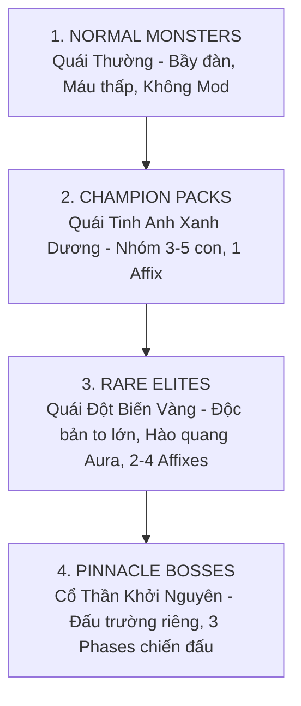
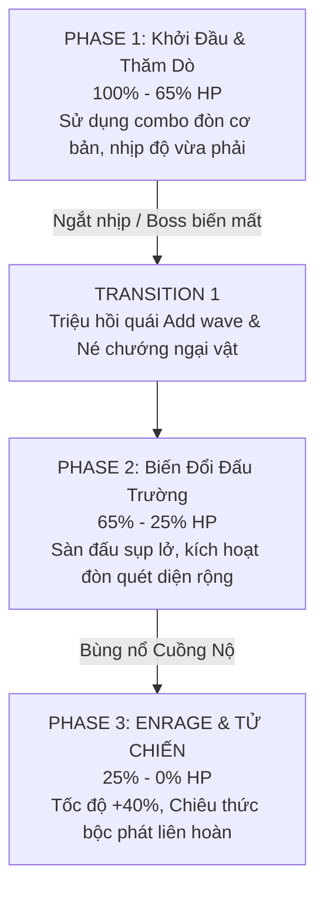

# ĐẶC TẢ THIẾT KẾ: HỆ THỐNG QUÁI VẬT, THUỘC TÍNH TINH ANH & TRÙM TỐI THƯỢNG (MONSTER AFFIXES & BOSS PHASES)
*Tài liệu phân tích cân bằng AI, Hệ sinh thái Quái vật & Thiết kế Trận đánh Trùm cho MDG (Aethelis)*

---

## 1. Phân Cấp Bậc Quái Vật (Monster Rarity & Hierarchy)

Hệ sinh thái quái vật trong thế giới Aethelis được chia làm **4 cấp bậc rõ rệt**, tăng dần về lượng máu, sát thương, hệ số rơi đồ và độ phức tạp của hành vi AI:

| Cấp Bậc | Màu Tên | Hệ Số Máu (HP Scale) | Hệ Số Rơi Đồ (Drop Scale) | Số Lượng Thuộc Tính (Affixes) | Đặc Điểm Chiến Thuật |
| :--- | :---: | :---: | :---: | :---: | :--- |
| **Normal (Thường)** | `#FFFFFF` | $1.0\times$ | $1.0\times$ | 0 | Đi theo đàn lớn (8-15 con), dùng để farm EXP nhanh và nạp bình máu (Flask Charges). |
| **Champion (Tinh Anh)** | `#8888FF` | $3.5\times$ | $3.0\times$ | 1 Mod | Xuất hiện theo cụm 3-5 con, cùng chia sẻ 1 hiệu ứng đặc thù (ví dụ: *Tăng tốc* hoặc *Băng phong*). |
| **Rare (Đột Biến)** | `#FFFF77` | $8.0\times$ | $6.5\times$ | 2 - 4 Mods | Thể hình to lớn $+30\%$, mang Hào quang cường hóa bầy tiểu quái xung quanh. |
| **Pinnacle Boss (Trùm)** | `#FF8800` | $35.0\times - 80.0\times$ | $20.0\times$ | Bộ kỹ năng độc bản (3 Phases) | Kháng choáng mạnh, có cơ chế né đòn (Telegraph Attacks) và chuyển giao Phase khi tuột mốc máu. |

---

## 2. Hệ Thống Thuộc Tính Quái Đột Biến (Monster Affix Pool)

Quái vật Rare/Elite sẽ ngẫu nhiên sở hữu từ **2 đến 4 thuộc tính (Affixes)** trong danh sách dưới đây:

### 2.1. Nhóm Nguyên Tố & Sát Thương (Offensive Affixes)

| Tên Affix | Icon | Hiệu Ứng Chiến Đấu | Cách Khắc Chế Cho Người Chơi |
| :--- | :---: | :--- | :--- |
| **Magma Conduit** | 🔥 | Đòn đánh gây thêm $+40\%$ Sát thương Lửa. Khi bị đánh trúng, phóng ra các quả cầu dung nham nổ xung quanh. | Đạt Fire Res $\ge 75\%$, di chuyển liên tục tránh vũng dung nham. |
| **Frostpulse** | ❄️ | Tỏa ra luồng sóng băng định kỳ mỗi 3s gây Chậm $-30\%$ và có $25\%$ cơ hội Đóng băng người chơi. | Giữ khoảng cách tầm xa hoặc dùng kỹ năng giải dị tật (Dash / Unfreeze Flask). |
| **Static Discharge**| ⚡ | Khi nhận đòn, phóng ra 3 tia sét giật chuỗi gây hiệu ứng `Shock` (nhận thêm $+25\%$ sát thương). | Tránh đánh đa đòn quá dồn dập khi chưa đủ Lightning Res. |
| **Corrupted Miasma**| ☠️ | Để lại vũng độc bóng tối dưới chân khi di chuyển và bộc phát chướng khí sau khi chết. | Không đứng yên tại chỗ quái vừa bị tiêu diệt, duy trì Chaos Res. |

### 2.2. Nhóm Phòng Thủ & Khống Chế (Defensive & Utility Affixes)

| Tên Affix | Icon | Hiệu Ứng Chiến Đấu | Cách Khắc Chế Cho Người Chơi |
| :--- | :---: | :--- | :--- |
| **Aether Ward** | 🛡️ | Sở hữu lớp khiên năng lượng hấp thụ $75\%$ sát thương. Khi vỡ khiên sẽ bị choáng $1.5$s. | Dồn sát thương nhanh để đập vỡ khiên khiến quái bị ngắt chiêu. |
| **Vampiric Leech** | 🩸 | Hồi phục $5\%$ máu tối đa mỗi khi đòn đánh trúng người chơi. | Né đòn chủ động, tránh để quái cận chiến đánh trúng liên tiếp. |
| **Temporal Snare** | ⏳ | Tạo vòng từ trường làm giảm $40\%$ tốc độ chạy và tốc đánh của người chơi trong bán kính 250px. | Dùng kỹ năng lướt (`Space Dash`) thoát ra khỏi vòng từ trường. |
| **Gargantuan** | 🪨 | Tăng $+80\%$ Máu, $+30\%$ Sát thương vật lý nhưng giảm $20\%$ tốc độ di chuyển. | Thả diều (Kiting) từ xa, khai thác tốc độ chậm chạp của quái. |

---

## 3. Kiến Trúc Trận Đánh Trùm Tối Thượng (Pinnacle Boss Design)

Mỗi Boss Cốt Truyện và Boss Vực Thẳm (*Genesis Pinnacle Boss*) đều tuân theo **Cấu Trúc 3 Phase Chặt Chẽ**:

### 3.1. Thiết Kế Mẫu: "Ignis, The Molten Archon" (Chúa Tể Nham Thạch)

* **Vị trí:** Tầng sâu nhất của *Molten Caldera* (Endgame Tier 15 Rift).
* **Quy tắc cơ chế 3 Phase:**
  1. **Phase 1 (100% $\rightarrow$ 65% HP):**
     * Boss sử dụng chiêu *Flame Cleave* (Chém lửa hình quạt) và *Meteor Drop* (Vết đỏ báo trước $1.2$s trên sàn).
     * *Chiến thuật:* Người chơi chú ý vệt đỏ cảnh báo (Telegraphs) để lăn né.
  2. **Phase 2 (65% $\rightarrow$ 25% HP - Arena Hazard):**
     * Boss nhảy vào giữa tâm hồ dung nham, trở nên bất khả xâm phạm trong 15s.
     * Dung nham dâng cao, chỉ còn 3 mỏm đá an toàn. Boss liên tục phóng hỏa cầu rải thảm.
     * Triệu hồi 4 tiểu quái *Magma Golems*. Người chơi phải tiêu diệt toàn bộ để kéo Boss trở lại sàn đấu.
  3. **Phase 3 (25% $\rightarrow$ 0% HP - Enrage Apocalypse):**
     * Toàn bộ đấu trường bị bao phủ bởi bão tàn lửa (chịu sát thương Hỏa DoT môi trường).
     * Boss tung chiêu *Supernova*: Vận công trong 3.0s để nổ tung toàn màn hình. Người chơi bắt buộc phải nấp sau các cột đá tàn tích (*Obsidian Pillars*) để chặn sát thương tử vong.

---

## 4. Tích Hợp Backend C# & Đồng Bộ Client

1. **Quản lý AI State Machine trên Backend (`Mdg.Core`):**
   * Quái vật lưu trữ danh sách `MonsterAffixes` và tính toán Aura định kỳ theo Tick Loop.
   * Boss chuyển Phase thông qua sự kiện `BossPhaseChangedEvent`, gửi thông báo về Client để đổi nhạc nền (BGM) và hiệu ứng môi trường.
2. **Hiển Thị Trực Quan Trên Client (`Mdg.Server/wwwroot`):**
   * Thanh máu Boss hiển thị các vạch khấc phân tách Phase (65% và 25%).
   * Quái Rare có vòng hào quang sáng dưới chân (Aura Ring) màu vàng kim và liệt kê các Icon Affix bên dưới tên quái.
