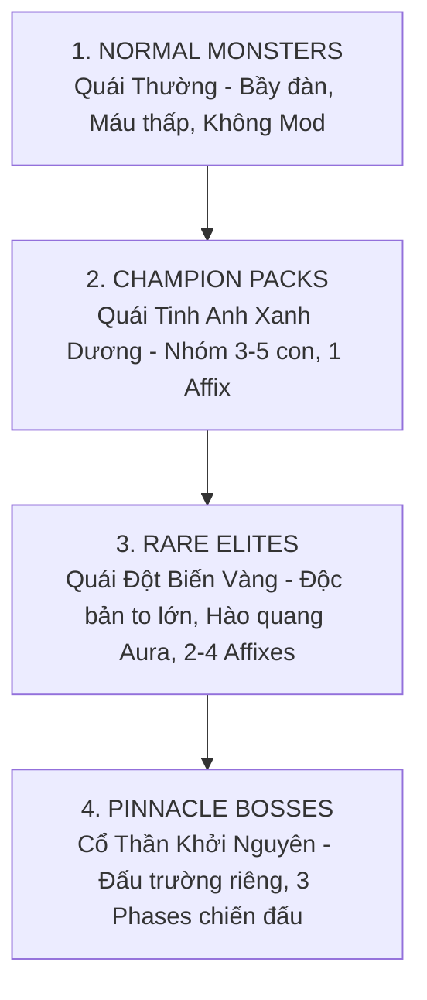
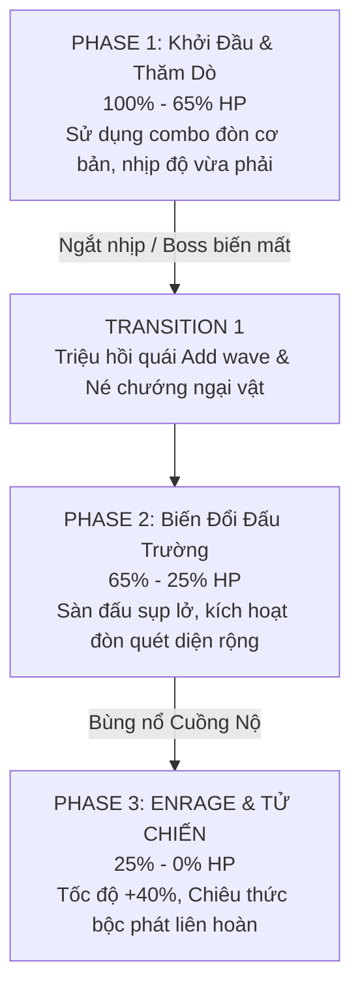

# ĐẶC TẢ THIẾT KẾ: HỆ THỐNG QUÁI VẬT, THUỘC TÍNH TINH ANH & TRÙM TỐI THƯỢNG (MONSTER AFFIXES & BOSS PHASES)
*Tài liệu phân tích cân bằng AI, Hệ sinh thái Quái vật & Thiết kế Trận đánh Trùm cho MDG (Aethelis)*

---

## 1. Phân Cấp Bậc Quái Vật (Monster Rarity & Hierarchy)

Hệ sinh thái quái vật trong thế giới Aethelis được chia làm **4 cấp bậc rõ rệt**, tăng dần về lượng máu, sát thương, hệ số rơi đồ và độ phức tạp của hành vi AI:



| Cấp Bậc | Màu Tên | Hệ Số Máu (HP Scale) | Hệ Số Rơi Đồ (Drop Scale) | Số Lượng Thuộc Tính (Affixes) | Đặc Điểm Chiến Thuật |
| :--- | :---: | :---: | :---: | :---: | :--- |
| **Normal (Thường)** | `#FFFFFF` | $1.0\times$ | $1.0\times$ | 0 | Đi theo đàn lớn (8-15 con), dùng để farm EXP nhanh và nạp bình máu (Flask Charges). |
| **Champion (Tinh Anh)** | `#8888FF` | $3.5\times$ | $3.0\times$ | 1 Mod | Xuất hiện theo cụm 3-5 con, cùng chia sẻ 1 hiệu ứng đặc thù (ví dụ: *Tăng tốc* hoặc *Băng phong*). |
| **Rare (Đột Biến)** | `#FFFF77` | $8.0\times$ | $6.5\times$ | 2 - 4 Mods | Thể hình to lớn $+30\%$, mang Hào quang cường hóa bầy tiểu quái xung quanh. |
| **Pinnacle Boss (Trùm)** | `#FF8800` | $35.0\times - 80.0\times$ | $20.0\times$ | Bộ kỹ năng độc bản (3 Phases) | Kháng choáng mạnh, có cơ chế né đòn (Telegraph Attacks) và chuyển giao Phase khi tuột mốc máu. |

---

## 2. Hệ Thống Thuộc Tính Quái Đột Biến (Monster Affix Pool)

Quái vật Rare/Elite sẽ ngẫu nhiên sở hữu từ **2 đến 4 thuộc tính (Affixes)** trong danh sách dưới đây:

### 2.1. Nhóm Nguyên Tố & Sát Thương (Offensive Affixes)

| Tên Affix | Icon | Hiệu Ứng Chiến Đấu | Cách Khắc Chế Cho Người Chơi |
| :--- | :---: | :--- | :--- |
| **Magma Conduit** | 🔥 | Đòn đánh gây thêm $+40\%$ Sát thương Lửa. Khi bị đánh trúng, phóng ra các quả cầu dung nham nổ xung quanh. | Đạt Fire Res $\ge 75\%$, di chuyển liên tục tránh vũng dung nham. |
| **Frostpulse** | ❄️ | Tỏa ra luồng sóng băng định kỳ mỗi 3s gây Chậm $-30\%$ và có $25\%$ cơ hội Đóng băng người chơi. | Giữ khoảng cách tầm xa hoặc dùng kỹ năng giải dị tật (Dash / Unfreeze Flask). |
| **Static Discharge**| ⚡ | Khi nhận đòn, phóng ra 3 tia sét giật chuỗi gây hiệu ứng `Shock` (nhận thêm $+25\%$ sát thương). | Tránh đánh đa đòn quá dồn dập khi chưa đủ Lightning Res. |
| **Corrupted Miasma**| ☠️ | Để lại vũng độc bóng tối dưới chân khi di chuyển và bộc phát chướng khí sau khi chết. | Không đứng yên tại chỗ quái vừa bị tiêu diệt, duy trì Chaos Res. |

### 2.2. Nhóm Phòng Thủ & Khống Chế (Defensive & Utility Affixes)

| Tên Affix | Icon | Hiệu Ứng Chiến Đấu | Cách Khắc Chế Cho Người Chơi |
| :--- | :---: | :--- | :--- |
| **Aether Ward** | 🛡️ | Sở hữu lớp khiên năng lượng hấp thụ $75\%$ sát thương. Khi vỡ khiên sẽ bị choáng $1.5$s. | Dồn sát thương nhanh để đập vỡ khiên khiến quái bị ngắt chiêu. |
| **Vampiric Leech** | 🩸 | Hồi phục $5\%$ máu tối đa mỗi khi đòn đánh trúng người chơi. | Né đòn chủ động, tránh để quái cận chiến đánh trúng liên tiếp. |
| **Temporal Snare** | ⏳ | Tạo vòng từ trường làm giảm $40\%$ tốc độ chạy và tốc đánh của người chơi trong bán kính 250px. | Dùng kỹ năng lướt (`Space Dash`) thoát ra khỏi vòng từ trường. |
| **Gargantuan** | 🪨 | Tăng $+80\%$ Máu, $+30\%$ Sát thương vật lý nhưng giảm $20\%$ tốc độ di chuyển. | Thả diều (Kiting) từ xa, khai thác tốc độ chậm chạp của quái. |

### 2.3. Hệ Thống Mod Bản Đồ Vực Thẳm (Rift Map Affixes & Risk-Reward Scaling)

Các bản đồ Endgame (Rifts) được cường hóa bởi hệ thống **Map Affixes** (`RiftMapAffix.cs`), tác động đồng thời lên toàn bộ quái vật trong bản đồ và thưởng thêm phần trăm Rơi Đồ / Độ Hiếm / Mật Độ Quái:

| Key Map Affix | Mô Tả Hiệu Ứng Lên Quái & Người Chơi | Bonus IIQ (Số Lượng) | Bonus IIR (Độ Hiếm) | Bonus Pack Size (Mật Độ) |
| :--- | :--- | :---: | :---: | :---: |
| `extra_fire` | Quái vật gây thêm $+40\%$ Sát thương Hỏa | $+20\%$ | $+25\%$ | $0\%$ |
| `extra_cold` | Quái vật gây thêm $+40\%$ Sát thương Băng | $+20\%$ | $+25\%$ | $0\%$ |
| `extra_lightning` | Quái vật gây thêm $+40\%$ Sát thương Sét | $+20\%$ | $+25\%$ | $0\%$ |
| `pack_size` | Tăng $+30\%$ số lượng quái mỗi đàn & $+20\%$ quái Magic | $+15\%$ | $+30\%$ | $+30\%$ |
| `minus_res` | Người chơi bị giảm $-20\%$ Kháng tất cả Nguyên tố | $+35\%$ | $+50\%$ | $+15\%$ |
| `reflect_phys` | Quái vật phản lại $15\%$ Sát thương nhận vào | $+25\%$ | $+35\%$ | $0\%$ |
| `monster_speed` | Quái vật tăng $+30\%$ Tốc độ di chuyển & Tốc đánh | $+20\%$ | $+30\%$ | $+20\%$ |
| `boss_frenzy` | Trùm bản đồ tăng $+60\%$ Máu & $+25\%$ Bán kính chiêu | $+30\%$ | $+45\%$ | $0\%$ |

---

### 2.4. Cơ Chế Chia Sẻ Hào Quang Quái Tinh Anh (Rare Minion Aura Sharing)

Quái Rare mang theo một bầy tiểu quái (Minion Pack $4 - 8$ con) và **chia sẻ hào quang cường hóa** cho đàn đệ tử:
1. **Bán kính Hào quang:** $350\text{px}$ xung quanh quái Rare.
2. **Hiệu ứng truyền tải:**
   - Nếu Rare có `Magma Conduit` $\rightarrow$ Đàn đệ tử nhận thêm $+20\%$ Fire Damage và để lại vệt lửa nhỏ khi chết.
   - Nếu Rare có `Aether Ward` $\rightarrow$ Đàn đệ tử nhận thêm $+25\%$ Armor & $+15\%$ All Resistances.
   - Nếu Rare có `Temporal Snare` $\rightarrow$ Đàn đệ tử tăng $+15\%$ tốc chạy khi áp sát người chơi.
3. **Quy tắc ưu tiên chiến thuật:** Tiêu diệt quái Rare chủ đàn sẽ ngay lập tức **hủy bỏ toàn bộ Hào quang**, khiến đàn tiểu quái suy yếu và bị choáng $0.5$s.

---

### 2.5. Bảng Tương Tác Xếp Chồng Combo Mod Quái (Affix Stacking Synergies)

Khi quái Rare roll trúng các cặp Mod đặc thù, sức mạnh và cơ chế phòng thủ sẽ cộng hưởng theo cấp số nhân:

| Combo Affixes | Tên Hiệu Ứng Cộng Hưởng | Hệ Quả Thực Chiến | Chiến Thuật Đối Phó |
| :--- | :---: | :--- | :--- |
| **Gargantuan + Aether Ward** | *The Immovable Colossus* | Máu $\times 1.8$ kết hợp Khiên $50\%$ Máu $\implies$ Lượng EHP (Effective HP) tăng hơn **$300\%$**. | Phải có kỹ năng DPS đơn mục tiêu cực cao và xuyên giáp/kháng. |
| **Magma Conduit + Static Discharge** | *Elemental Overload* | Sát thương hỗn hợp Lửa + Sét và liên tục phóng tia phản đòn khi bị tấn công dồn dập. | Giữ khoảng cách tầm xa, không dùng đòn đánh nhanh nếu kháng thấp. |
| **Frostpulse + Temporal Snare** | *Absolute Zero Trap* | Vừa làm chậm $40\%$ diện rộng vừa bắn sóng băng $25\%$ đóng băng. | Bắt buộc phải có Dash và bình giải Băng (Unfreeze Flask). |
| **Vampiric Leech + Gargantuan** | *Immortal Behemoth* | Lượng máu cực lớn hồi $5\%$ mỗi đòn trúng. Nếu người chơi đứng im cận chiến sẽ không thể hạ được. | Thả diều liên tục, tuyệt đối không để quái đánh trúng. |

---

## 3. Kiến Trúc Trận Đánh Trùm Tối Thượng (Pinnacle Boss Design)

Mỗi Boss Cốt Truyện và Boss Vực Thẳm (*Genesis Pinnacle Boss*) đều tuân theo **Cấu Trúc 3 Phase Chặt Chẽ**:



### 3.1. Thiết Kế Mẫu: "Ignis, The Molten Archon" (Chúa Tể Nham Thạch)

* **Vị trí:** Tầng sâu nhất của *Molten Caldera* (Endgame Tier 15 Rift).
* **Quy tắc cơ chế 3 Phase:**
  1. **Phase 1 (100% $\rightarrow$ 65% HP):**
     * Boss sử dụng chiêu *Flame Cleave* (Chém lửa hình quạt) và *Meteor Drop* (Vết đỏ báo trước $1.2$s trên sàn).
     * *Chiến thuật:* Người chơi chú ý vệt đỏ cảnh báo (Telegraphs) để lăn né.
  2. **Phase 2 (65% $\rightarrow$ 25% HP - Arena Hazard):**
     * Boss nhảy vào giữa tâm hồ dung nham, trở nên bất khả xâm phạm trong 15s.
     * Dung nham dâng cao, chỉ còn 3 mỏm đá an toàn. Boss liên tục phóng hỏa cầu rải thảm.
     * Triệu hồi 4 tiểu quái *Magma Golems*. Người chơi phải tiêu diệt toàn bộ để kéo Boss trở lại sàn đấu.
  3. **Phase 3 (25% $\rightarrow$ 0% HP - Enrage Apocalypse):**
     * Toàn bộ đấu trường bị bao phủ bởi bão tàn lửa (chịu sát thương Hỏa DoT môi trường).
     * Boss tung chiêu *Supernova*: Vận công trong 3.0s để nổ tung toàn màn hình. Người chơi bắt buộc phải nấp sau các cột đá tàn tích (*Obsidian Pillars*) để chặn sát thương tử vong.

---

## 4. Hệ Thống 3 Tầng Phòng Thủ Quái Vật (Monster Defensive Layers: Resistance, Evasion & Block)

Để tạo độ khó chiến thuật thực sự và khuyến khích người chơi xây dựng các cơ chế giảm kháng/chính xác cao, quái vật trong Aethelis được trang bị **3 tầng phòng thủ sinh động**:

```mermaid
graph TD
    Hit[Đòn đánh của Player trúng mục tiêu] --> EvaCheck{1. Kiểm Tra Né Tránh (Evasion)?}
    EvaCheck -->|Thành Công: 15-30% Chance| Miss[💨 Né Đòn: DODGED!<br>Không nhận sát thương & không bị văng lùi]
    EvaCheck -->|Thất Bại| BlockCheck{2. Kiểm Tra Đỡ Đòn (Block)?}
    BlockCheck -->|Thành Công: 25-40% Chance| Blocked[🛡️ Đỡ Đòn: BLOCKED!<br>Giảm 75% sát thương nhận vào + Tóe lửa khiên]
    BlockCheck -->|Thất Bại| ResMitigation[3. Giảm Trừ Kháng Cự & Giáp<br>Áp dụng Elemental/Chaos Res & Armor]
    Blocked --> ResMitigation
    ResMitigation --> FinalDmg[Trừ vào Máu & Kích hoạt Ailments]
```

### 4.1. Bảng Phân Bổ Chỉ Số Phòng Thủ Theo Chủng Loại Quái

| Chủng Loại Quái Vật | Kháng Nguyên Tố (Elemental Res) | Kháng Hỗn Loạn (Chaos Res) | Tỷ Lệ Né Tránh (Evasion) | Tỷ Lệ Đỡ Đòn (Block Chance) | Đặc Tính Phòng Thủ Nổi Bật |
| :--- | :---: | :---: | :---: | :---: | :--- |
| **Slime & Beast (Quái Nhầy / Sói)** | $15\%\text{ All}$ | $10\%$ | **$25\%$** | $0\%$ | Thân thể dẻo dai, dễ dàng uốn mình né tránh đòn đánh. |
| **Goblin & Rogue (Tiểu Quỷ / Sát Thủ)**| $20\%\text{ All}$ | $15\%$ | **$30\%$** | $10\%$ | Cực kỳ nhanh nhẹn, né tránh liên tục và phản đòn chớp nhoáng. |
| **Skeleton & Undead (Xương / Xác Sống)**| $25\%\text{ All}$ | $20\%$ | $5\%$ | **$25\%$** | Khung xương cứng cáp, mang khiên gỗ đỡ đòn. |
| **Undead Knight (Hiệp Sĩ Tử Vong)** | $40\text{ Phys Armor}$ / $35\%\text{ Res}$ | $25\%$ | $10\%$ | **$40\%$** | Khiên tháp cự đại, chặn $75\%$ sát thương khi Block thành công. |
| **Frost Golem (Người Đá Băng Giá)** | **$50\%\text{ Cold}$** / $20\%\text{ Fire}$ | $20\%$ | $0\%$ | **$30\%$** | Giáp băng dày cộp, miễn nhiễm đóng băng và kháng băng cực mạnh. |
| **Fire Imp / Magma Golem** | **$50\%\text{ Fire}$** / $20\%\text{ Cold}$ | $20\%$ | $15\%$ | **$20\%$** | Nung đỏ dung nham, kháng lửa vượt trội. |
| **Pinnacle Boss (Malakor / Vael / Ignis)**| **$55\% - 75\%\text{ Res}$** | **$35\%$** | **$20\%$** | **$35\%$** | Đầy đủ 3 tầng phòng ngự, đòi hỏi người chơi có đồ xuyên kháng. |

---

## 5. Lộ Trình Triển Khai & Kiểm Thử

1. **Backend C# (`Mdg.Core/Features/Combat/`):**
   * Định nghĩa `MonsterDefensiveLayer.cs` xử lý logic Evasion, Block và Resistance Mitigation.
   * Viết unit tests kiểm thử độ chính xác của các công thức tính toán phòng thủ quái vật.
2. **Frontend Client (`combat.js`, `main.js`, `renderer.js`):**
   * Tích hợp kiểm tra Evasion & Block vào pipeline `dealDamage`.
   * Hiển thị số nhảy `DODGED!` màu xám và `🛡️ BLOCKED!` màu vàng xanh khi quái kích hoạt phòng thủ.
3. **Tích Hợp Backend C# & Đồng Bộ Client:**
   * Quản lý AI State Machine trên Backend (`Mdg.Core`): Quái vật lưu trữ danh sách `MonsterAffixes` và tính toán Aura định kỳ theo Tick Loop.
   * Boss chuyển Phase thông qua sự kiện `BossPhaseChangedEvent`, gửi thông báo về Client để đổi nhạc nền (BGM) và hiệu ứng môi trường.
   * Hiển Thị Trực Quan Trên Client (`Mdg.Server/wwwroot`): Thanh máu Boss hiển thị các vạch khấc phân tách Phase (65% và 25%). Quái Rare có vòng hào quang sáng dưới chân (Aura Ring) màu vàng kim và liệt kê các Icon Affix bên dưới tên quái.
