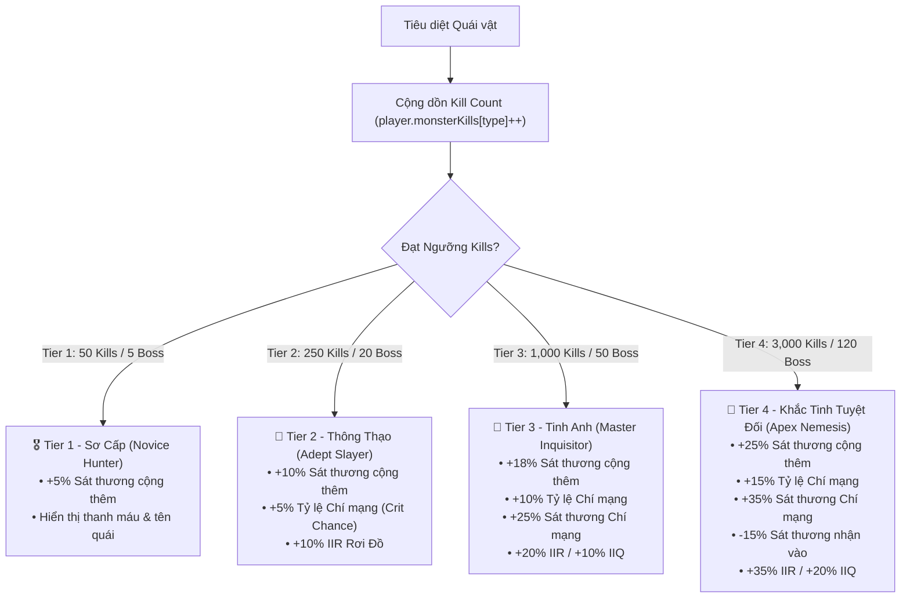

# Đặc Tả Thiết Kế Hệ Thống Sổ Tay Am Hiểu & Khắc Tinh Quái Vật (Bestiary & Monster Lore Mastery)

## 1. Tổng Quan Triết Lý Thiết Kế (Design Philosophy)

Hệ thống **Monster Lore Mastery (Am Hiểu Quái Vật)** trong **My Dream Game (MDG)** được thiết kế nhằm khuyến khích cày cuốc (Grinding with Purpose), biến mỗi mạng hạ gục của người chơi thành một sự tiến bộ vĩnh viễn (Permanent Account/Character Progression).

Khi tiêu diệt một loài quái vật đủ nhiều lần, nhân vật sẽ tích lũy kinh nghiệm chiến đấu, thấu hiểu cấu trúc cơ thể, điểm yếu nguyên tố và thói quen ra đòn của chúng. Từ đó, người chơi nhận được các chỉ số gia tăng vượt trội: **tăng Sát thương cộng thêm**, **tăng Tỷ lệ Chí mạng**, **tăng Sát thương Chí mạng**, **giảm Sát thương nhận vào** và **tăng Tỷ lệ Rơi đồ (IIR/IIQ)** từ chính loài quái vật đó.

---

## 2. Bảng Phân Tầng Bậc Am Hiểu (Lore Mastery Tiers & Milestones)

| Bậc Am Hiểu | Danh Hiệu Hunter | Ngưỡng Kills Thường | Ngưỡng Kills Boss | Tăng Sát Thương (Extra Damage) | Tăng Tỷ Lệ Crit (Bonus Crit) | Tăng Sát Thương Crit (Bonus Crit Multi) | Giảm Thương Nhận Vào (Dmg Taken Reduction) | Thưởng Rơi Đồ (Drop Multipliers) |
| :---: | :--- | :---: | :---: | :---: | :---: | :---: | :---: | :---: |
| **Tier 0** | *Unfamiliar (Chưa Biết)* | `0` | `0` | $+0\%$ | $+0\%$ | $+0\%$ | $0\%$ | $0\%$ |
| **Tier 1** | *Novice Hunter (Thợ Săn Mới)* | `50` | `5` | $+5\%$ | $+0\%$ | $+0\%$ | $0\%$ | $0\%$ |
| **Tier 2** | *Adept Slayer (Sát Thủ Thông Thạo)* | `250` | `20` | $+10\%$ | $+5\%$ | $+0\%$ | $0\%$ | $+10\%\text{ IIR}$ |
| **Tier 3** | *Master Inquisitor (Thầy Trừ Tà)* | `1,000` | `50` | $+18\%$ | $+10\%$ | $+25\%$ | $-5\%$ | $+20\%\text{ IIR} / +10\%\text{ IIQ}$ |
| **Tier 4** | *Apex Nemesis (Khắc Tinh Tuyệt Đối)*| `3,000` | `120` | $+25\%$ | $+15\%$ | $+35\%$ | $-15\%$ | $+35\%\text{ IIR} / +20\%\text{ IIQ}$ |

---

## 3. Công Thức Tác Động Vào Pipeline Chiến Đấu

Khi đòn đánh hoặc kỹ năng của người chơi tác động lên mục tiêu loài quái $M$:

$$\text{Effective Crit Chance} = \text{PlayerBaseCrit} + \text{LoreBonusCrit}(M)$$

$$\text{Effective Crit Multiplier} = \text{PlayerBaseCritMulti} + \text{LoreBonusCritMulti}(M)$$

$$\text{Total Damage} = \text{BaseCalculatedDamage} \times \left(1 + \frac{\text{LoreBonusDamage}(M)}{100}\right)$$

Khi người chơi nhận sát thương từ loài quái $M$:

$$\text{Damage Received} = \text{RawMonsterDamage} \times \left(1 - \frac{\text{LoreDamageReduction}(M)}{100}\right)$$

---

## 4. Giao Diện & Trải Nghiệm Người Dùng (UI & Feedback FX)

1. **Hiệu ứng thăng cấp Am Hiểu (Level Up Flash):** Khi đạt mốc Tier mới, màn hình hiển thị Banner và hiệu ứng vàng kim lấp lánh: `📖 BESTIARY UNLOCKED: Goblin Slayer Tier 2 (+5% Crit Chance)!` cùng âm thanh chúc mừng.
2. **Huy hiệu trên đầu quái vật (Targeting Badge):**
   - Quái vật có huy hiệu đồng/bạc/vàng/kim cương `🎖️` thể hiện cấp độ am hiểu của người chơi với loài quái đó.
3. **Sổ Tay Bách Quái (Bestiary Codex UI):**
   - Người chơi có thể mở tab Bestiary trong menu Stats (`C`) để xem danh sách toàn bộ quái vật đã gặp, số lượng đã tiêu diệt, thanh tiến trình đạt Tier tiếp theo và các buff đang được kích hoạt.
