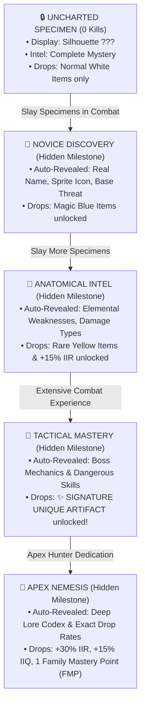

# ĐẶC TẢ THIẾT KẾ: ĐẠI TU ĐỘ KHÓ QUÁI VẬT, SƯƠNG MÙ KHÁM PHÁ TUYỆT ĐỐI & CÂY THIÊN PHÚ RẼ NHÁNH (BESTIARY OVERHAUL & BRANCHING MASTERY TREES)
*Tài liệu phân tích chiều sâu, kiến trúc rẽ nhánh & tiêu chuẩn hóa tiếng Anh trong game cho MDG (Aethelis)*

---

## 1. Tổng Quan Triết Lý & Yêu Cầu Thiết Kế (Design Philosophy) `[ĐÃ CẬP NHẬT]`

### 1.1. Khắc Phục Vấn Đề Cũ
1. **Lộ thông tin trước (Milestone Spoilers):** Việc hiển thị sẵn các con số như "Cần 500 Kills để mở điểm yếu" làm mất đi tính bất ngờ, cảm giác tò mò và cảm giác tự hào khi khám phá ra bí mật của quái vật.
2. **Cây thiên phú tuyến tính (Linear Path Problem):** Một đường thẳng 1 -> 2 -> 3 -> 4 khiến tất cả người chơi đều có chung một điểm đến cuối cùng, triệt tiêu sự đa dạng build và tính cá nhân hóa chiến thuật.
3. **Ngôn ngữ trong game:** Toàn bộ giao diện, tên quái vật, kỹ năng, vật phẩm và lore trong game phải **hoàn toàn bằng Tiếng Anh (English in-game)**.

### 1.2. Giải Pháp Cốt Lõi (Core Solutions)
1. **Sương Mù Khám Phá Tuyệt Đối (Absolute Fog of Discovery):**
   - Không hiển thị bất kỳ con số mốc nào trước.
   - Các thông tin chưa mở khóa (Điểm yếu, Kỹ năng, Bảng rơi đồ, Vật phẩm đặc trưng) sẽ hoàn toàn ẩn hoặc chỉ hiển thị dưới dạng tấm thẻ bí ẩn `??? • Uncharted Intel (Slay more specimens to decipher)`.
   - Khi người chơi tự nhiên chạm ngưỡng trong lúc chiến đấu, game sẽ nổ hiệu ứng thăng cấp nhận thức (`✨ NEW INTEL DECIPHERED`) và tự động giải mã thông tin đó trong Codex.
2. **Cây Thiên Phú Rẽ Nhánh Độc Quyền (Branching Family Mastery Trees):**
   - Mỗi chủng tộc (Beasts, Undead, Fiends, Elementals, Constructs) sở hữu một **Cây Thiên Phú Rẽ 3 Nhánh Chuyên Biệt**:
     - 🌿 **Branch A: Harvest & Economy (Thu Hoạch & Kinh Tế):** Tăng % Rơi Tinh Thể Khởi Nguyên, Phôi đồ và Tỉ lệ rơi Đồ Cam Unique / Signature.
     - ⚔️ **Branch B: Combat & Lethality (Sát Thương & Tiêu Diệt):** Tăng % Sát thương chí mạng, Tốc độ đánh/chạy, và Đòn kết liễu Executions.
     - 🛡️ **Branch C: Survival & Warding (Phòng Thủ & Khắc Chế):** Giảm % Sát thương nhận vào, Miễn nhiễm Dị tật (Bleed/Poison/Ignite/Freeze/Shock) và Khiên hộ mệnh.
   - **Giới hạn Điểm Thiên Phú (Point Budget Constraint):** Người chơi không thể cộng full tất cả, buộc phải chọn nhánh chuyên hóa (Build Specialization) phù hợp với phong cách chơi của mình.
   - **Nút Tẩy Điểm (Respec System):** Cho phép hoàn trả điểm để thử nghiệm các hướng build khác.

---

## 2. Mô Hình Sương Mù Khám Phá Tuyệt Đối (Absolute Fog of Discovery Flow) `[ĐÃ HOÀN THÀNH - ACTIVE]`



### 2.1. Quy Tắc Ẩn/Hiện Trong Giao Diện (UI Visibility Rules)

| Thuộc Tính / Thông Tin | Trạng Thái Ban Đầu (Rank 0) | Khi Đạt Mốc Tương Ứng | Cơ Chế Hiển Thị |
| :--- | :--- | :--- | :--- |
| **Monster Name & Sprite** | `??? Unknown Entity` + Silhouette đen | Tự động mở khi đạt Rank I | Bỏ Silhouette, hiện tên & icon chuẩn. |
| **Threat & HP** | `??? • Uncharted Intel` | Tự động mở khi đạt Rank I | Hiện Base HP và hệ nguyên tố. |
| **Elemental Weakness** | Ẩn hoàn toàn | Tự động mở khi đạt Rank II | Hiện điểm yếu nguyên tố (e.g. `Weakness: Fire`). |
| **Discovered Drops** | Ẩn hoàn toàn | Tự động mở khi đạt Rank II | Hiện danh mục vật phẩm đã khám phá. |
| **Signature Unique Artifact** | Khung ẩn bí ẩn `??? Hidden Artifact` | Tự động mở khi đạt Rank III | Hiện khung viền kim cương cam, tên & thuộc tính bảo vật. |
| **Monster Skills & Lore** | Ẩn hoàn toàn | Tự động mở khi đạt Rank IV | Hiện toàn bộ lore và cơ chế chiến đấu. |

---

## 3. Kiến Trúc Cây Thiên Phú Rẽ Nhánh 5 Đại Chủng Tộc (Branching Family Talent Trees) `[ĐÃ HOÀN THÀNH - ACTIVE]`

```text
                                  ┌───────────────────────────┐
                                  │      ROOT FOUNDATION      │
                                  │   [Apprentice Tracker]    │
                                  │ (+10% Bonus Family Dmg)   │
                                  └─────────────┬─────────────┘
                                                │
         ┌──────────────────────────────────────┼──────────────────────────────────────┐
         ▼                                      ▼                                      ▼
┌─────────────────────────────┐┌─────────────────────────────┐┌─────────────────────────────┐
│    BRANCH A: HARVEST        ││    BRANCH B: LETHALITY      ││    BRANCH C: SURVIVAL       │
│                             ││                             ││                             │
│ [A1] Flensing Butcher       ││ [B1] Anatomical Precision   ││ [C1] Carapace Plating       │
│ (+30% Extra Currency Drops) ││ (+15% Crit Chance vs Family)││ (-20% Dmg taken from Family)│
│              │              ││              │              ││              │              │
│              ▼              ││              ▼              ││              ▼              │
│ [A2] Relic Extraction       ││ [B2] Executioner's Stride   ││ [C2] Inoculated Vitality    │
│ (+40% Unique & Sig Rarity)  ││ (+25% Move/Atk Speed on Kill││ (Immunity to Family Ailment)│
│              │              ││              │              ││              │              │
│              ▼              ││              ▼              ││              ▼              │
│ [KEYSTONE A: BOUNTIFUL]     ││ [KEYSTONE B: APEX SLAYER]   ││ [KEYSTONE C: TITAN BASTION] │
│ ★ Double drop roll on Bosses││ ★ Execute targets < 20% HP  ││ ★ Stacking +300 Shield Ward │
└─────────────────────────────┘└─────────────────────────────┘└─────────────────────────────┘
```

### 3.1. Chi Tiết 5 Chủng Tộc & 3 Nhánh Chuyên Hóa (100% English Game Data)

#### 1. 🐺 Beast Family (Ancient Wildlife)
* **Root:** `Hunter Instincts` (+10% Physical Damage vs Beasts)
* **Branch A (Harvest):**
  * `Trophy Skimmer` (+30% Raw Materials & Catalysts from Beasts)
  * `Alpha Relic Siphon` (+40% Signature Fang Drop Rate)
  * `★ Keystone: Primal Harvest` (Beast Bosses drop double loot rolls)
* **Branch B (Lethality):**
  * `Flesh Piercer` (+15% Crit Chance & +30% Crit Multi vs Beasts)
  * `Blood Frenzy` (Killing Beasts grants +25% Movement & Attack Speed for 5s)
  * `★ Keystone: Apex Predator` (Crits on Beasts instantly execute targets below 20% Life)
* **Branch C (Survival):**
  * `Thickened Hide` (-20% Damage taken from Beasts)
  * `Coagulation Ward` (100% Immunity to Bleeding and Lacerations)
  * `★ Keystone: Untamed Fortitude` (Taking a heavy hit from Beasts grants a 300 HP Primal Barrier for 4s)

#### 2. 💀 Undead Family (Crypt Sentinels)
* **Root:** `Consecrated Striking` (+10% Holy/Fire Damage vs Undead)
* **Branch A (Harvest):**
  * `Crypt Scavenger` (+35% Gem & Socketing Core Drops from Undead)
  * `Soul Gem Extractor` (+40% Rare & Unique Gear Rarity from Undead)
  * `★ Keystone: Tomb Raider` (Undead Elites have 50% chance to drop bonus Crafting Catalysts)
* **Branch B (Lethality):**
  * `Bone Breaker` (+20% Pure Physical & Fire Penetration vs Undead)
  * `Soul Shatter` (Slain Undead explode dealing 40% of their Max HP as Holy AoE)
  * `★ Keystone: Inquisitor's Wrath` (Gain +50% Crit Multiplier and +20% Attack Speed in crypts)
* **Branch C (Survival):**
  * `Soul Ward Cloak` (-20% Chaos & Physical Damage taken from Undead)
  * `Miasma Cleanser` (100% Immunity to Poison and Soul Chill)
  * `★ Keystone: Undying Aegis` (Fatal blows from Undead leave you at 1 HP with 3s Divine Invulnerability)

#### 3. 🔥 Fiend Family (Nether Horrors)
* **Root:** `Demonbane Knowledge` (+10% Chaos & Elemental Damage vs Fiends)
* **Branch A (Harvest):**
  * `Hellstone Harvester` (+40% Fracture Core & Ascendant Catalyst Drops from Fiends)
  * `Abyssal Siphon` (+50% Signature Artifact Drop Chance)
  * `★ Keystone: Infernal Wealth` (Fiend Bosses drop guaranteed 2 Genesis Catalysts)
* **Branch B (Lethality):**
  * `Hellbreaker Cleave` (+25% Chaos Damage & +15% Crit Chance vs Fiends)
  * `Demon Purge` (Hitting Fiends siphons 4% Mana & 5% Energy Shield per hit)
  * `★ Keystone: Doom Slayer` (Inflict 50% More Damage against Fiend Bosses)
* **Branch C (Survival):**
  * `Obsidian Shell` (-20% Fire & Chaos Damage taken from Fiends)
  * `Flameproof Aegis` (100% Immunity to Ignite & Scorched Ground)
  * `★ Keystone: Abyssal Resilience` (Gain +15% to Maximum Fire & Chaos Resistances)

#### 4. ⚡ Elemental Family (Primal Spirits)
* **Root:** `Arcane Attunement` (+10% Elemental Damage vs Elementals)
* **Branch A (Harvest):**
  * `Aether Condenser` (+40% Skill Gem & Resonance Orb Drops from Elementals)
  * `Prismatic Harvest` (+45% Rare Ring & Amulet Drop Rate)
  * `★ Keystone: Elemental Surge` (Elementals drop double Tinh Thể Khởi Nguyên)
* **Branch B (Lethality):**
  * `Overcharge Discharge` (+20% Attack & Cast Speed vs Elementals)
  * `Prismatic Disruption` (Attacks strip 50% of Elemental Resistances from targets)
  * `★ Keystone: Arcane Cataclysm` (Killing Elementals releases a Chain Lightning storm)
* **Branch C (Survival):**
  * `Prismatic Refraction` (-20% Elemental Damage taken)
  * `Tri-Element Ward` (100% Immunity to Freeze, Shock, and Ignite)
  * `★ Keystone: Elemental Mirror` (Reflect 35% of all incoming Elemental Damage)

#### 5. 🗿 Construct Family (Titan Automata)
* **Root:** `Shatter Theory` (+10% Armor Penetration vs Constructs)
* **Branch A (Harvest):**
  * `Ore Extractor` (+50% Socketing Cores & Harmonic Tethers from Constructs)
  * `Titan Core Siphon` (+50% Crafting Base Item Drop Rarity)
  * `★ Keystone: Foundry Master` (Constructs drop guaranteed Tier 1 Crafting Bases)
* **Branch B (Lethality):**
  * `Crushing Impact` (Attacks ignore 70% of Construct Armor & Energy Shield)
  * `Titan Breaker` (Stun duration on Constructs increased by +100%)
  * `★ Keystone: Core Overload` (Crits on Constructs detonate their power core for massive AoE)
* **Branch C (Survival):**
  * `Reinforced Plating` (-20% Physical Damage taken from Constructs)
  * `Titan Bastion` (+250 Flat Armor & 100% Knockback Immunity)
  * `★ Keystone: Iron Will` (Immune to Stun and Crushing Tremors from Golems)

---

## 4. Bảng Tổng Hợp Tránh Chồng Chéo Kiến Trúc (Architecture Non-Collision)

| Hệ Thống | Phạm Vi / Scope | Điểm Khác Biệt & Cách Thức Tách Biệt |
| :--- | :--- | :--- |
| **Character Attributes (`stats-modal`)** | Chỉ số nhân vật cơ bản toàn cục (Str/Dex/Int, HP, Global Resistances). | Không chứa logic quái vật. |
| **Celestial Devotion Tree (`devotionModal`)** | 4 Nhánh chòm sao toàn cục (Phoenix, Frost, Thunder, Void) kích hoạt Combat Procs. | Sử dụng điểm `devotionPoints` kiếm từ Shrines, áp dụng lên mọi đòn đánh. |
| **Skill Mastery Tree (`skills-modal`)** | Tinh hoa của từng Skill riêng biệt (Slash, Fireball, Frost Nova...). | Sử dụng điểm `skillPoints`, biến đổi cơ chế của chiêu thức đó. |
| **Family Mastery Trees (`bestiaryModal`)** | **Thiên phú đặc thù theo 5 Chủng Tộc Quái Vật (Beast, Undead, Fiend, Elemental, Construct).** | **Chỉ kích hoạt khi chiến đấu/nhặt đồ từ đúng loài quái đó.** Sử dụng điểm `familyMasteryPoints[family]`, có 3 nhánh rẽ (Harvest / Combat / Survival) với Keystones chuyên biệt. |
