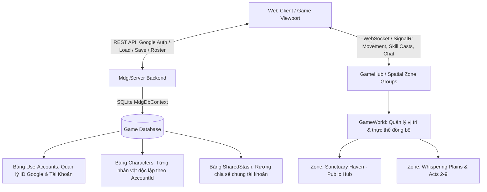

# KIẾN TRÚC QUẢN LÝ ĐA NHÂN VẬT (CHARACTER ROSTER) & MULTIPLAYER SERVER-AUTHORITATIVE CHO MDG

---

## 1. Tổng Quan Kiến Trúc `[ĐÃ HOÀN THÀNH - ACTIVE]`

Hệ thống được thiết kế để mở rộng từ **Single-Player có lưu trữ DB** lên **Multi-Character (Nhiều nhân vật trên 1 tài khoản)** và vận hành **Multiplayer Co-op thời gian thực** thông qua mô hình Server-Authoritative trên nền ASP.NET Core & SignalR WebSockets.



---

## 2. Trục Cốt Lõi 1: Quản Lý Đa Nhân Vật (Multi-Character Roster) `[ĐÃ HOÀN THÀNH - ACTIVE]`

### 2.1. Phân Tách Dữ Liệu Nhân Vật (Character Isolation) `[ĐÃ HOÀN THÀNH]`

Mỗi nhân vật là một thực thể độc lập hoàn toàn với `CharacterId` riêng biệt (UUID) gắn với `AccountId`:
* **Chỉ số cá nhân:** Cấp độ, Kinh nghiệm, Máu/Mana/ES, Hệ phái (`Vanguard`, `Arcanist`, `ShadowRogue`), Giới tính (`Male`/`Female`).
* **Túi đồ cá nhân:** 16 ô đồ mang theo trên người và trang bị trên Paperdoll.
* **Cây Kỹ Năng & Nguyệt Thạch (Gem Sockets & Mastery):** Mỗi nhân vật sở hữu bộ ngọc và điểm tinh hoa riêng biệt.

### 2.2. Hệ Thống Rương Chung (Account-Wide Shared Stash - Phím X) `[ĐÃ HOÀN THÀNH]`

* Cung cấp một kho chứa đồ chung giữa tất cả các nhân vật trên cùng tài khoản (`AccountId`).
* Người chơi có thể dùng nhân vật Cày cuốc (Farmer) để farm đồ Unique hoặc ngọc xịn rồi cất vào **Shared Stash** cho nhân vật mới tạo sử dụng.

### 2.3. Hệ Thống Đăng Nhập & Định Danh Google OAuth 2.0 `[ĐÃ HOÀN THÀNH]`

* Hỗ trợ xác thực Google OAuth 2.0 trực tiếp qua Google Consent Page và giải mã JWT `id_token` phía Server.
* Tự động liên kết danh sách nhân vật (`Characters`) theo `AccountId` của Google hoặc Custom Account.

---

## 3. Trục Cốt Lõi 2: Hệ Thống Multiplayer Đồng Bộ Thời Gian Thực (Multiplayer SignalR Engine) `[ĐÃ HOÀN THÀNH - ACTIVE]`

```text
               ┌────────────────────────────────────────────────────────┐
               │          SERVER-AUTHORITATIVE SIGNALR GAMEHUB          │
               └────────────────────────────────────────────────────────┘
                                            │
             ┌─────────────────────────────┼─────────────────────────────┐
             ▼                             ▼                             ▼
   [ Session Player 1 ]          [ Session Player 2 ]          [ Session Player 3 ]
  (Pos, Skill Casts, HP)        (Pos, Skill Casts, HP)        (Pos, Skill Casts, HP)
             │                             │                             │
             └─────────────────────────────┼─────────────────────────────┘
                                            │
                                            ▼
                    [ SPATIAL PARTITIONING (THEO ZONE ID) ]
                     • Chỉ đồng bộ người chơi trong cùng Map
                     • Broadcast: Vị trí (x, y), Góc quay, Đạn bay, Đòn đánh
                     • Zone Chat: Trò chuyện tức thời chống trùng lặp packet
```

### 3.1. Phân Vùng Bản Đồ & Đồng Bộ Người Chơi (Zone Spatial Sync) `[ĐÃ HOÀN THÀNH]`

* **Public Hubs & Combat Zones:** Mọi người chơi cùng xuất hiện trong một Act/Zone, nhìn thấy sprite avatar, tên nhân vật, class, thanh máu và hướng quay mặt của nhau theo thời gian thực.
* **Zone Chat Realtime:** Khung chat khu vực có tính năng thu nhỏ/mở rộng, hỗ trợ gửi tin nhắn tức thời đến toàn bộ người chơi trong cùng Zone với bộ lọc chống trùng tin nhắn (`messageId`).

### 3.2. Đồng Bộ Trận Đấu & Sát Thương (Combat Sync) `[ĐÃ HOÀN THÀNH]`

* **CastSkill:** Khi người chơi tung chiêu (Fireball, Frost Nova, Slash, Meteor), `GameHub` phát sự kiện `PlayerSkillCast` tới tất cả người chơi trong khu vực.
* **UpdatePosition:** Mỗi 50ms, người chơi gửi vị trí và vector di chuyển, client khác tự động nội suy vị trí (lerp interpolation) mượt mà.

### 3.3. Hệ Thống Phân Kênh Thế Giới (World Channel Sharding Engine) `[ĐÃ HOÀN THÀNH - ACTIVE]`

Nhằm giải quyết bài toán hiệu năng khi số lượng người chơi đông đảo và cho phép tạo phòng/kênh giao lưu riêng, máy chủ cung cấp hệ thống 4 Kênh Thế Giới (`CH-1` đến `CH-4`):
1. **🌐 Channel 1 (Global Nexus):** Kênh thế giới chính mặc định, kết nối rộng khắp.
2. **⚡ Channel 2 (Asia Pacific Realm):** Kênh phân vùng tối ưu độ trễ cho khu vực châu Á.
3. **💀 Channel 3 (Hardcore Sanctuary):** Kênh thử thách cao độ dành cho cao thủ săn Boss và đi Rift.
4. **💎 Channel 4 (Trade & Social Hub):** Kênh giao thương, tụ họp co-op và kết bạn.

* **Nhóm SignalR Tối Ưu (Spatial & Channel Grouping):** `GetGroupKey(channelId, zoneId)` $\to$ `ch_1_SanctuaryHaven`, `ch_2_WhisperingPlains`. Mỗi Kênh là một phiên bản Map độc lập, giảm tải băng thông và tránh chen chúc.
* **Chuyển Kênh Tức Thời (Hot Channel Switch):** Nhấn vào nút Kênh trên Minimap (`🌐 CH-1 ▾`), chọn kênh mới $\to$ Client tự động chuyển Group SignalR mà không cần reload trang.
* **Minimap Ally Radar:** Hiển thị đồng đội trong cùng Map và Kênh với chấm xanh lá (`#00e676`), giúp dễ dàng tìm thấy nhau.
* **Phân Luồng Trò Chuyện (Chat Scopes):** Hỗ trợ chat trong Kênh hiện tại (`[CH-1]`), chat toàn bản đồ (`/zone`), hoặc chat thế giới (`/world`).

### 3.4. Kế Hoạch Mở Rộng Tiếp Theo (Future Multiplayer Features) `[CẦN MỞ RỘNG - PLANNED]`

* **Co-op Stagger & Switch Window (Cảm hứng SAO):** Cửa sổ tấn công phối hợp bạo kích x2 khi đồng đội tạo choáng.
* **Party Dungeon Instances:** Tạo phòng phụ bản riêng giới hạn 4 người chơi cùng chia sẻ Map Device Rift.
* **Player Trading:** Giao dịch vật phẩm trực tiếp giữa 2 người chơi trong thị trấn.

---

## 4. Đặc Tả REST API Cho Đa Nhân Vật & Auth `[ĐÃ HOÀN THÀNH - ACTIVE]`

| Endpoint | Method | Chức Năng | Payload / Response |
| :--- | :---: | :--- | :--- |
| `/api/v1/auth/google` | `POST` | Xác thực Google OAuth Token / Dev Profile. | `{ user, characters }` |
| `/api/v1/auth/login` | `POST` | Đăng nhập / Đăng ký tài khoản custom. | `{ user, characters }` |
| `/api/v1/characters?accountId={acc}` | `GET` | Lấy danh sách nhân vật theo tài khoản. | `[ { id, name, classSpec, gender, level, zoneId, updatedAt } ]` |
| `/api/v1/characters` | `POST` | Tạo mới một nhân vật gắn với AccountId. | `{ id, name, gender, classSpec, accountId }` |
| `/api/v1/characters/{id}` | `DELETE` | Xóa một nhân vật. | `{ success: true, id }` |
| `/api/v1/savegame?characterId={id}` | `GET` | Tải toàn bộ tiến trình nhân vật từ DB. | Dữ liệu nhân vật đầy đủ (Túi đồ, Gear, Mastery Nodes). |
| `/api/v1/savegame` | `POST` | Lưu tiến trình của nhân vật đang chơi. | Full Save Payload kèm `characterId` & `accountId`. |

---

## 5. Cấu Trúc SQLite Schema `[ĐÃ HOÀN THÀNH - ACTIVE]`

```sql
-- Bảng Tài Khoản Người Chơi
CREATE TABLE IF NOT EXISTS UserAccounts (
    Id TEXT PRIMARY KEY,
    Email TEXT,
    Name TEXT NOT NULL,
    PictureUrl TEXT,
    CreatedAt TEXT NOT NULL,
    LastLoginAt TEXT NOT NULL
);

-- Bảng Danh Sách Nhân Vật
CREATE TABLE IF NOT EXISTS Characters (
    Id TEXT PRIMARY KEY,
    AccountId TEXT NOT NULL DEFAULT 'guest',
    Name TEXT NOT NULL,
    Gender TEXT NOT NULL DEFAULT 'Male',
    ClassSpec TEXT NOT NULL DEFAULT 'Novice',
    Level INTEGER NOT NULL DEFAULT 1,
    CurrentExp INTEGER NOT NULL DEFAULT 0,
    ExpToNext INTEGER NOT NULL DEFAULT 100,
    SkillPoints INTEGER NOT NULL DEFAULT 3,
    Life REAL NOT NULL DEFAULT 250,
    MaxLife REAL NOT NULL DEFAULT 250,
    Mana REAL NOT NULL DEFAULT 120,
    MaxMana REAL NOT NULL DEFAULT 120,
    Es REAL NOT NULL DEFAULT 100,
    MaxEs REAL NOT NULL DEFAULT 100,
    ZoneId TEXT NOT NULL DEFAULT 'SanctuaryHaven',
    PositionX REAL NOT NULL DEFAULT 2000,
    PositionY REAL NOT NULL DEFAULT 2000,
    SkillsJson TEXT,
    EquippedJson TEXT,
    BackpackJson TEXT,
    CreatedAt TEXT NOT NULL,
    UpdatedAt TEXT NOT NULL
);

-- Bảng Rương Chia Sẻ Chung (Account Shared Stash)
CREATE TABLE IF NOT EXISTS SharedStash (
    SlotIndex INTEGER PRIMARY KEY,
    AccountId TEXT NOT NULL DEFAULT 'guest',
    ItemJson TEXT NOT NULL,
    UpdatedAt TEXT NOT NULL
);
```
