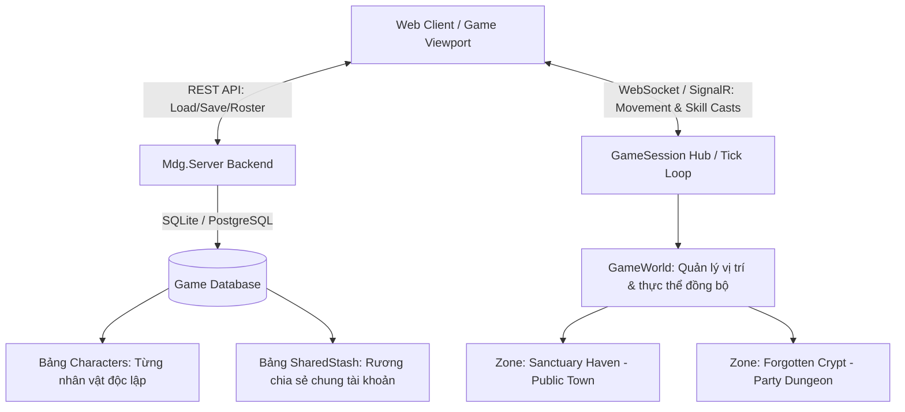

# KIẾN TRÚC QUẢN LÝ ĐA NHÂN VẬT (CHARACTER ROSTER) & DỰ PHÒNG MULTIPLAYER CHO MDG

---

## 1. Tổng Quan Kiến Trúc

Hệ thống được thiết kế để mở rộng từ **Single-Player có lưu trữ DB** lên **Multi-Character (Nhiều nhân vật trên 1 tài khoản)** và sẵn sàng chuyển đổi sang **Multiplayer Co-op / MMO ARPG** thông qua mô hình Server-Authoritative.



---

## 2. Trục Cốt Lõi 1: Quản Lý Đa Nhân Vật (Multi-Character Roster)

### 2.1. Phân Tách Dữ Liệu Nhân Vật (Character Isolation)

Mỗi nhân vật là một thực thể độc lập hoàn toàn với `CharacterId` riêng biệt (UUID):
* **Chỉ số cá nhân:** Cấp độ, Kinh nghiệm, Máu/Mana/ES, Hệ phái (`Vanguard`, `Arcanist`, `ShadowRogue`), Giới tính (`Male`/`Female`).
* **Túi đồ cá nhân:** 16 ô đồ mang theo trên người và trang bị trên Paperdoll.
* **Cây Kỹ Năng & Nguyệt Thạch (Gem Sockets & Mastery):** Mỗi nhân vật sở hữu bộ ngọc và điểm tinh hoa riêng biệt.

### 2.2. Hệ Thống Rương Chung (Account-Wide Shared Stash)

* Cung cấp một kho chứa đồ chung giữa tất cả các nhân vật trên cùng tài khoản.
* Người chơi có thể dùng nhân vật Cày cuốc (Farmer) để farm đồ Unique hoặc ngọc xịn rồi cất vào **Shared Stash** cho nhân vật mới tạo sử dụng.

---

## 3. Trục Cốt Lõi 2: Thiết Kế Dự Phòng Multiplayer (Multiplayer-Ready Architecture)

Để nhiều người chơi có thể cùng xuất hiện trong một vùng đất (Zone), kiến trúc áp dụng mô hình **Authoritative Server + Client Prediction**:

```text
               ┌────────────────────────────────────────────────────────┐
               │          SERVER-AUTHORITATIVE TICK LOOP (30 TPS)       │
               └────────────────────────────────────────────────────────┘
                                           │
             ┌─────────────────────────────┼─────────────────────────────┐
             ▼                             ▼                             ▼
   [ Session Player 1 ]          [ Session Player 2 ]          [ Session Player 3 ]
  (Pos, Skill Casts, HP)        (Pos, Skill Casts, HP)        (Pos, Skill Casts, HP)
             │                             │                             │
             └─────────────────────────────┼─────────────────────────────┘
                                           │
                                           ▼
                    [ SPATIAL PARTITIONING (THEO ZONE ID) ]
                     • Chỉ đồng bộ người chơi trong cùng Map
                     • Broadcast: Vị trí (x, y), Góc quay, Đạn bay, Đòn đánh
```

### 3.1. Phân Vùng Bản Đồ (Zone / Room Instances)

* **Public Hubs (Thành chính - Sanctuary Haven):** Mọi người chơi cùng xuất hiện, trò chuyện, giao dịch (Trading), và xem trang bị của nhau (Inspect Paperdoll).
* **Instanced Dungeons (Phụ bản tổ đội - Forgotten Crypt):** Tạo phòng riêng (Room Instance) cho tối đa **4 người chơi** cùng tổ đội (Party Co-op) săn Boss và chia sẻ phần thưởng.

### 3.2. Đồng Bộ Trận Đấu & Sát Thương (Combat Sync)

* **Client:** Gửi gói tin `PlayerCastSkillPayload` `{ SkillId: "fireball", OriginX, OriginY, TargetX, TargetY }`.
* **Server:**
  1. Kiểm tra Cooldown và Mana của người chơi trên Server.
  2. Tạo Projectile trong `GameWorld`.
  3. Tính toán va chạm (Hit Detection) và trừ máu quái vật.
  4. Broadcast sự kiện `DamageDealtEvent` và `EntityDiedEvent` về tất cả Client trong khu vực để vẽ hiệu ứng số nhảy và rơi đồ.

---

## 4. Đặc Tả REST API Cho Đa Nhân Vật

| Endpoint | Method | Chức Năng | Payload / Response |
| :--- | :---: | :--- | :--- |
| `/api/v1/characters` | `GET` | Lấy danh sách tất cả nhân vật có trên tài khoản. | `[ { id, name, classSpec, gender, level, zoneId, updatedAt } ]` |
| `/api/v1/characters` | `POST` | Tạo mới một nhân vật. | `{ name: "Aria", gender: "Female", classSpec: "Novice" }` |
| `/api/v1/characters/{id}` | `DELETE` | Xóa một nhân vật. | `{ success: true, message: "Deleted" }` |
| `/api/v1/savegame?characterId={id}` | `GET` | Tải toàn bộ tiến trình của nhân vật được chọn. | Dữ liệu nhân vật đầy đủ (Túi đồ, Gear, Mastery Nodes). |
| `/api/v1/savegame` | `POST` | Lưu tiến trình của nhân vật đang chơi. | Full Save Payload kèm `characterId`. |

---

## 5. Cấu Trúc SQLite Schema Nâng Cấp

```sql
-- Bảng Danh Sách Nhân Vật
CREATE TABLE IF NOT EXISTS Characters (
    Id TEXT PRIMARY KEY,
    Name TEXT NOT NULL,
    Gender TEXT NOT NULL DEFAULT 'Male',
    ClassSpec TEXT NOT NULL DEFAULT 'Novice',
    Level INTEGER NOT NULL DEFAULT 1,
    CurrentExp INTEGER NOT NULL DEFAULT 0,
    ExpToNext INTEGER NOT NULL DEFAULT 100,
    SkillPoints INTEGER NOT NULL DEFAULT 3,
    Life REAL NOT NULL DEFAULT 250,
    MaxLife REAL NOT NULL DEFAULT 250,
    Mana REAL NOT NULL DEFAULT 120,
    MaxMana REAL NOT NULL DEFAULT 120,
    Es REAL NOT NULL DEFAULT 100,
    MaxEs REAL NOT NULL DEFAULT 100,
    ZoneId TEXT NOT NULL DEFAULT 'SanctuaryHaven',
    PositionX REAL NOT NULL DEFAULT 2000,
    PositionY REAL NOT NULL DEFAULT 2000,
    SkillsJson TEXT,
    EquippedJson TEXT,
    BackpackJson TEXT,
    CreatedAt TEXT NOT NULL,
    UpdatedAt TEXT NOT NULL
);

-- Bảng Rương Chia Sẻ Chung (Account Shared Stash)
CREATE TABLE IF NOT EXISTS SharedStash (
    SlotIndex INTEGER PRIMARY KEY,
    ItemJson TEXT NOT NULL,
    UpdatedAt TEXT NOT NULL
);
```
