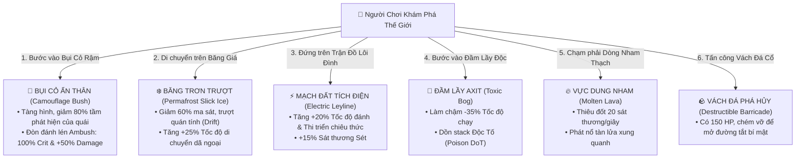

# 🗺️ Procedural Chunk Streaming, Viewport Culling & Interactive Terrain Mechanics

---

## 1. Triết Lý Thiết Kế: Tối Ưu Hiệu Năng Vượt Trội & Thế Giới Mở Rộng Lớn (Vast Chunk Streaming)

Khi bản đồ game được mở rộng lên quy mô khổng lồ ($160\times 160$ tới $256\times 256$ ô gạch, tức $7,680\times 7,680$ tới $12,288\times 12,288$ px), việc xử lý toàn bộ quái vật, vật thể và render toàn bản đồ sẽ gây nghẽn CPU/GPU.

### Kiến Trúc Giải Pháp:
1. **Đi Đến Đâu Gen Đến Đó (On-Demand Chunk Streaming):**
   - Bản đồ được chia thành các **Chunk $16\times 16$ Tiles ($768\times 768$ px)**.
   - Chỉ khởi tạo, sinh quái vật và nạp tài nguyên cho các Chunk nằm trong bán kính quan sát của người chơi ($3\times 3$ đến $5\times 5$ chunks lân cận).
2. **Cắt Tỉa Khung Nhìn Tuyệt Đối (Strict Frustum & Viewport Culling):**
   - `renderer.js` chỉ render các ô đất, quái vật, vật phẩm rơi, hiệu ứng hạt nằm trọn trong vùng màn hình hiển thị ($+\text{Buffer } 100$px).
3. **Cơ Chế Ngủ Đông Quái Vật Dã Ngoại (Monster AI Hibernation):**
   - Quái vật cách người chơi $>650$px sẽ tự động chuyển sang trạng thái ngủ đông (không tính toán tìm đường A* hay va chạm nặng), giảm $90\%$ tải CPU.

---

## 2. Hệ Thống 6 Cơ Chế Địa Hình Tương Tác Đỉnh Cao (Interactive Terrain Mechanics)

| Loại Địa Hình | Mã Tile | Hiệu Ứng Cơ Chế Tương Tác (Gameplay Mechanics) |
| :--- | :---: | :--- |
| 🌾 **Bụi Cỏ Ẩn Thân (Camouflage Bush)** | `14` | Khi đứng trong bụi: Nhân vật mờ ảo, quái vật không thể phát hiện từ xa ($80\%$ Stealth). Đòn đánh đầu tiên từ bụi cỏ gây **Đòn Đánh Lén (Ambush Strike: $100\%$ Bạo kích & $+50\%$ Sát thương)**. |
| ❄️ **Băng Trơn Trượt (Slick Permafrost)** | `7` | Giảm $60\%$ ma sát bám đường, tạo hiệu ứng trượt lướt (Drift), tăng $+25\%$ tốc độ di chuyển dã ngoại. |
| ⚡ **Mạch Đất Tích Điện (Electric Leyline)** | `8` | Đứng trên mạch đất tăng **$+20\%$ Tốc độ tấn công & Thi triển phép**, $+15\%$ Sát thương Sét. |
| 🧪 **Đầm Lầy Độc Tố (Toxic Bog)** | `6` | Làm chậm $-35\%$ tốc độ di chuyển và gây dồn stack Độc Tố (Poison DoT). |
| 🔥 **Vực Dung Nham (Molten Lava)** | `5` | Thiêu đốt người chơi và quái vật $20$ HP/giây, phun trào tàn lửa. |
| 🪨 **Vách Đá Phá Hủy (Destructible Wall)** | `15` | Có thể dùng kỹ năng chém thường hoặc phép nổ để đập vỡ, mở ra **Đường Tắt Bí Cảnh (Secret Shortcuts)** và Rương Kho Báu Ẩn! |

---

## 3. Bản Đồ Thế Giới Mở Rộng Quy Mô Khổng Lồ

- **Sanctuary Haven (Thị Trấn):** $64\times 64$ Tiles ($3,072\times 3,072$ px) — Mở rộng Khu Hiệp Hội Thợ Săn, Vườn Thảo Dược, Hồ Nước Thánh.
- **Whispering Plains (Đồng Cỏ Thầm Thì):** $160\times 160$ Tiles ($7,680\times 7,680$ px) — Rừng rậm bạt ngàn, dòng sông uốn lượn, nhiều trại quái vật và bụi cỏ ẩn thân.
- **Frostpeak Tundra (Đỉnh Băng Giá):** $160\times 160$ Tiles ($7,680\times 7,680$ px) — Đồng bằng băng trơn trượt, hang động tuyết và bão tuyết dã ngoại.
- **Molten Caldera (Miệng Núi Lửa):** $160\times 160$ Tiles ($7,680\times 7,680$ px) — Dòng sông nham thạch, đảo đá hắc diện và vách đá có thể phá hủy.
