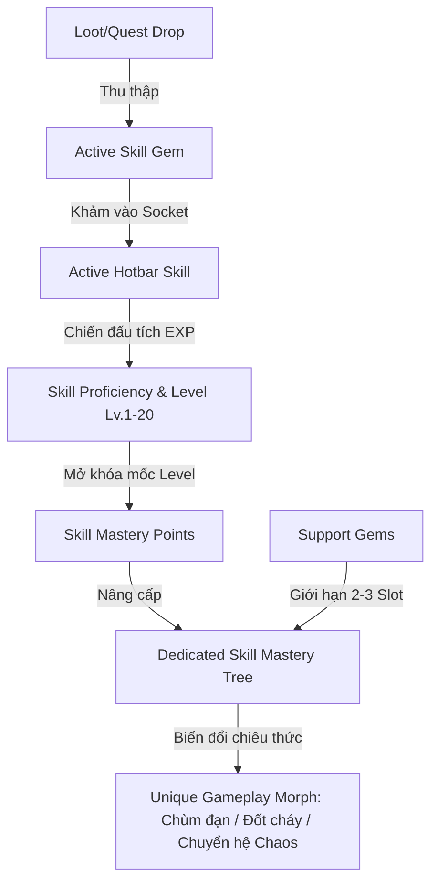

# THIẾT KẾ HỆ THỐNG SKILL GEMS & CÂY PHÁT TRIỂN KỸ NĂNG RIÊNG BIỆT (SKILL MASTERY TREE)
*Tài liệu phân tích & đặc tả thiết kế hệ thống Kỹ năng cho MDG (Aethelis)*

---

## 1. Tổng Quan & Triết Lý Thiết Kế `[ĐÃ HOÀN THÀNH - ACTIVE]`

Hệ thống kỹ năng của **MDG** là sự kết hợp tối ưu giữa **3 trường phái ARPG đỉnh cao**:
1. **Path of Exile**: Kỹ năng tồn tại dưới dạng vật phẩm ngọc (**Skill Gem**) có thể rơi ra từ quái, giao dịch và khảm vào trang bị.
2. **Last Epoch**: Mỗi chiêu thức khi sử dụng sẽ có **Cây Kỹ Năng Riêng Biệt (Skill Specialization Tree)** với các nhánh biến đổi cơ chế (Morph/Transmutation).
3. **Grim Dawn**: Độ thông thạo kỹ năng tăng dần theo số lần chiến đấu (**Proficiency EXP**), mở khóa dần các mốc hỗ trợ và nội tại sâu sắc.

---

## 2. Trục Cốt Lõi 1: Hệ Thống Skill Gem & Sockets (Ngọc Kỹ Năng) `[ĐÃ HOÀN THÀNH - ACTIVE]`

### 2.1. Phân Loại Gems `[ĐÃ HOÀN THÀNH]`

| Loại Gem | Đặc Điểm | Ví Dụ | Trạng Thái |
| :--- | :--- | :--- | :---: |
| **Active Skill Gem** *(Ngọc Chủ Động)* | Khảm vào để mở khóa chiêu thức trên thanh Hotbar. Có Level (1-20) và Tags thuộc tính. | `Pyro Fireball Gem`, `Heavy Cleave Gem`, `Frost Nova Gem`. | `[ĐÃ HOÀN THÀNH]` |
| **Support Gem** *(Ngọc Hỗ Trợ)* | Gắn kèm vào Active Gem để tăng cường hoặc đổi tính chất chiêu, đi kèm hệ số tiêu hao Mana (`Mana Multiplier`). | `Lesser Multiple Projectiles (130% MP)`, `Added Fire Damage (115% MP)`. | `[ĐÃ HOÀN THÀNH]` |

### 2.2. Cơ Chế Giới Hạn Hỗ Trợ (Support Limits & Tag Compatibility) `[ĐÃ HOÀN THÀNH]`

* **Quy tắc tương thích Tags (Tag Matching):**
  * Support Gem chỉ kích hoạt nếu **trùng ít nhất 1 Tag** với Active Gem.
  * *Ví dụ:* Support `Multiple Projectiles` (Tags: `[Projectile]`) **kích hoạt** cho `Fireball` (`[Fire, Projectile, Spell]`), nhưng **vô hiệu** khi gắn vào `Frost Nova` (`[Cold, AoE, Spell]`).
* **Giới hạn số lượng Support (Support Capacity):**
  * **Cấp 1-9 (Novice):** Tối đa **1 Support Gem** cho mỗi chiêu.
  * **Cấp 10-24 (Adept / Ascended):** Mở rộng lên **2 Support Gems**.
  * **Cấp 25+ (Master):** Mở rộng lên tối đa **3 Support Gems** (Cân bằng tốt, loại bỏ việc phụ thuộc vào 6-link may rủi như PoE 1).

---

## 3. Trục Cốt Lõi 2: Cây Kỹ Năng Riêng Biệt (Per-Skill Mastery Tree - Phím K) `[ĐÃ HOÀN THÀNH - ACTIVE]`

Mỗi Skill Gem khi đạt cấp độ sẽ nhận **Skill Mastery Points (SMP)** để tăng vào Cây Tinh Hoa của chính chiêu đó:
* **Slash (Kiếm Khí):** Nhánh quét rộng Cleave, Nhánh Chém chí mạng Bleed, Nhánh Giáp phản đòn.
* **Fireball (Cầu Lửa):** Nhánh chùm đạn đa hướng (Multi-Shot), Nhánh Nổ thiêu đốt (Ignite), Nhánh Bão lửa rực rỡ.
* **Frost Nova (Băng Sóng):** Nhánh Đóng băng tuyệt đối (Absolute Zero), Nhánh Tạo khiên ES, Nhánh Băng vỡ vụn (Shatter).
* **Meteor (Thiên Thạch):** Nhánh Rơi dồn dập (Meteor Shower), Nhánh Tinh cầu Hư vô (Void Comet).
* **Dash (Lướt Thần Tốc):** Nhánh Tăng tốc di chuyển, Nhánh Để lại vệt lửa/băng, Nhánh Giảm hồi chiêu.

---

## 4. Trục Cốt Lõi 3: Độ Thuần Thục Cực Hạn (Hardcore Skill Proficiency Curve) `[ĐÃ HOÀN THÀNH - ACTIVE]`

Độ thuần thục kỹ năng phản ánh kinh nghiệm thực chiến chuyên sâu của nhân vật đối với từng chiêu thức riêng biệt. Càng tung chiêu và đánh trúng kẻ địch, kỹ năng càng tích lũy Proficiency EXP để thăng cấp:

| Bậc Thuần Thục | Ngưỡng EXP Yêu Cầu | Danh Hiệu Bậc | % Sát Thương Cộng Dồn | % Diện Tích (AoE) | % Tỉ Lệ Bạo Kích | Màu Hào Quang (Aura) |
| :--- | :--- | :--- | :---: | :---: | :---: | :---: |
| **Rank F** | $0$ | *Novice Practitioner (Rank F)* | $+0\%$ | $+0\%$ | $+0\%$ | `#b0bec5` |
| **Rank E** | $500$ | *Adept Adept (Rank E)* | $+6\%$ | $+0\%$ | $+0\%$ | `#81c784` |
| **Rank D** | $2,000$ | *Hardened Combatant (Rank D)* | $+14\%$ | $+0\%$ | $+0\%$ | `#4fc3f7` |
| **Rank C** | $8,000$ | *Skilled Specialist (Rank C)* | $+25\%$ | $+0\%$ | $+0\%$ | `#ba68c8` |
| **Rank B** | $25,000$ | *Master Virtuoso (Rank B)* | $+40\%$ | $+10\%$ | $+0\%$ | `#ffb74d` |
| **Rank A** | $75,000$ | *Grandmaster Ascendant (Rank A - Mở khóa Thức Tỉnh)* | $+65\%$ | $+20\%$ | $+0\%$ | `#ff7043` |
| **Rank S** | $200,000$ | *👑 S-Rank Calamity (Rank S)* | $+95\%$ | $+35\%$ | $+8\%$ | `#e91e63` |
| **Rank SSS** | $600,000$ | *🌟 SSS-Rank Monarch (Rank SSS)* | $+135\%$ | $+50\%$ | $+15\%$ | `#9c27b0` |
| **Mythic** | $1,800,000$ | *✨ Primordial Mythic Awakening* | $+180\%$ | $+70\%$ | $+25\%$ | `#ffd700` |

---

## 5. Trục Cốt Lõi 4: Hệ Thống Thức Tỉnh Kỹ Năng Tối Thượng (Skill Awakening System) `[ĐÃ HOÀN THÀNH - ACTIVE]`

### 5.1. Quy Tắc & Điều Kiện Thức Tỉnh (Awakening Prerequisites)
Để biến đổi một kỹ năng thông thường sang **Hình Thái Thức Tỉnh (Awakened Form)**, người chơi phải thỏa mãn đồng thời **2 điều kiện nghiêm ngặt**:
1. **Trình độ Thuần Thục Tối Thiểu:** Kỹ năng phải đạt từ **Rank A trở lên** ($\ge 75,000$ Proficiency EXP).
2. **Vật Phẩm Tinh Hoa Khởi Nguyên (Awakening Catalyst Essence):** Sở hữu đúng loại Tinh Hoa tương ứng trong túi đồ.

### 5.2. Tinh Hoa Khởi Nguyên & Tỷ Lệ Rơi Siêu Hiếm (Awakening Essences Drop Table)
* **Quái Tinh Anh / Rare Mob:** **$0.8\%$** (Cực kỳ quý hiếm).
* **Trùm / Dungeon & Endless Spire Boss:** **$5.0\%$** (Thử thách săn Boss chuyên biệt).

| Kỹ Năng Gốc | Tinh Hoa Yêu Cầu | Hình Thái Thức Tỉnh (Awakened Form) | Cơ Chế & Hiệu Ứng Chiến Đấu Đột Phá |
| :--- | :--- | :--- | :--- |
| **Slash** | 🌌 *Essence of the Blade Sovereign* | **Void Dimension Cleave** | Sát thương x2.2; Xé rách không gian tạo hố đen chân không trong 2.0s liên tục hút quái vào tâm và kích nổ 95 Chaos DMG. |
| **Fireball** | ☀️ *Essence of the Solar Archon* | **Supernova Celestial Orb** | Sát thương x2.5; Cầu siêu tân tinh khổng lồ liên tục phóng 4 chùm tia plasma khi bay trước khi nổ bão lửa 360°. |
| **Frost Nova** | ❄️ *Essence of Absolute Zero* | **Glacial Domain of Oblivion** | Sát thương x2.0, AoE +60%; Đóng băng tuyệt đối 2.5s và ban tặng Khiên Hộ Mệnh +500 ES cho người chơi. |
| **Meteor** | ☄️ *Essence of the Cosmic Void* | **Starfall Cataclysm** | Sát thương x2.8; Triệu hồi trận mưa 5 đợt thiên thạch dội dập liên tiếp oanh tạc toàn bộ đấu trường. |
| **Dash** | ⚡ *Essence of the Phantom Mirage* | **Flash Phantasm Mirage** | Khoảng cách lướt +80px; Để lại 2 tàn ảnh phân thân tung kiếm chém quét 180 Physical DMG diện rộng. |

---

## 6. Kế Hoạch Mở Rộng Tiếp Theo `[PLANNED]`
* **Co-op Stagger & Switch Window (SAO):** Thanh Break Bar dưới máu Boss cho phép 2 người chơi phối hợp combo bộc phá sát thương x2.0.
* **Shadow / Soul Extraction (Manhua):** Chiêu mộ bóng ma quái/boss đã tiêu diệt làm quân đoàn hỗ trợ chiến đấu.
