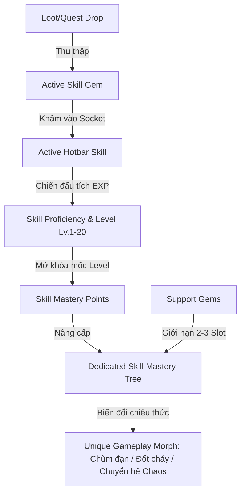

# THIẾT KẾ HỆ THỐNG SKILL GEMS & CÂY PHÁT TRIỂN KỸ NĂNG RIÊNG BIỆT (SKILL MASTERY TREE)
*Tài liệu phân tích & đặc tả thiết kế hệ thống Kỹ năng cho MDG (My Dream Game)*

---

## 1. Tổng Quan & Triết Lý Thiết Kế

Hệ thống kỹ năng của **MDG** là sự kết hợp tối ưu giữa **3 trường phái ARPG đỉnh cao**:
1. **Path of Exile**: Kỹ năng tồn tại dưới dạng vật phẩm ngọc (**Skill Gem**) có thể rơi ra từ quái, giao dịch và khảm vào trang bị.
2. **Last Epoch**: Mỗi chiêu thức khi sử dụng sẽ có **Cây Kỹ Năng Riêng Biệt (Skill Specialization Tree)** với các nhánh biến đổi cơ chế (Morph/Transmutation).
3. **Grim Dawn**: Độ thông thạo kỹ năng tăng dần theo số lần chiến đấu (**Proficiency EXP**), mở khóa dần các mốc hỗ trợ và nội tại sâu sắc.



---

## 2. Trục Cốt Lõi 1: Hệ Thống Skill Gem & Sockets (Ngọc Kỹ Năng)

### 2.1. Phân Loại Gems

| Loại Gem | Đặc Điểm | Ví Dụ |
| :--- | :--- | :--- |
| **Active Skill Gem** *(Ngọc Chủ Động)* | Khảm vào để mở khóa chiêu thức trên thanh Hotbar. Có Level (1-20) và Tags thuộc tính. | `Pyro Fireball Gem`, `Heavy Cleave Gem`, `Frost Nova Gem`. |
| **Support Gem** *(Ngọc Hỗ Trợ)* | Gắn kèm vào Active Gem để tăng cường hoặc đổi tính chất chiêu, đi kèm hệ số tiêu hao Mana (`Mana Multiplier`). | `Lesser Multiple Projectiles (130% MP)`, `Added Fire Damage (115% MP)`. |

### 2.2. Cơ Chế Giới Hạn Hỗ Trợ (Support Limits & Tag Compatibility)

* **Quy tắc tương thích Tags (Tag Matching):**
  * Support Gem chỉ kích hoạt nếu **trùng ít nhất 1 Tag** với Active Gem.
  * *Ví dụ:* Support `Multiple Projectiles` (Tags: `[Projectile]`) **kích hoạt** cho `Fireball` (`[Fire, Projectile, Spell]`), nhưng **vô hiệu** khi gắn vào `Frost Nova` (`[Cold, AoE, Spell]`).
* **Giới hạn số lượng Support (Support Capacity):**
  * **Cấp 1-9 (Novice):** Tối đa **1 Support Gem** cho mỗi chiêu.
  * **Cấp 10-24 (Adept / Ascended):** Mở rộng lên **2 Support Gems**.
  * **Cấp 25+ (Master):** Mở rộng lên tối đa **3 Support Gems** (Cân bằng tốt, loại bỏ việc phụ thuộc vào 6-link may rủi như PoE 1).

---

## 3. Trục Cốt Lõi 2: Cây Kỹ Năng Riêng Biệt (Per-Skill Mastery Tree)

Thay vì chỉ tăng sát thương phẳng nhàm chán, mỗi Skill Gem khi đạt cấp độ sẽ nhận **Skill Mastery Points (SMP)** để tăng vào Cây Tinh Hoa của chính chiêu đó.

```text
                             [ FIREBALL MASTERY TREE ]
                                        │
                 ┌──────────────────────┴──────────────────────┐
                 ▼                                             ▼
       [ NHÁNH A: PYROCLASM ]                        [ NHÁNH B: HELLFIRE BURST ]
   (Tập trung Bạo kích & Nổ diện rộng)              (Chuyển hóa sang Đốt cháy DoT & Chaos)
                 │                                             │
      ┌──────────┴──────────┐                       ┌──────────┴──────────┐
      ▼                     ▼                       ▼                     ▼
[+20% AoE Radius]   [+30% Crit Multi]       [+50% Ignite Chance]  [Convert 50% to Chaos]
      │                     │                       │                     │
      └──────────┬──────────┘                       └──────────┬──────────┘
                 ▼                                             ▼
    { KEYSTONE MORPH 1 }                          { KEYSTONE MORPH 2 }
   ★ NOVA CATACLYSM:                              ★ DRAGON BREATH:
   Bắn tỏa 8 quả cầu lửa xoay tròn 360°           Biến thành luồng lửa phun liên tục DoT
```

### Các Nhóm Node Trong Cây Kỹ Năng Riêng:

1. **Minor Nodes (Chỉ số cơ bản):** Tăng nhẹ +8% Sát thương, -5% Tiêu hao Mana, +10% Tốc độ bay của đạn.
2. **Major Nodes (Hiệu ứng phụ):** Gây hiệu ứng Đóng băng (Freeze), Thiêu đốt (Ignite), hoặc Hút máu (Leech).
3. **Keystone Morph Nodes (Biến đổi hình thái chiêu):** Đột phá hoàn toàn cách thức hoạt động của chiêu thức (ví dụ: chuyển chiêu bắn đơn lẻ thành bão lửa đa tia hoặc bẫy lửa).

---

## 4. Bảng Thiết Kế Cụ Thể Cho 3 Chiêu Thức Mẫu

### 4.1. Chiêu "Pyro Fireball"

* **Tags:** `[Fire]`, `[Spell]`, `[Projectile]`, `[AoE]`
* **Cây Kỹ Năng Gồm 3 Nhánh:**
  * **Nhánh Tốc Bắn & Số Lượng:** Bắn thêm +2 quả cầu lửa phụ chụm góc hẹp.
  * **Nhánh Bộc Phá (AoE Explosion):** Tăng 40% bán kính nổ, kẻ địch trúng nổ bị giảm 20% kháng Lửa.
  * **Nhánh Địa Ngục (Hellfire Morph):** Quả cầu lửa để lại vệt dung nham sôi sục đốt cháy DoT trong 3 giây.

### 4.2. Chiêu "Heavy Slash"

* **Tags:** `[Physical]`, `[Melee]`, `[Attack]`
* **Cây Kỹ Năng Gồm 3 Nhánh:**
  * **Nhánh Trọng Kích:** Tăng mạnh sát thương đơn mục tiêu, có 25% cơ hội làm choáng Boss.
  * **Nhánh Kiếm Khí (Wind Blade):** Đòn chém phóng ra một luồng kiếm khí bay xa 300px.
  * **Nhánh Khát Máu (Bloodlust):** Đòn đánh gây Chảy máu (Bleed) và hồi lại 3% HP trên mỗi kẻ địch trúng đòn.

### 4.3. Chiêu "Frost Nova"

* **Tags:** `[Cold]`, `[Spell]`, `[AoE]`
* **Cây Kỹ Năng Gồm 3 Nhánh:**
  * **Nhánh Băng Giá Tuyệt Đối:** Đóng băng cứng kẻ địch 1.5 giây, tăng 50% sát thương bạo kích lên mục tiêu bị đóng băng.
  * **Nhánh Vòng Xoáy Băng (Ice Vortex):** Tạo tâm hút kéo kẻ địch xung quanh vào giữa tâm vụ nổ.
  * **Nhánh Giáp Băng (Frost Armor Shield):** Mỗi kẻ địch trúng chiêu lập tức hồi phục 25 Energy Shield cho bản thân.

---

## 5. Kiến Trúc Dữ Liệu & Triển Khai (Data Model)

### 5.1. Cấu Trúc SQLite Schema

```sql
-- Bảng lưu trữ Gem của người chơi
CREATE TABLE IF NOT EXISTS SkillGems (
    Id TEXT PRIMARY KEY,
    CharacterId TEXT NOT NULL,
    SkillId TEXT NOT NULL,          -- 'fireball', 'slash', etc.
    Level INTEGER NOT NULL DEFAULT 1,
    CurrentExp INTEGER NOT NULL DEFAULT 0,
    ExpToNext INTEGER NOT NULL DEFAULT 120,
    MasteryPoints INTEGER NOT NULL DEFAULT 0,
    AllocatedNodesJson TEXT,        -- Danh sách ID các node đã học trong cây
    SocketedSupportsJson TEXT,      -- Danh sách Support Gems gắn kèm (Tối đa 3)
    IsEquippedToHotbar INTEGER DEFAULT 0,
    HotbarSlot INTEGER DEFAULT -1,
    FOREIGN KEY(CharacterId) REFERENCES Characters(Id) ON DELETE CASCADE
);
```

### 5.2. Luồng Xử Lý Logic C# (`Mdg.Core`)

```csharp
public sealed class SkillGemInstance
{
    public string GemId { get; }
    public SkillDefinition BaseDefinition { get; }
    public int Level { get; set; } = 1;
    public int MasteryPointsAvailable { get; set; }
    public HashSet<string> AllocatedMasteryNodeIds { get; } = new();
    public List<SupportGemDefinition> SocketedSupports { get; } = new();

    // Tính toán lại toàn bộ chỉ số sau khi áp dụng Skill Tree & Support Gems
    public CompiledSkillStats CompileStats()
    {
        var stats = new CompiledSkillStats(BaseDefinition);
        
        // 1. Áp dụng các Node trong Skill Tree
        foreach (var nodeId in AllocatedMasteryNodeIds)
        {
            ApplyNodeModifier(stats, nodeId);
        }
        
        // 2. Áp dụng Support Gems
        foreach (var support in SocketedSupports)
        {
            if ((support.AllowedTags & BaseDefinition.Tags) != 0)
            {
                stats.DamageMultiplier *= support.DamageMultiplier;
                stats.ManaCostMultiplier *= support.ManaMultiplier;
                stats.AdditionalProjectiles += support.AddedProjectiles;
            }
        }

        return stats;
    }
}
```

---

## 6. Lộ Trình Triển Khai Thực Tế

1. **Giai đoạn 1 (Core Data & Socketing):**
   * Chuyển đổi 5 kỹ năng hiện tại sang dạng **Skill Gem Items** trong túi đồ/kho ngọc.
   * Người chơi nhặt được Skill Gem mới mở khóa được ô Hotbar tương ứng.
2. **Giai đoạn 2 (Mastery Tree UI & Nodes):**
   * Thiết kế giao diện **Skill Mastery Tree Modal** (phím `K`), khi chọn 1 Skill Gem sẽ mở ra cây tài năng trực quan gồm các nút nối liên kết.
   * Cho phép tăng điểm, thử nghiệm build và tẩy điểm (Respec).
3. **Giai đoạn 3 (Support Gems & Morph VFX):**
   * Tạo các Support Gems cơ bản (*Greater Multiple Projectiles, Added Fire, Chain*).
   * Cập nhật hiệu ứng hạt Particle & VFX trên Canvas phản ánh đúng nhánh build đã chọn (ví dụ: Fireball bắn ra 3 tia hoặc Frost Nova màu tím Chaos).
