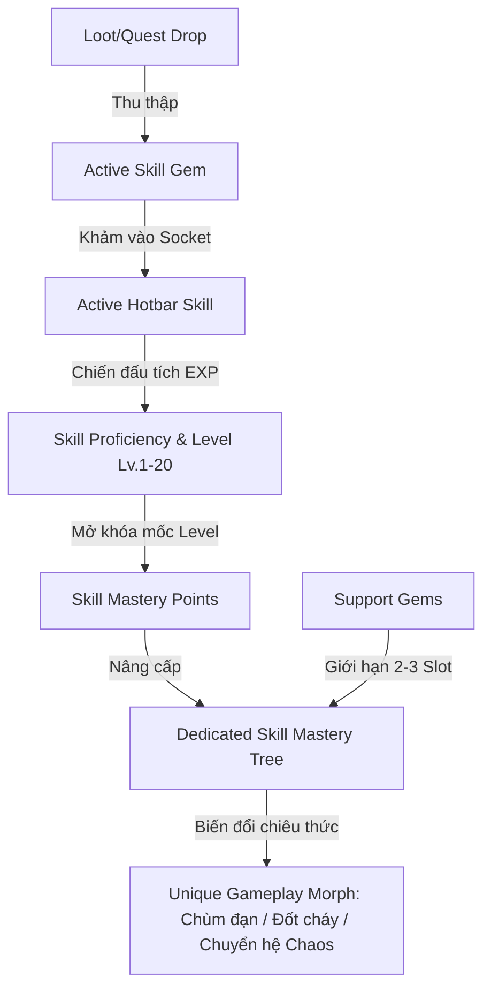

# THIẾT KẾ HỆ THỐNG SKILL GEMS & CÂY PHÁT TRIỂN KỸ NĂNG RIÊNG BIỆT (SKILL MASTERY TREE)
*Tài liệu phân tích & đặc tả thiết kế hệ thống Kỹ năng cho MDG (Aethelis)*

---

## 1. Tổng Quan & Triết Lý Thiết Kế `[ĐÃ HOÀN THÀNH - ACTIVE]`

Hệ thống kỹ năng của **MDG** là sự kết hợp tối ưu giữa **3 trường phái ARPG đỉnh cao**:
1. **Path of Exile**: Kỹ năng tồn tại dưới dạng vật phẩm ngọc (**Skill Gem**) có thể rơi ra từ quái, giao dịch và khảm vào trang bị.
2. **Last Epoch**: Mỗi chiêu thức khi sử dụng sẽ có **Cây Kỹ Năng Riêng Biệt (Skill Specialization Tree)** với các nhánh biến đổi cơ chế (Morph/Transmutation).
3. **Grim Dawn**: Độ thông thạo kỹ năng tăng dần theo số lần chiến đấu (**Proficiency EXP**), mở khóa dần các mốc hỗ trợ và nội tại sâu sắc.

---

## 2. Trục Cốt Lõi 1: Hệ Thống Skill Gem & Sockets (Ngọc Kỹ Năng) `[ĐÃ HOÀN THÀNH - ACTIVE]`

### 2.1. Phân Loại Gems `[ĐÃ HOÀN THÀNH]`

| Loại Gem | Đặc Điểm | Ví Dụ | Trạng Thái |
| :--- | :--- | :--- | :---: |
| **Active Skill Gem** *(Ngọc Chủ Động)* | Khảm vào để mở khóa chiêu thức trên thanh Hotbar. Có Level (1-20) và Tags thuộc tính. | `Pyro Fireball Gem`, `Heavy Cleave Gem`, `Frost Nova Gem`. | `[ĐÃ HOÀN THÀNH]` |
| **Support Gem** *(Ngọc Hỗ Trợ)* | Gắn kèm vào Active Gem để tăng cường hoặc đổi tính chất chiêu, đi kèm hệ số tiêu hao Mana (`Mana Multiplier`). | `Lesser Multiple Projectiles (130% MP)`, `Added Fire Damage (115% MP)`. | `[ĐÃ HOÀN THÀNH]` |

### 2.2. Cơ Chế Giới Hạn Hỗ Trợ (Support Limits & Tag Compatibility) `[ĐÃ HOÀN THÀNH]`

* **Quy tắc tương thích Tags (Tag Matching):**
  * Support Gem chỉ kích hoạt nếu **trùng ít nhất 1 Tag** với Active Gem.
  * *Ví dụ:* Support `Multiple Projectiles` (Tags: `[Projectile]`) **kích hoạt** cho `Fireball` (`[Fire, Projectile, Spell]`), nhưng **vô hiệu** khi gắn vào `Frost Nova` (`[Cold, AoE, Spell]`).
* **Giới hạn số lượng Support (Support Capacity):**
  * **Cấp 1-9 (Novice):** Tối đa **1 Support Gem** cho mỗi chiêu.
  * **Cấp 10-24 (Adept / Ascended):** Mở rộng lên **2 Support Gems**.
  * **Cấp 25+ (Master):** Mở rộng lên tối đa **3 Support Gems** (Cân bằng tốt, loại bỏ việc phụ thuộc vào 6-link may rủi như PoE 1).

---

## 3. Trục Cốt Lõi 2: Cây Kỹ Năng Riêng Biệt (Per-Skill Mastery Tree - Phím K) `[ĐÃ HOÀN THÀNH - ACTIVE]`

Mỗi Skill Gem khi đạt cấp độ sẽ nhận **Skill Mastery Points (SMP)** để tăng vào Cây Tinh Hoa của chính chiêu đó:
* **Slash (Kiếm Khí):** Nhánh quét rộng Cleave, Nhánh Chém chí mạng Bleed, Nhánh Giáp phản đòn.
* **Fireball (Cầu Lửa):** Nhánh chùm đạn đa hướng (Multi-Shot), Nhánh Nổ thiêu đốt (Ignite), Nhánh Bão lửa rực rỡ.
* **Frost Nova (Băng Sóng):** Nhánh Đóng băng tuyệt đối (Absolute Zero), Nhánh Tạo khiên ES, Nhánh Băng vỡ vụn (Shatter).
* **Meteor (Thiên Thạch):** Nhánh Rơi dồn dập (Meteor Shower), Nhánh Tinh cầu Hư vô (Void Comet).
* **Dash (Lướt Thần Tốc):** Nhánh Tăng tốc di chuyển, Nhánh Để lại vệt lửa/băng, Nhánh Giảm hồi chiêu.

---

## 4. Kế Hoạch Mở Rộng Sword Skills & Unique Keystones (Cảm Hứng SAO) `[CẦN MỞ RỘNG - PLANNED]`

* **Sword Skill Combo Chains:** Chuỗi đòn đánh kiếm thuật liên hoàn kết thúc bằng đòn chém dứt điểm cực mạnh.
* **Secret Unique Keystones:** Nhánh kỹ năng độc bản mở khóa sau khi hoàn thành kỳ tích ẩn (ví dụ: *Song Kiếm Tuyệt Kỹ Dual Blades*, *Thánh Kiếm Hộ Thần Holy Sword*).
